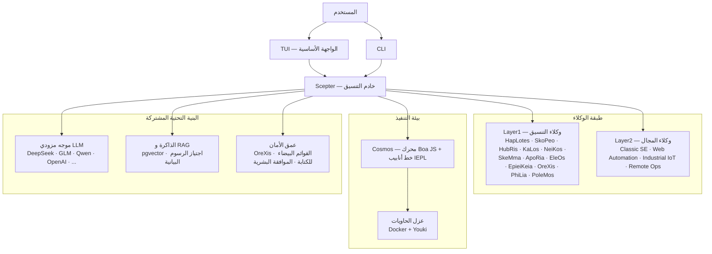

<!-- markdownlint-disable MD033 MD041 MD036 -->
<div align="center">


# Entelecheia

**منصة تعاون متعدد الوكلاء للتحكم الصناعي بالذكاء الاصطناعي**

[](LICENSE)
[](https://github.com/celestia-island/entelecheia)

</div>

<div align="center">

[English](https://github.com/celestia-island/docs.celestia.world/blob/master/docs/en/guides/core/README-entelecheia.md) &bull; [Deutsch](https://github.com/celestia-island/docs.celestia.world/blob/master/docs/de/guides/core/README-entelecheia.md) &bull; [简体中文](https://github.com/celestia-island/docs.celestia.world/blob/master/docs/zhs/guides/core/README-entelecheia.md) &bull; [繁體中文](https://github.com/celestia-island/docs.celestia.world/blob/master/docs/zht/guides/core/README-entelecheia.md) &bull; [日本語](https://github.com/celestia-island/docs.celestia.world/blob/master/docs/ja/guides/core/README-entelecheia.md) &bull; [한국어](https://github.com/celestia-island/docs.celestia.world/blob/master/docs/ko/guides/core/README-entelecheia.md) &bull; [Français](https://github.com/celestia-island/docs.celestia.world/blob/master/docs/fr/guides/core/README-entelecheia.md) &bull; [Español](https://github.com/celestia-island/docs.celestia.world/blob/master/docs/es/guides/core/README-entelecheia.md) &bull; [Português](https://github.com/celestia-island/docs.celestia.world/blob/master/docs/pt/guides/core/README-entelecheia.md) &bull; [Русский](https://github.com/celestia-island/docs.celestia.world/blob/master/docs/ru/guides/core/README-entelecheia.md) &bull; **العربية**

</div>

> جزء من منظومة [celestia-island](https://github.com/celestia-island).

## نظرة عامة

Entelecheia هي منصة متعددة الوكلاء ذات نواة دقيقة للتنفيذ فقط. يرى نموذج اللغة الكبير LLM عددًا محدودًا من الأدوات البدائية (`exec`، `write_to_var`، `write_to_var_json`) — كل العمل الحقيقي يحدث داخل خط أنابيب IEPL TypeScript، حيث يقوم كود الوكلاء عبر استيراد وحدات ES بتوجيه الاستدعاءات إلى مجموعة واسعة من أدوات MCP عبر عدة وكلاء.

المنصة مصممة من أجل **التحكم الصناعي ذي المتطلبات الأمنية الحرجة**: توافق البروتوكولات عبر البائعين (Modbus، S7comm، OPC UA)، عمق أمان متعدد الطبقات (مراجعة التعليمات → تنفيذ معزول → تحقق من السياسات → تأكيد بشري → سجل تدقيق)، وتنفيذ مهام معزول بالحاويات.

**الإصدار 0.2.0** — مرحلة تطوير مبكرة. واجهة TUI هي الواجهة الأساسية؛ واجهة WebUI موجودة في المستودع الشقيق [shittim-chest](https://github.com/celestia-island/shittim-chest).

### الميزات الرئيسية

- **نواة دقيقة للتنفيذ فقط**: سطح أدوات النموذج مقيد عمدًا بعدد قليل من البدائيات. يتم استدعاء الأدوات داخل بيئة التشغيل عبر استيراد وحدات JavaScript، وليس عبر ربط مباشر بين LLM والأداة — مما يجعل هجمات حقن التوجيهات أصعب هيكليًا.
- **وكلاء متعددو الطبقات**: اثنا عشر وكيل تنسيق من Layer1 (HapLotes، SkoPeo، HubRis، KaLos، NeiKos، SkeMma، ApoRia، EleOs، EpieiKeia، OreXis، PhiLia، PoleMos) بالإضافة إلى وكلاء المجال (Web Automation، Classic Software Engineering، Industrial IoT، Remote Operations). لا توجد دوال وهمية `todo!()` أو `unimplemented!()` في قاعدة الكود.
- **عمق الأمان**: كل استدعاء أداة يمس الأجهزة المادية يمر عبر OreXis — وكيل الحارس الأمني. قوائم بيضاء لعناوين الكتابة، بوابات موافقة بشرية للعمليات الطارئة، وسجل تدقيق كامل السلسلة.
- **عزل الحاويات**: بيئة تشغيل ثنائية المستوى (تنسيق خارجي Docker/Podman + صندوق رمل داخلي Youki/libcontainer). كل سلسلة مهارات تعمل في حاوية معزولة مع حدود للموارد، وملفات seccomp، والتحكم في الخروج الشبكي.
- **توجيه LLM متعدد المزودين**: تكوينات عديدة للمزودين (DeepSeek، Zhipu GLM، Qwen، OpenAI، Anthropic، Google، وغيرهم) مع تجاوز تلقائي للأعطال، وتتبع حدود المعدل، واختيار نموذج متعدد المستويات (Deep/Normal/Basic).
- **التكرار الذاتي**: يعمل خادم YOLO للتحكم الآلي المستمر على تشغيل سلاسل مهارات دورية لتحليل الكود تلقائيًا، وإصلاحات clippy، وتوحيد الذاكرة، وتدقيقات الأمان — مع شبكات أمان لنقاط تفتيش git والتراجع.

## البدء السريع

**Linux / macOS:**

```bash
curl -fsSL https://raw.githubusercontent.com/celestia-island/entelecheia/main/scripts/deploy/install.sh | bash
```

**Windows (WSL2):**

```powershell
irm https://raw.githubusercontent.com/celestia-island/entelecheia/main/scripts/deploy/install.ps1 | iex
```

**من الكود المصدري:**

```bash
git clone https://github.com/celestia-island/entelecheia.git
cd entelecheia
just bootstrap    # تثبيت التبعيات، بناء مساحة العمل، إنشاء التكوين
just dev          # تشغيل واجهة TUI (يتولى تنسيق Docker والخدمات)
```

المتطلبات الأساسية: Rust 1.85+ (edition 2024)، Docker، مدير المهام `just`.

**وضع قاعدة البيانات المضمنة** (لا حاجة إلى PostgreSQL خارجي):

```bash
just local         # scepter مع pglite المضمنة
```

## الوكلاء

| الوكيل | الدور |
|--------|-------|
| **HapLotes** | جسر اتصال بين Scepter و Cosmos |
| **SkoPeo** | التنسيق المركزي — تنسيق الأهداف والمسارات والمهام |
| **HubRis** | محرك التخطيط — تفكيك المهام، إدارة قوائم TODO |
| **KaLos** | بوابة إدخال/إخراج الملفات — عمليات ملفات ذرية وواعية بالتعارضات |
| **NeiKos** | بيئة تشغيل الحاويات — إنشاء، تفرع، لقطات، تنفيذ |
| **SkeMma** | بيئة تشغيل JavaScript — محرك Boa، تنفيذ IEPL |
| **ApoRia** | مركز LLM وتخزين المعرفة — قاعدة بيانات RAG المتجهة، كشف الشذوذ |
| **EleOs** | بوابة المعلومات الخارجية — جلب الويب، بحث الويب |
| **EpieiKeia** | التنسيق الزمني — الجدولة، تسليم الرسائل، مراقبة الملفات |
| **OreXis** | حارس الأمان — مراقبة الأدوات، أمان الكتابة، تدقيق الامتثال، الإنذارات |
| **PhiLia** | مركز الذاكرة والبروتوكولات — ذاكرة متجهة، اجتياز الرسوم البيانية، جودة البيانات |
| **PoleMos** | الحوسبة الطرفية وإدارة الأجهزة — الوصول إلى ملفات وأوامر المضيف، معلومات الأجهزة |
| **Classic SE** | توليد الكود، التحليل الثابت، إعادة الهيكلة، تكامل LSP |
| **Web Automation** | التحكم بالمتصفح — WebDriver، التنقل، لقطات الشاشة، الإدخال |
| **Industrial IoT** | البروتوكولات الصناعية — Modbus، S7comm، OPC UA، الاكتشاف التسلسلي |
| **Remote Ops** | SSH، الطرفيات البعيدة، أتمتة واجهة المستخدم الرسومية، نقل الملفات |

## الهندسة المعمارية



لا يستدعي LLM أدوات MCP مباشرةً أبدًا. بدلاً من ذلك، يقوم بتوليد كود TypeScript يستورد وحدات الوكلاء (`import { file_read } from 'kalos'`). يقوم خط أنابيب IEPL بتحويل هذا الكود إلى JavaScript عبر SWC، وتنفيذه في محرك Boa، وتوجيه الاستدعاءات الأصلية عبر موجه MCP — مع قاطع دائرة وإعادة محاولة وإنفاذ سياسات الأمان في كل خطوة.

## التوثيق

الهندسة المعمارية الكاملة وقرارات التصميم والأدلة متوفرة على **[docs.celestia.world](https://docs.celestia.world)**:

- **[نظرة عامة على الهندسة المعمارية](https://docs.celestia.world/en/designs/core/architecture.html)** — التحقق من المكونات، طبقات الكريتات، حالة التنفيذ
- **[الأساسيات](https://docs.celestia.world/en/guides/core/fundamentals.html)** — الوكلاء، سطح الأدوات للتنفيذ فقط، المهارات، المستويات
- **[البناء والنشر](https://docs.celestia.world/en/guides/core/building.html)** — دليل كامل للبناء والتثبيت و Docker والإصدارات
- **[مرجع CLI](https://docs.celestia.world/en/guides/core/cli.html)** — جميع أوامر CLI وخياراتها
- **[تطوير أدوات MCP](https://docs.celestia.world/en/guides/core/mcp-tool-development.html)** — كيفية إضافة أدوات ووكلاء جدد
- **[نموذج الأمان](https://docs.celestia.world/en/meta/security.html)** — المصادقة، RBAC، تحصين الحاويات
- **[قرارات التصميم](https://docs.celestia.world/en/designs/core/design-decisions.html)** — فهرس ADR (النواة الدقيقة للتنفيذ فقط، محرك Boa، pgvector، مساحة العمل متعددة الطبقات، صندوق رمل الحاويات)

## الترخيص

Business Source License 1.1 (BUSL-1.1). يتطلب الاستخدام التجاري ترخيص تفويض. يتبع الاستخدام غير التجاري بروتوكول SySL-1.0. يتحول إلى Apache-2.0 في 2030-01-01.
