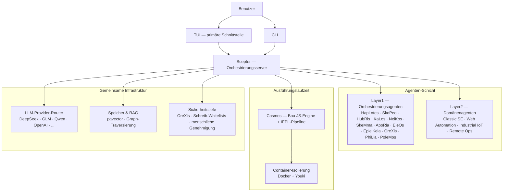

<!-- markdownlint-disable MD033 MD041 MD036 -->
<div align="center">


# Entelecheia

**Multi-Agenten-Kollaborationsplattform für industrielle KI-Steuerung**

[](LICENSE)
[](https://github.com/celestia-island/entelecheia)

</div>

<div align="center">

[English](https://github.com/celestia-island/docs.celestia.world/blob/master/docs/en/guides/core/README-entelecheia.md) &bull; **Deutsch** &bull; [简体中文](https://github.com/celestia-island/docs.celestia.world/blob/master/docs/zhs/guides/core/README-entelecheia.md) &bull; [繁體中文](https://github.com/celestia-island/docs.celestia.world/blob/master/docs/zht/guides/core/README-entelecheia.md) &bull; [日本語](https://github.com/celestia-island/docs.celestia.world/blob/master/docs/ja/guides/core/README-entelecheia.md) &bull; [한국어](https://github.com/celestia-island/docs.celestia.world/blob/master/docs/ko/guides/core/README-entelecheia.md) &bull; [Français](https://github.com/celestia-island/docs.celestia.world/blob/master/docs/fr/guides/core/README-entelecheia.md) &bull; [Español](https://github.com/celestia-island/docs.celestia.world/blob/master/docs/es/guides/core/README-entelecheia.md) &bull; [Português](https://github.com/celestia-island/docs.celestia.world/blob/master/docs/pt/guides/core/README-entelecheia.md) &bull; [Русский](https://github.com/celestia-island/docs.celestia.world/blob/master/docs/ru/guides/core/README-entelecheia.md) &bull; [العربية](https://github.com/celestia-island/docs.celestia.world/blob/master/docs/ar/guides/core/README-entelecheia.md)

</div>

> Teil des [celestia-island](https://github.com/celestia-island)-Ökosystems.

## Übersicht

Entelecheia ist eine reine Ausführungs-Mikrokernel-Multi-Agenten-Plattform. Das LLM sieht nur eine Handvoll primitiver Werkzeuge (`exec`, `write_to_var`, `write_to_var_json`) — die gesamte eigentliche Arbeit findet innerhalb der IEPL-TypeScript-Pipeline statt, in der der Agentencode über ES-Modul-Importe auf eine große Oberfläche von MCP-Werkzeugen über mehrere Agenten hinweg zugreift.

Die Plattform ist für **sicherheitskritische industrielle Steuerung** konzipiert: herstellerübergreifende Protokollkompatibilität (Modbus, S7comm, OPC UA), mehrschichtige Sicherheitstiefe (Anweisungsprüfung → sandboxed Ausführung → Richtlinienvalidierung → menschliche Bestätigung → Audit-Trail) und containerisolierte Aufgabenausführung.

**Version 0.2.0** — frühe Entwicklung. Die TUI ist die primäre Schnittstelle; das WebUI befindet sich im Schwester-Repository [shittim-chest](https://github.com/celestia-island/shittim-chest).

### Hauptfunktionen

- **Reines Ausführungs-Mikrokernel**: Die Werkzeugoberfläche des Modells ist bewusst auf wenige Primitive beschränkt. Der Werkzeugaufruf erfolgt innerhalb der Laufzeitumgebung über JavaScript-Modulimporte, nicht durch direkte LLM-zu-Werkzeug-Bindung — was Prompt-Injection-Angriffe strukturell erschwert.
- **Geschichtete Agenten**: ein Dutzend Layer1-Orchestrierungsagenten (HapLotes, SkoPeo, HubRis, KaLos, NeiKos, SkeMma, ApoRia, EleOs, EpieiKeia, OreXis, PhiLia, PoleMos) sowie Domänenagenten (Webautomation, klassische Softwareentwicklung, industrielles IoT, Fernbetrieb). Keine `todo!()`- oder `unimplemented!()`-Stubs im Codebestand.
- **Sicherheitstiefe**: Jeder Werkzeugaufruf, der physische Geräte berührt, durchläuft OreXis — den Sicherheits-Sentinel-Agenten. Schreibadressen-Whitelists, menschliche Genehmigungsstufen für Notfalloperationen und vollständige Audit-Protokollierung.
- **Container-Isolierung**: Zweistufige Laufzeitumgebung (Docker/Podman äußere Orchestrierung + Youki/libcontainer innere Sandbox). Jede Skill-Kette läuft in einem isolierten Container mit Ressourcenlimits, Seccomp-Profilen und Netzwerk-Egress-Kontrolle.
- **Multi-Provider-LLM-Routing**: zahlreiche Provider-Konfigurationen (DeepSeek, Zhipu GLM, Qwen, OpenAI, Anthropic, Google und weitere) mit automatischem Failover, Ratenlimit-Verfolgung und stufenbasierter Modellauswahl (Deep/Normal/Basic).
- **Selbstiteration**: Der YOLO-Cruise-Control-Daemon führt periodische Skill-Ketten für automatisierte Codeanalyse, Clippy-Korrekturen, Speicherkonsolidierung und Sicherheitsaudits aus — mit Git-Checkpoint/Rollback-Sicherheitsnetzen.

## Schnellstart

**Linux / macOS:**

```bash
curl -fsSL https://raw.githubusercontent.com/celestia-island/entelecheia/main/scripts/deploy/install.sh | bash
```

**Windows (WSL2):**

```powershell
irm https://raw.githubusercontent.com/celestia-island/entelecheia/main/scripts/deploy/install.ps1 | iex
```

**Aus dem Quellcode:**

```bash
git clone https://github.com/celestia-island/entelecheia.git
cd entelecheia
just bootstrap    # Abhängigkeiten installieren, Workspace bauen, Konfiguration generieren
just dev          # TUI starten (übernimmt Docker/Service-Orchestrierung)
```

Voraussetzungen: Rust 1.85+ (Edition 2024), Docker, `just` Task-Runner.

**Eingebetteter Datenbankmodus** (kein externes PostgreSQL erforderlich):

```bash
just local         # scepter mit eingebettetem pglite
```

## Agenten

| Agent | Rolle |
|-------|-------|
| **HapLotes** | Kommunikationsbrücke zwischen Scepter und Cosmos |
| **SkoPeo** | Zentrale Koordination — Ziel-/Aufgaben-/Track-Orchestrierung |
| **HubRis** | Planungs-Engine — Aufgabendekomposition, TODO-Verwaltung |
| **KaLos** | Datei-I/O-Gateway — atomare, konfliktbewusste Dateioperationen |
| **NeiKos** | Container-Laufzeitumgebung — Erstellen, Forken, Snapshot, Ausführen |
| **SkeMma** | JavaScript-Laufzeitumgebung — Boa-Engine, IEPL-Ausführung |
| **ApoRia** | LLM-Hub & Wissensspeicher — RAG-Vektordatenbank, Anomalieerkennung |
| **EleOs** | Gateway für externe Informationen — Webabruf, Websuche |
| **EpieiKeia** | Zeitliche Orchestrierung — Planung, Nachrichtenzustellung, Dateibeobachter |
| **OreXis** | Sicherheits-Sentinel — Werkzeug-Gating, Schreibsicherheit, Compliance-Audit, Alarme |
| **PhiLia** | Speicher- & Protokoll-Nexus — Vektorspeicher, Graph-Traversierung, Datenqualität |
| **PoleMos** | Edge-Computing & Gerätemanagement — Host-Datei-/Befehlszugriff, Hardware-Informationen |
| **Classic SE** | Codegenerierung, statische Analyse, Refactoring, LSP-Integration |
| **Web Automation** | Browser-Steuerung — WebDriver, Navigation, Screenshots, Eingabe |
| **Industrial IoT** | Industrielle Protokolle — Modbus, S7comm, OPC UA, serielle Erkennung |
| **Remote Ops** | SSH, Remote-Terminals, GUI-Automation, Dateitransfer |

## Architektur



Das LLM ruft niemals MCP-Werkzeuge direkt auf. Stattdessen generiert es TypeScript-Code, der Agentenmodule importiert (`import { file_read } from 'kalos'`). Die IEPL-Pipeline transpiliert diesen nach JavaScript (SWC), führt ihn in der Boa-Engine aus und leitet native Aufrufe über den MCP-Router weiter — mit Circuit-Breaker, Wiederholungslogik und Sicherheitsrichtlinien-Durchsetzung bei jedem Schritt.

## Dokumentation

Vollständige Architektur, Designentscheidungen und Anleitungen unter **[docs.celestia.world](https://docs.celestia.world)**:

- **[Architekturübersicht](https://docs.celestia.world/en/designs/core/architecture.html)** — Komponenten-Realitätscheck, Crate-Ebenen, Implementierungsstatus
- **[Grundlagen](https://docs.celestia.world/en/guides/core/fundamentals.html)** — Agenten, reine Ausführungs-Werkzeugoberfläche, Skills, Stufen
- **[Build & Deployment](https://docs.celestia.world/en/guides/core/building.html)** — vollständiger Build-, Installations-, Docker- und Release-Leitfaden
- **[CLI-Referenz](https://docs.celestia.world/en/guides/core/cli.html)** — alle CLI-Befehle und Optionen
- **[MCP-Werkzeugentwicklung](https://docs.celestia.world/en/guides/core/mcp-tool-development.html)** — wie man neue Werkzeuge und Agenten hinzufügt
- **[Sicherheitsmodell](https://docs.celestia.world/en/meta/security.html)** — Authentifizierung, RBAC, Container-Härtung
- **[Designentscheidungen](https://docs.celestia.world/en/designs/core/design-decisions.html)** — ADR-Index (reines Ausführungs-Mikrokernel, Boa-Engine, pgvector, geschichteter Workspace, Container-Sandbox)

## Lizenz

Business Source License 1.1 (BUSL-1.1). Kommerzielle Nutzung erfordert eine Autorisierungslizenz. Nicht-kommerzielle Nutzung folgt dem SySL-1.0-Protokoll. Konvertiert zu Apache-2.0 am 01.01.2030.
