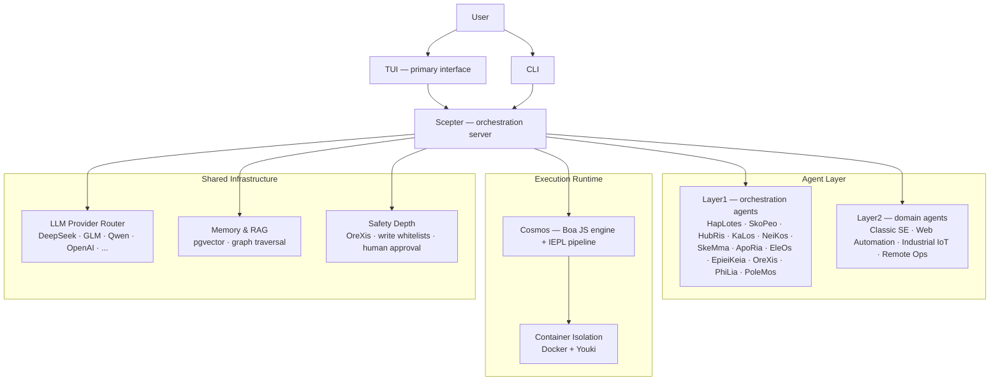

<!-- markdownlint-disable MD033 MD041 MD036 -->
<div align="center">


# Entelecheia

**Multi-agent collaboration platform for industrial AI control**

[](LICENSE)
[](https://github.com/celestia-island/entelecheia)

</div>

<div align="center">

**English** &bull; **[Deutsch](https://github.com/celestia-island/docs.celestia.world/blob/master/docs/de/guides/core/README-entelecheia.md)** &bull; **[简体中文](https://github.com/celestia-island/docs.celestia.world/blob/master/docs/zhs/guides/core/README-entelecheia.md)** &bull; **[繁體中文](https://github.com/celestia-island/docs.celestia.world/blob/master/docs/zht/guides/core/README-entelecheia.md)** &bull; **[日本語](https://github.com/celestia-island/docs.celestia.world/blob/master/docs/ja/guides/core/README-entelecheia.md)** &bull; **[한국어](https://github.com/celestia-island/docs.celestia.world/blob/master/docs/ko/guides/core/README-entelecheia.md)** &bull; **[Français](https://github.com/celestia-island/docs.celestia.world/blob/master/docs/fr/guides/core/README-entelecheia.md)** &bull; **[Español](https://github.com/celestia-island/docs.celestia.world/blob/master/docs/es/guides/core/README-entelecheia.md)** &bull; **[Português](https://github.com/celestia-island/docs.celestia.world/blob/master/docs/pt/guides/core/README-entelecheia.md)** &bull; **[Русский](https://github.com/celestia-island/docs.celestia.world/blob/master/docs/ru/guides/core/README-entelecheia.md)** &bull; **[العربية](https://github.com/celestia-island/docs.celestia.world/blob/master/docs/ar/guides/core/README-entelecheia.md)**

</div>

> Part of the [celestia-island](https://github.com/celestia-island) ecosystem.

## Overview

Entelecheia is an exec-only microkernel multi-agent platform. The LLM sees only a handful of primitive tools (`exec`, `write_to_var`, `write_to_var_json`) — all real work happens inside the IEPL TypeScript pipeline, where agent code dispatches to a large surface of MCP tools across multiple agents via ES module imports.

The platform is designed for **safety-critical industrial control**: cross-vendor protocol compatibility (Modbus, S7comm, OPC UA), multi-layer safety depth (instruction review → sandboxed execution → policy validation → human confirmation → audit trail), and container-isolated task execution.

**Version 0.2.0** — early development. The TUI is the primary interface; the WebUI lives in the sibling repo [shittim-chest](https://github.com/celestia-island/shittim-chest).

### Key features

- **Exec-only microkernel**: the model's tool surface is deliberately constrained to a few primitives. Tool invocation happens inside the runtime via JavaScript module imports, not direct LLM-to-tool binding — making prompt injection attacks structurally harder.
- **Layered agents**: a dozen Layer1 orchestration agents (HapLotes, SkoPeo, HubRis, KaLos, NeiKos, SkeMma, ApoRia, EleOs, EpieiKeia, OreXis, PhiLia, PoleMos) plus domain agents (Web Automation, Classic Software Engineering, Industrial IoT, Remote Operations). No `todo!()` or `unimplemented!()` stubs in the codebase.
- **Safety depth**: every tool call that touches physical devices passes through OreXis — the security sentinel agent. Write-address whitelists, human-approval gates for emergency operations, and full-chain audit logging.
- **Container isolation**: two-tier runtime (Docker/Podman outer orchestration + Youki/libcontainer inner sandbox). Each skill chain runs in an isolated container with resource limits, seccomp profiles, and network egress control.
- **Multi-provider LLM routing**: numerous provider configurations (DeepSeek, Zhipu GLM, Qwen, OpenAI, Anthropic, Google, and more) with automatic failover, rate-limit tracking, and tier-based model selection (Deep/Normal/Basic).
- **Self-iteration**: YOLO cruise-control daemon runs periodic skill chains for automated code analysis, clippy fixes, memory consolidation, and security audits — with git checkpoint/rollback safety nets.

## Quick Start

**Linux / macOS:**

```bash
curl -fsSL https://raw.githubusercontent.com/celestia-island/entelecheia/main/scripts/deploy/install.sh | bash
```

**Windows (WSL2):**

```powershell
irm https://raw.githubusercontent.com/celestia-island/entelecheia/main/scripts/deploy/install.ps1 | iex
```

**From source:**

```bash
git clone https://github.com/celestia-island/entelecheia.git
cd entelecheia
just bootstrap    # install deps, build workspace, generate config
just dev          # launch the TUI (handles Docker/service orchestration)
```

Prerequisites: Rust 1.85+ (edition 2024), Docker, `just` task runner.

**Embedded database mode** (no external PostgreSQL needed):

```bash
just local         # scepter with embedded pglite
```

## Agents

| Agent | Role |
|-------|------|
| **HapLotes** | Communication bridge between Scepter and Cosmos |
| **SkoPeo** | Central coordination — goal/track/task orchestration |
| **HubRis** | Planning engine — task decomposition, TODO management |
| **KaLos** | File I/O gateway — atomic, conflict-aware file operations |
| **NeiKos** | Container runtime — create, fork, snapshot, execute |
| **SkeMma** | JavaScript runtime — Boa engine, IEPL execution |
| **ApoRia** | LLM hub & knowledge storage — RAG vector DB, anomaly detection |
| **EleOs** | External information gateway — web fetch, web search |
| **EpieiKeia** | Temporal orchestration — scheduling, message delivery, file observers |
| **OreXis** | Security sentinel — tool gating, write-safety, compliance audit, alarms |
| **PhiLia** | Memory & protocol nexus — vector memories, graph traversal, data quality |
| **PoleMos** | Edge computing & device management — host file/command access, hardware info |
| **Classic SE** | Code generation, static analysis, refactoring, LSP integration |
| **Web Automation** | Browser control — WebDriver, navigation, screenshots, input |
| **Industrial IoT** | Industrial protocols — Modbus, S7comm, OPC UA, serial discovery |
| **Remote Ops** | SSH, remote terminals, GUI automation, file transfer |

## Architecture



The LLM never calls MCP tools directly. Instead, it generates TypeScript code that imports agent modules (`import { file_read } from 'kalos'`). The IEPL pipeline transpiles this to JavaScript (SWC), executes it in the Boa engine, and routes native dispatches through the MCP router — with circuit breaker, retry, and security policy enforcement at every hop.

## Documentation

Full architecture, design decisions, and guides are at **[docs.celestia.world](https://docs.celestia.world)**:

- **[Architecture Overview](https://docs.celestia.world/en/designs/core/architecture.html)** — component reality check, crate layers, implementation status
- **[Fundamentals](https://docs.celestia.world/en/guides/core/fundamentals.html)** — agents, exec-only tool surface, skills, tiers
- **[Building & Deployment](https://docs.celestia.world/en/guides/core/building.html)** — full build, install, Docker, and release guide
- **[CLI Reference](https://docs.celestia.world/en/guides/core/cli.html)** — all CLI commands and options
- **[MCP Tool Development](https://docs.celestia.world/en/guides/core/mcp-tool-development.html)** — how to add new tools and agents
- **[Security Model](https://docs.celestia.world/en/meta/security.html)** — authentication, RBAC, container hardening
- **[Design Decisions](https://docs.celestia.world/en/designs/core/design-decisions.html)** — ADR index (exec-only microkernel, Boa engine, pgvector, layered workspace, container sandbox)

## License

Business Source License 1.1 (BUSL-1.1). Commercial use requires an authorization license. Non-commercial use follows the SySL-1.0 protocol. Converts to Apache-2.0 on 2030-01-01.
