# Contributing to Shittim Chest

Thank you for your interest in contributing! This guide covers everything you need to get started.

## Contribution policy (read this first)

Shittim Chest is the user-facing surface of a platform that can drive physical
and industrial systems, so **stability and safety outweigh contribution
throughput**. Please read this before opening a pull request.

- **High merge bar, not a public roadmap.** Opening a PR does not imply it will

be merged. We accept a deliberately small number of changes, and only when
they fit the architecture and pass review. This is by design, not rudeness.

- **What we welcome:** bug reports, focused fixes, well-scoped improvements to

the **periphery** (IDE plugins, Tauri apps, channel integrations, provider
adapters, and documentation), and prior design discussions before code.

- **What we generally will not merge:** large unsolicited rewrites,

architectural changes without a prior design discussion, bulk "vibe-coded"
PRs, anything that lowers the security or correctness bar of the core, and
changes to the security-critical core (auth, JWT/OAuth, LLM routing, webhook
validation, RBAC) without an explicit invitation and extended review.

- **Core vs. periphery.** The core backend and auth/RBAC model are held to the

strictest bar and maintained primarily by the core team. The periphery
(frontends, IDE/mobile apps, channel connectors) is where external
contributions are most useful and most likely to be accepted.

- **CLA required.** Every accepted contribution requires a signed Contributor

License Agreement. See [`CLA.md`](../meta/cla.md). Commits must carry a
`Signed-off-by` line (`git commit -s`).

> **The license may open; the merge bar will not.** On **2030-01-01** this
> project converts from BUSL-1.1 to the Synthetic Source License (SySL-1.0) — see
> [`LICENSE`](LICENSE). That broadens *what you may do with the code*; it does
> **not** lower the review bar, remove the CLA, or mean we accept more PRs. The
> contribution policy is unchanged before and after the change date.

## Security

Do **not** open public issues for security vulnerabilities. Report them privately
via [GitHub Security Advisories](https://github.com/celestia-island/shittim-chest/security/advisories/new).
See [`SECURITY.md`](../meta/security.md).

## Code of Conduct

Be respectful, constructive, and inclusive. We follow the [Rust Code of Conduct](https://www.rust-lang.org/policies/code-of-conduct).

## Development Environment Setup

### Prerequisites

- **Rust** 1.85+ (`rustup default stable`)
- **Node.js** 20+ and **pnpm** 9+
- **just** command runner (`cargo install just`)
- **PostgreSQL** 18+
- A running [entelecheia](https://github.com/celestia-island/entelecheia) scepter instance on `:8424` (optional — shittim-chest can run standalone for chat/image gen)

### Quick Start

```bash
git clone https://github.com/celestia-island/shittim-chest.git
cd shittim-chest
cp .env.example .env
# Edit .env — set DATABASE_URL, JWT_SECRET, ENCRYPTION_KEY
# For standalone LLM: set LLM_DEFAULT_PROVIDER_* variables
# For scepter proxy: set ENTELECHEIA_SCEPTER_URL

 # Full dev stack (via Docker)
 just install  # pre-stage ALL deps for offline builds (needs network once:
               #   cargo fetch + pnpm install + resolves the arona checkout
               #   that this repo shares devtool scripts with)
 just dev      # Starts postgres + builds + migrates + serves, and watches for changes
               # (auto-rebuild frontend/backend; with --mock also restarts scepter + mock LLM)

 # `just watch` is a deprecated alias for `just dev` (watching is the default).
 ```

> **Network:** the first build needs internet (cargo registry, git deps, the
> arona + entelecheia checkouts). Run `just install` once on a connected
> machine and subsequent `just dev` runs can proceed offline. The shared
> Python devtool scripts (target cache guard, logger, …) live in the `arona`
> repo and are located automatically via the cargo `[patch]` path, a sibling
> checkout, or a last-resort `git clone` into `targets/`.

### Standalone Development (without entelecheia)

shittim-chest can run independently for frontend + chat development. Set these in `.env`:

```bash
LLM_DEFAULT_PROVIDER_ENDPOINT=https://api.deepseek.com/v1
LLM_DEFAULT_PROVIDER_API_KEY=sk-xxx
LLM_DEFAULT_PROVIDER_MODELS=deepseek-chat,deepseek-reasoner
LLM_DEFAULT_PROVIDER_CATEGORY=chat
```

Then `just dev` — chat, image generation, and auth work without scepter. Proxy and device features will show errors but won't crash.

### Cross-Project Dependencies (local dev)

When working on both entelecheia and shittim-chest simultaneously, configure local Cargo patches in `~/.cargo/config.toml` for all cross-repo dependencies:

```toml
# ~/.cargo/config.toml

# crates.io deps with local overrides
[patch.crates-io]
libnoa = { path = "/path/to/noa" }

# git deps with local overrides
[patch."https://github.com/celestia-island/arona.git"]
arona = { path = "/path/to/arona" }

[patch."https://github.com/celestia-island/hifumi.git"]
hifumi = { path = "/path/to/hifumi/packages/types" }

[patch."https://github.com/celestia-island/evernight.git"]
evernight = { path = "/path/to/evernight" }
```

**Never commit `~/.cargo/config.toml` to any repository.** CI uses git references.

## Project Structure

```mermaid
flowchart TD
    root["shittim-chest/"] --> pkg["packages/"]
    root --> docs_dir["docs/"]
    root --> scripts_dir["scripts/"]
    root --> cargo_toml["Cargo.toml — Rust workspace root"]
    root --> pkg_json["package.json — pnpm workspace root"]
    root --> pnpm_ws["pnpm-workspace.yaml"]

    pkg --> cli_pkg["cli/ — CLI wrapper, orchestrates Docker services"]
    pkg --> sc_pkg["core/ — Rust + Axum backend"]
    pkg --> webui_pkg["webui/ — Vue 3 + Vite frontend (TSX)"]
    pkg --> app_pkg["app/"]
    pkg --> ide_pkg["ide/"]

    sc_pkg --> sc_main["main.rs — CLI entrypoint (DbInit/Migrate/Reset/Serve)"]
    sc_pkg --> sc_lib["lib.rs — Module declarations (33 modules)"]
    sc_pkg --> sc_config["config.rs — Environment config"]
    sc_pkg --> sc_auth["auth/ — Login, register, JWT, OAuth, sessions"]
    sc_pkg --> sc_api["api.rs — Router bootstrap + DB management"]
    sc_pkg --> sc_chat["chat/ — Conversations, messages, SSE/WS streaming"]
    sc_pkg --> sc_llm["llm/ — LLM client, router, provider management"]
    sc_pkg --> sc_gen["generation/ — Image generation"]
    sc_pkg --> sc_webhook["webhook.rs — GitHub/GitLab/Gitee/custom webhooks"]
    sc_pkg --> sc_devices["devices/ — Remote device management + signaling"]
    sc_pkg --> sc_channel["channel/ — 12-platform channel integrations"]
    sc_pkg --> sc_proxy["proxy/ — Scepter HTTP/WS bridge"]
    sc_pkg --> sc_entity["entity/ — SeaORM entity models (25 tables)"]
    sc_pkg --> sc_migration["migration/ — Database migrations (5)"]
    sc_pkg --> sc_static["static_files.rs"]
    sc_pkg --> sc_cargo["Cargo.toml"]

    webui_pkg --> webui_views["views/ — demiurge (chat), auth, admin, topology, holographic"]
    webui_pkg --> webui_comp["components/ — base/ (50+ S-design-system), chat/, layout/, preview/, ..."]
    webui_pkg --> webui_stores["stores/ — Pinia stores"]
    webui_pkg --> webui_composables["composables/ — useChatStream, useSceneManager, ..."]
    webui_pkg --> webui_i18n["i18n/ — vue-i18n, 11 languages, 17 namespace files per locale"]
    webui_pkg --> webui_api["api/ — API client modules"]
    webui_pkg --> webui_types["types/ — TypeScript types"]

    app_pkg --> app_tauri["tauri/ — Tauri desktop app"]
    app_pkg --> app_shared["tauri_shared/ — Shared DTOs for Tauri apps"]
    app_pkg --> app_mobile["tauri_mobile/ — Tauri mobile app"]
    app_pkg --> app_harmony["harmony/ — HarmonyOS app (ArkTS)"]

    ide_pkg --> ide_vscode["vscode/ — VS Code extension (TypeScript)"]
    ide_pkg --> ide_idea["idea/ — IntelliJ plugin (Kotlin)"]
    ide_pkg --> ide_zed["zed/ — Zed extension (Rust)"]
    ide_pkg --> ide_neovim["neovim/ — Neovim plugin (Lua)"]
    ide_pkg --> ide_lsp["lsp-bridge/ — LSP bridge (Rust)"]
    ide_pkg --> ide_e2e["e2e/ — Shared E2E tests (TypeScript)"]

    docs_dir --> docs_guides["guides/ — Multi-language docs (en, zhs, zht, ja, ko, fr, es, ru)"]

    scripts_dir --> scripts_images["images/ — Dockerfile"]
    scripts_dir --> scripts_utils["utils/ — Python utility scripts"]
```



## Code Style

### Rust

```bash
cargo fmt                  # auto-format
cargo clippy               # lint
cargo clippy --fix         # auto-fix
```

- Follow standard Rust conventions (`snake_case` for functions/variables, CamelCase for types)
- Use `workspace = true` for shared dependency versions in crate `Cargo.toml` files
- Error handling: use `anyhow::Result` for application code, `thiserror` for library crate error types

### TypeScript / Vue

```bash
pnpm -r lint               # ESLint across all packages
pnpm -r typecheck          # TypeScript strict check
pnpm -r build              # Verify production build
```

- Vue 3 with TSX (`defineComponent`, `@vitejs/plugin-vue-jsx`)
- TypeScript strict mode
- Pinia for state management
- Follow existing patterns in `webui/`

### i18n

When adding UI strings in the webui, use the `t()` function from `vue-i18n` via `packages/webui/src/i18n/`:

```ts
import { t } from '@/i18n'
// In template: {t('key.name')}
// With args: {t('msg.toolCalls', count, count > 1 ? t('msg.toolCalls.plural') : '')}
```

Locale files are organized as 17 namespace JSON files per language under `i18n/locales/{lang}/` (admin, auth, chat, cmd, common, devices, errors, footer, help, logs, models, reports, skills, timeline, tokenUsage, tools, workspace). When adding a key, add it to all 11 supported locales: `ar`, `de`, `en`, `es`, `fr`, `ja`, `ko`, `pt`, `ru`, `zhs`, `zht`.

### Naming Conventions

All directory names under `packages/` use **`snake_case`**:

| Type | Convention | Example |
| --- | --- | --- |
| Rust crate directory | snake_case | `core/` |
| Rust crate name | snake_case | `core` |

## Justfile Commands

```bash
just                       # list all commands
just dev                   # full dev stack via Docker (postgres + backend), watching for changes
just dev --clean           # clean start (remove volumes, .env, restart)
just dev --mock            # full mock stack (real scepter + mock LLM) + backend, watching;
                           # the mock scepter/LLM are rebuilt+restarted fresh every run
just up                    # build and start all services in Docker
just down                  # stop all services
just down --clean          # stop and remove volumes
just migrate               # run pending migrations inside container
just logs                  # stream logs from all containers
just status                # check service status
just watch                 # (deprecated alias for `just dev`)
just build                 # build release binary
just build-frontend        # build Vue frontends only
just build-release         # build frontend + release binary with embedded frontend
just test                  # run all tests
just lint                  # lint all (cargo clippy + eslint)
just fmt                   # auto-format all
just clean                 # clean build artifacts
```

## Pull Request Process

1. Create a feature branch from `dev`: `git checkout -b feat/my-feature dev`
1. Make changes with clear, atomic commits
1. Run `just lint && just test` before pushing
1. Open a PR against the `dev` branch
1. Ensure CI passes (Rust build, npm build, lint)

## Commit Convention

Use [Conventional Commits](https://www.conventionalcommits.org/):

```text
feat(auth): add password login endpoint
fix(proxy): handle WebSocket reconnect
docs(readme): add logo and badges
refactor(config): extract env loading
chore(deps): bump axum to 0.8
```

## License & CLA

Shittim Chest is licensed under the **Business Source License 1.1 (BUSL-1.1)**
with a **Change Date of 2030-01-01**, on which it converts to the
**Synthetic Source License (SySL-1.0)**. For all internal, academic, government,
educational, and non-commercial use it is already equivalent to SySL-1.0
today (see the Additional Use Grant in [`LICENSE`](LICENSE)). Restricted
commercial uses (hosting, resale, or rebranding as a service) require a separate
commercial license until the Change Date.

By contributing, you agree that your contributions are licensed under the
project's license and that you sign the CLA ([`CLA.md`](../meta/cla.md)). The CLA grants
the project a permissive license **including the right to relicense**, so the
project can keep its BUSL→SySL path and adapt its licensing in the future.
