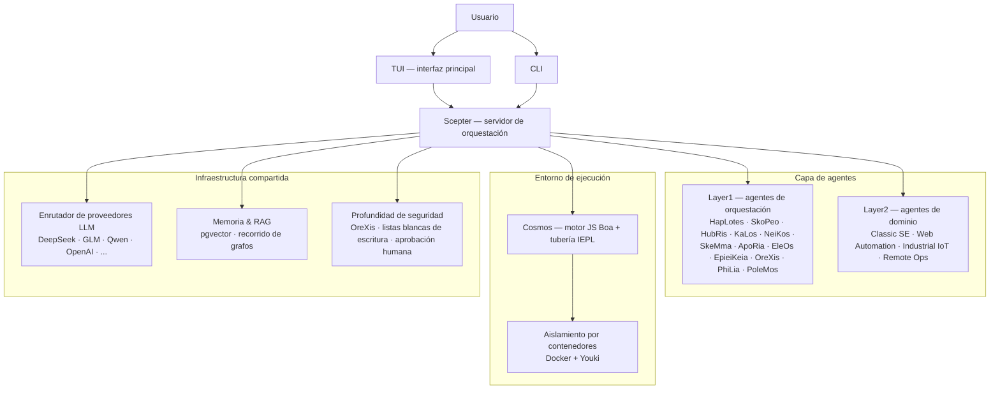

<!-- markdownlint-disable MD033 MD041 MD036 -->
<div align="center">


# Entelecheia

**Plataforma de colaboración multi-agente para control industrial con IA**

[](LICENSE)
[](https://github.com/celestia-island/entelecheia)

</div>

<div align="center">

[English](https://github.com/celestia-island/docs.celestia.world/blob/master/docs/en/guides/core/README-entelecheia.md) &bull; [Deutsch](https://github.com/celestia-island/docs.celestia.world/blob/master/docs/de/guides/core/README-entelecheia.md) &bull; [简体中文](https://github.com/celestia-island/docs.celestia.world/blob/master/docs/zhs/guides/core/README-entelecheia.md) &bull; [繁體中文](https://github.com/celestia-island/docs.celestia.world/blob/master/docs/zht/guides/core/README-entelecheia.md) &bull; [日本語](https://github.com/celestia-island/docs.celestia.world/blob/master/docs/ja/guides/core/README-entelecheia.md) &bull; [한국어](https://github.com/celestia-island/docs.celestia.world/blob/master/docs/ko/guides/core/README-entelecheia.md) &bull; [Français](https://github.com/celestia-island/docs.celestia.world/blob/master/docs/fr/guides/core/README-entelecheia.md) &bull; **Español** &bull; [Português](https://github.com/celestia-island/docs.celestia.world/blob/master/docs/pt/guides/core/README-entelecheia.md) &bull; [Русский](https://github.com/celestia-island/docs.celestia.world/blob/master/docs/ru/guides/core/README-entelecheia.md) &bull; [العربية](https://github.com/celestia-island/docs.celestia.world/blob/master/docs/ar/guides/core/README-entelecheia.md)

</div>

> Parte del ecosistema [celestia-island](https://github.com/celestia-island).

## Descripción general

Entelecheia es una plataforma multi-agente de microkernel de solo ejecución. El LLM solo ve un puñado de herramientas primitivas (`exec`, `write_to_var`, `write_to_var_json`) — todo el trabajo real ocurre dentro de la tubería TypeScript IEPL, donde el código de los agentes despacha a una amplia superficie de herramientas MCP a través de múltiples agentes mediante importaciones de módulos ES.

La plataforma está diseñada para el **control industrial de seguridad crítica**: compatibilidad de protocolos entre proveedores (Modbus, S7comm, OPC UA), profundidad de seguridad multicapa (revisión de instrucciones → ejecución en sandbox → validación de políticas → confirmación humana → pista de auditoría) y ejecución de tareas aisladas en contenedores.

**Versión 0.2.0** — desarrollo temprano. La TUI es la interfaz principal; la WebUI reside en el repositorio hermano [shittim-chest](https://github.com/celestia-island/shittim-chest).

### Características principales

- **Microkernel de solo ejecución**: la superficie de herramientas del modelo está deliberadamente restringida a unas pocas primitivas. La invocación de herramientas ocurre dentro del entorno de ejecución mediante importaciones de módulos JavaScript, no mediante vinculación directa LLM-herramienta — lo que dificulta estructuralmente los ataques de inyección de prompt.
- **Agentes en capas**: una docena de agentes de orquestación Layer1 (HapLotes, SkoPeo, HubRis, KaLos, NeiKos, SkeMma, ApoRia, EleOs, EpieiKeia, OreXis, PhiLia, PoleMos) más agentes de dominio (automatización web, ingeniería de software clásica, IoT industrial, operaciones remotas). Sin stubs `todo!()` o `unimplemented!()` en el código fuente.
- **Profundidad de seguridad**: cada llamada de herramienta que toca dispositivos físicos pasa por OreXis — el agente centinela de seguridad. Listas blancas de direcciones de escritura, niveles de aprobación humana para operaciones de emergencia y registro de auditoría de cadena completa.
- **Aislamiento por contenedores**: entorno de ejecución de dos niveles (orquestación externa Docker/Podman + sandbox interno Youki/libcontainer). Cada cadena de habilidades se ejecuta en un contenedor aislado con límites de recursos, perfiles seccomp y control de salida de red.
- **Enrutamiento LLM multi-proveedor**: numerosas configuraciones de proveedores (DeepSeek, Zhipu GLM, Qwen, OpenAI, Anthropic, Google y más) con conmutación por error automática, seguimiento de límites de tasa y selección de modelos por niveles (Deep/Normal/Basic).
- **Auto-iteración**: el demonio de control de crucero YOLO ejecuta cadenas de habilidades periódicas para análisis automático de código, correcciones clippy, consolidación de memoria y auditorías de seguridad — con redes de seguridad de punto de control/reversión Git.

## Inicio rápido

**Linux / macOS:**

```bash
curl -fsSL https://raw.githubusercontent.com/celestia-island/entelecheia/main/scripts/deploy/install.sh | bash
```

**Windows (WSL2):**

```powershell
irm https://raw.githubusercontent.com/celestia-island/entelecheia/main/scripts/deploy/install.ps1 | iex
```

**Desde el código fuente:**

```bash
git clone https://github.com/celestia-island/entelecheia.git
cd entelecheia
just bootstrap    # instalar dependencias, construir el espacio de trabajo, generar configuración
just dev          # lanzar la TUI (gestiona la orquestación de Docker/servicios)
```

Requisitos previos: Rust 1.85+ (edición 2024), Docker, ejecutor de tareas `just`.

**Modo de base de datos embebida** (no requiere PostgreSQL externo):

```bash
just local         # scepter con pglite embebido
```

## Agentes

| Agente | Rol |
|-------|------|
| **HapLotes** | Puente de comunicación entre Scepter y Cosmos |
| **SkoPeo** | Coordinación central — orquestación de objetivos/pistas/tareas |
| **HubRis** | Motor de planificación — descomposición de tareas, gestión de TODO |
| **KaLos** | Puerta de enlace de E/S de archivos — operaciones atómicas y conscientes de conflictos |
| **NeiKos** | Entorno de ejecución de contenedores — crear, bifurcar, instantánea, ejecutar |
| **SkeMma** | Entorno de ejecución JavaScript — motor Boa, ejecución IEPL |
| **ApoRia** | Hub LLM y almacenamiento de conocimiento — base de datos vectorial RAG, detección de anomalías |
| **EleOs** | Puerta de enlace de información externa — obtención web, búsqueda web |
| **EpieiKeia** | Orquestación temporal — programación, entrega de mensajes, observadores de archivos |
| **OreXis** | Centinela de seguridad — control de herramientas, seguridad de escritura, auditoría de cumplimiento, alarmas |
| **PhiLia** | Nexus de memoria y protocolo — memorias vectoriales, recorrido de grafos, calidad de datos |
| **PoleMos** | Computación en el borde y gestión de dispositivos — acceso a archivos/comandos del host, información de hardware |
| **Classic SE** | Generación de código, análisis estático, refactorización, integración LSP |
| **Web Automation** | Control de navegador — WebDriver, navegación, capturas de pantalla, entrada |
| **Industrial IoT** | Protocolos industriales — Modbus, S7comm, OPC UA, descubrimiento serie |
| **Remote Ops** | SSH, terminales remotos, automatización GUI, transferencia de archivos |

## Arquitectura



El LLM nunca llama a las herramientas MCP directamente. En su lugar, genera código TypeScript que importa módulos de agente (`import { file_read } from 'kalos'`). La tubería IEPL transpila esto a JavaScript (SWC), lo ejecuta en el motor Boa y enruta los despachos nativos a través del enrutador MCP — con disyuntor, reintento y aplicación de políticas de seguridad en cada paso.

## Documentación

La arquitectura completa, las decisiones de diseño y las guías están en **[docs.celestia.world](https://docs.celestia.world)**:

- **[Descripción general de la arquitectura](https://docs.celestia.world/en/designs/core/architecture.html)** — verificación de componentes, capas de crate, estado de implementación
- **[Fundamentos](https://docs.celestia.world/en/guides/core/fundamentals.html)** — agentes, superficie de herramientas de solo ejecución, habilidades, niveles
- **[Construcción y despliegue](https://docs.celestia.world/en/guides/core/building.html)** — guía completa de build, instalación, Docker y publicación
- **[Referencia CLI](https://docs.celestia.world/en/guides/core/cli.html)** — todos los comandos y opciones CLI
- **[Desarrollo de herramientas MCP](https://docs.celestia.world/en/guides/core/mcp-tool-development.html)** — cómo añadir nuevas herramientas y agentes
- **[Modelo de seguridad](https://docs.celestia.world/en/meta/security.html)** — autenticación, RBAC, endurecimiento de contenedores
- **[Decisiones de diseño](https://docs.celestia.world/en/designs/core/design-decisions.html)** — índice ADR (microkernel de solo ejecución, motor Boa, pgvector, espacio de trabajo en capas, sandbox de contenedor)

## Licencia

Business Source License 1.1 (BUSL-1.1). El uso comercial requiere una licencia de autorización. El uso no comercial sigue el protocolo SySL-1.0. Se convierte a Apache-2.0 el 01/01/2030.
