# Contribuir a Shittim Chest

¡Gracias por tu interés en contribuir! Esta guía cubre todo lo que necesitas para empezar.

## Política de contribución (lee esto primero)

Shittim Chest es la superficie orientada al usuario de una plataforma que puede controlar sistemas
físicos e industriales, por lo que **la estabilidad y seguridad prevalecen sobre el volumen de
contribuciones**. Por favor, lee esto antes de abrir una pull request.

- **Listón de fusión alto, no es una hoja de ruta pública.** Abrir un PR no implica que será

fusionado. Aceptamos un número deliberadamente pequeño de cambios, y solo cuando
encajan en la arquitectura y pasan la revisión. Es por diseño, no por descortesía.

- **Lo que damos la bienvenida:** informes de errores, correcciones enfocadas, mejoras bien delimitadas en

la **periferia** (plugins IDE, aplicaciones Tauri, integraciones de canal, adaptadores de
proveedor y documentación), y discusiones de diseño previas antes del código.

- **Lo que generalmente no fusionaremos:** grandes reescrituras no solicitadas,

cambios arquitectónicos sin una discusión de diseño previa, PRs masivos "vibe-coded",
cualquier cosa que reduzca el listón de seguridad o corrección del núcleo, y
cambios en el núcleo crítico de seguridad (autenticación, JWT/OAuth, enrutamiento LLM, validación
de webhooks, RBAC) sin una invitación explícita y revisión extendida.

- **Núcleo vs. periferia.** El backend central y el modelo auth/RBAC se mantienen con el

listón más estricto y son mantenidos principalmente por el equipo central. La periferia
(frontends, aplicaciones IDE/móviles, conectores de canal) es donde las contribuciones
externas son más útiles y más probablemente aceptadas.

- **CLA requerido.** Cada contribución aceptada requiere un Acuerdo de Licencia del

Contribuyente firmado. Ver [`CLA.md`](../meta/cla.md). Los commits deben incluir una
línea `Signed-off-by` (`git commit -s`).

> **La licencia puede abrirse; el listón de fusión no.** El **2030-01-01** este
> proyecto se convierte de BUSL-1.1 a la Synthetic Source License (SySL-1.0) — ver
> [`LICENSE`](LICENSE). Eso amplía *lo que puedes hacer con el código*; **no**
> reduce el listón de revisión, elimina el CLA, ni significa que aceptemos más PRs. La
> política de contribución no cambia antes ni después de la fecha de cambio.

## Seguridad

**No** abras issues públicos para vulnerabilidades de seguridad. Repórtalas de forma privada
mediante [Avisos de Seguridad de GitHub](https://github.com/celestia-island/shittim-chest/security/advisories/new).
Ver [`SECURITY.md`](../meta/security.md).

## Código de Conducta

Sé respetuoso, constructivo e inclusivo. Seguimos el [Código de Conducta de Rust](https://www.rust-lang.org/policies/code-of-conduct).

## Configuración del Entorno de Desarrollo

### Requisitos Previos

- **Rust** 1.85+ (`rustup default stable`)
- **Node.js** 20+ y **pnpm** 9+
- **just** ejecutor de comandos (`cargo install just`)
- **PostgreSQL** 18+
- Una instancia de [entelecheia](https://github.com/celestia-island/entelecheia) scepter en ejecución en `:8424` (opcional — shittim-chest puede ejecutarse independiente para chat/generación de imágenes)

### Inicio Rápido

```bash
git clone https://github.com/celestia-island/shittim-chest.git
cd shittim-chest
cp .env.example .env
# Edita .env — configura DATABASE_URL, JWT_SECRET, ENCRYPTION_KEY
# Para LLM independiente: configura las variables LLM_DEFAULT_PROVIDER_*
# Para proxy scepter: configura ENTELECHEIA_SCEPTER_URL

 # Stack dev completo (mediante Docker)
 just install  # pre-prepara TODAS las dependencias para builds offline (necesita red una vez:
               #   cargo fetch + pnpm install + resuelve el checkout de arona
               #   con el que este repo comparte scripts devtool)
 just dev      # Inicia postgres + construye + migra + sirve, y vigila cambios
               # (reconstrucción automática frontend/backend; con --mock también reinicia scepter + LLM mock)

 # `just watch` es un alias obsoleto para `just dev` (la vigilancia es el comportamiento por defecto).
 ```

> **Red:** la primera construcción necesita internet (registro cargo, dependencias git, los
> checkouts de arona + entelecheia). Ejecuta `just install` una vez en una máquina
> conectada y las ejecuciones posteriores de `just dev` pueden proceder offline. Los scripts
> Python devtool compartidos (guardián de caché de target, logger, …) residen en el repositorio
> `arona` y se localizan automáticamente mediante la ruta del `[patch]` de cargo, un checkout
> hermano, o un `git clone` de último recurso en `targets/`.

### Desarrollo Independiente (sin entelecheia)

shittim-chest puede ejecutarse independientemente para desarrollo de frontend + chat. Configura esto en `.env`:

```bash
LLM_DEFAULT_PROVIDER_ENDPOINT=https://api.deepseek.com/v1
LLM_DEFAULT_PROVIDER_API_KEY=sk-xxx
LLM_DEFAULT_PROVIDER_MODELS=deepseek-chat,deepseek-reasoner
LLM_DEFAULT_PROVIDER_CATEGORY=chat
```

Luego `just dev` — el chat, la generación de imágenes y la autenticación funcionan sin scepter. Las funciones de proxy y dispositivos mostrarán errores pero no fallarán.

### Dependencias Multi-Proyecto (desarrollo local)

Al trabajar en entelecheia y shittim-chest simultáneamente, configura parches Cargo locales en `~/.cargo/config.toml` para todas las dependencias entre repositorios:

```toml
# ~/.cargo/config.toml

# dependencias de crates.io con anulaciones locales
[patch.crates-io]
libnoa = { path = "/ruta/a/noa" }

# dependencias git con anulaciones locales
[patch."https://github.com/celestia-island/arona.git"]
arona = { path = "/ruta/a/arona" }

[patch."https://github.com/celestia-island/hifumi.git"]
hifumi = { path = "/ruta/a/hifumi/packages/types" }

[patch."https://github.com/celestia-island/evernight.git"]
evernight = { path = "/ruta/a/evernight" }
```

**Nunca commitees `~/.cargo/config.toml` a ningún repositorio.** CI usa referencias git.

## Estructura del Proyecto

```mermaid
flowchart TD
    root["shittim-chest/"] --> pkg["packages/"]
    root --> docs_dir["docs/"]
    root --> scripts_dir["scripts/"]
    root --> cargo_toml["Cargo.toml — raíz del workspace Rust"]
    root --> pkg_json["package.json — raíz del workspace pnpm"]
    root --> pnpm_ws["pnpm-workspace.yaml"]

    pkg --> cli_pkg["cli/ — Wrapper CLI, orquesta servicios Docker"]
    pkg --> sc_pkg["core/ — Backend Rust + Axum"]
    pkg --> webui_pkg["webui/ — Frontend Vue 3 + Vite (TSX)"]
    pkg --> app_pkg["app/"]
    pkg --> ide_pkg["ide/"]

    sc_pkg --> sc_main["main.rs — Punto de entrada CLI (DbInit/Migrate/Reset/Serve)"]
    sc_pkg --> sc_lib["lib.rs — Declaraciones de módulos (33 módulos)"]
    sc_pkg --> sc_config["config.rs — Configuración de entorno"]
    sc_pkg --> sc_auth["auth/ — Inicio de sesión, registro, JWT, OAuth, sesiones"]
    sc_pkg --> sc_api["api.rs — Inicialización del Router + gestión de BD"]
    sc_pkg --> sc_chat["chat/ — Conversaciones, mensajes, streaming SSE/WS"]
    sc_pkg --> sc_llm["llm/ — Cliente LLM, enrutador, gestión de proveedores"]
    sc_pkg --> sc_gen["generation/ — Generación de imágenes"]
    sc_pkg --> sc_webhook["webhook.rs — Webhooks GitHub/GitLab/Gitee/personalizado"]
    sc_pkg --> sc_devices["devices/ — Gestión de dispositivos remotos + señalización"]
    sc_pkg --> sc_channel["channel/ — Integraciones de canal de 12 plataformas"]
    sc_pkg --> sc_proxy["proxy/ — Puente HTTP/WS de Scepter"]
    sc_pkg --> sc_entity["entity/ — Modelos de entidad SeaORM (25 tablas)"]
    sc_pkg --> sc_migration["migration/ — Migraciones de base de datos (5)"]
    sc_pkg --> sc_static["static_files.rs"]
    sc_pkg --> sc_cargo["Cargo.toml"]

    webui_pkg --> webui_views["views/ — demiurge (chat), auth, admin, topology, holographic"]
    webui_pkg --> webui_comp["components/ — base/ (50+ sistema de diseño S-), chat/, layout/, preview/, ..."]
    webui_pkg --> webui_stores["stores/ — Stores Pinia"]
    webui_pkg --> webui_composables["composables/ — useChatStream, useSceneManager, ..."]
    webui_pkg --> webui_i18n["i18n/ — vue-i18n, 11 idiomas, 17 archivos de namespace por locale"]
    webui_pkg --> webui_api["api/ — Módulos de cliente API"]
    webui_pkg --> webui_types["types/ — Tipos TypeScript"]

    app_pkg --> app_tauri["tauri/ — App de escritorio Tauri"]
    app_pkg --> app_shared["tauri_shared/ — DTOs compartidos para apps Tauri"]
    app_pkg --> app_mobile["tauri_mobile/ — App móvil Tauri"]
    app_pkg --> app_harmony["harmony/ — App HarmonyOS (ArkTS)"]

    ide_pkg --> ide_vscode["vscode/ — Extensión VS Code (TypeScript)"]
    ide_pkg --> ide_idea["idea/ — Plugin IntelliJ (Kotlin)"]
    ide_pkg --> ide_zed["zed/ — Extensión Zed (Rust)"]
    ide_pkg --> ide_neovim["neovim/ — Plugin Neovim (Lua)"]
    ide_pkg --> ide_lsp["lsp-bridge/ — Puente LSP (Rust)"]
    ide_pkg --> ide_e2e["e2e/ — Pruebas E2E compartidas (TypeScript)"]

    docs_dir --> docs_guides["guides/ — Documentación multi-idioma (en, zhs, zht, ja, ko, fr, es, ru)"]

    scripts_dir --> scripts_images["images/ — Dockerfile"]
    scripts_dir --> scripts_utils["utils/ — Scripts de utilidad Python"]
```



## Estilo de Código

### Rust

```bash
cargo fmt                  # auto-formatear
cargo clippy               # lint
cargo clippy --fix         # auto-corregir
```

- Sigue las convenciones estándar de Rust (`snake_case` para funciones/variables, CamelCase para tipos)
- Usa `workspace = true` para versiones de dependencias compartidas en archivos `Cargo.toml` de crate
- Manejo de errores: usa `anyhow::Result` para código de aplicación, `thiserror` para tipos de error de crate de biblioteca

### TypeScript / Vue

```bash
pnpm -r lint               # ESLint en todos los paquetes
pnpm -r typecheck          # Verificación estricta de TypeScript
pnpm -r build              # Verificar build de producción
```

- Vue 3 con TSX (`defineComponent`, `@vitejs/plugin-vue-jsx`)
- TypeScript en modo estricto
- Pinia para gestión de estado
- Sigue los patrones existentes en `webui/`

### i18n

Al añadir cadenas de UI en el webui, usa la función `t()` de `vue-i18n` mediante `packages/webui/src/i18n/`:

```ts
import { t } from '@/i18n'
// En plantilla: {t('key.name')}
// Con argumentos: {t('msg.toolCalls', count, count > 1 ? t('msg.toolCalls.plural') : '')}
```

Los archivos de locale se organizan como 17 archivos JSON de namespace por idioma bajo `i18n/locales/{lang}/` (admin, auth, chat, cmd, common, devices, errors, footer, help, logs, models, reports, skills, timeline, tokenUsage, tools, workspace). Al añadir una clave, agrégala a los 11 locales soportados: `ar`, `de`, `en`, `es`, `fr`, `ja`, `ko`, `pt`, `ru`, `zhs`, `zht`.

### Convenciones de Nombrado

Todos los nombres de directorio bajo `packages/` usan **`snake_case`**:

| Tipo | Convención | Ejemplo |
| --- | --- | --- |
| Directorio de crate Rust | snake_case | `core/` |
| Nombre de crate Rust | snake_case | `core` |

## Comandos del Justfile

```bash
just                       # listar todos los comandos
just dev                   # stack dev completo mediante Docker (postgres + backend), vigilando cambios
just dev --clean           # inicio limpio (eliminar volúmenes, .env, reiniciar)
just dev --mock            # stack mock completo (scepter real + LLM mock) + backend, vigilando;
                           # el scepter/LLM mock se reconstruyen+reinician frescos en cada ejecución
just up                    # construir e iniciar todos los servicios en Docker
just down                  # detener todos los servicios
just down --clean          # detener y eliminar volúmenes
just migrate               # ejecutar migraciones pendientes dentro del contenedor
just logs                  # transmitir logs de todos los contenedores
just status                # verificar estado de los servicios
just watch                 # (alias obsoleto para `just dev`)
just build                 # construir binario release
just build-frontend        # construir solo frontends Vue
just build-release         # construir frontend + binario release con frontend incrustado
just test                  # ejecutar todas las pruebas
just lint                  # lint todo (cargo clippy + eslint)
just fmt                   # auto-formatear todo
just clean                 # limpiar artefactos de build
```

## Proceso de Pull Request

1. Crea una rama de funcionalidad desde `dev`: `git checkout -b feat/mi-funcionalidad dev`
1. Haz cambios con commits claros y atómicos
1. Ejecuta `just lint && just test` antes de hacer push
1. Abre un PR contra la rama `dev`
1. Asegúrate de que CI pase (build Rust, build npm, lint)

## Convención de Commits

Usa [Conventional Commits](https://www.conventionalcommits.org/):

```text
feat(auth): añadir endpoint de inicio de sesión con contraseña
fix(proxy): manejar reconexión WebSocket
docs(readme): añadir logo e insignias
refactor(config): extraer carga de variables de entorno
chore(deps): actualizar axum a 0.8
```

## Licencia y CLA

Shittim Chest está licenciado bajo la **Business Source License 1.1 (BUSL-1.1)**
con una **Fecha de Cambio del 2030-01-01**, en la cual se convierte a la
**Synthetic Source License (SySL-1.0)**. Para todo uso interno, académico, gubernamental,
educativo y no comercial ya es equivalente a SySL-1.0
hoy (ver la Concesión de Uso Adicional en [`LICENSE`](LICENSE)). Los usos comerciales
restringidos (alojamiento, reventa o rebranding como servicio) requieren una licencia
comercial separada hasta la Fecha de Cambio.

Al contribuir, aceptas que tus contribuciones se licencian bajo la
licencia del proyecto y que firmas el CLA ([`CLA.md`](../meta/cla.md)). El CLA concede
al proyecto una licencia permisiva **incluyendo el derecho de relicenciar**, para que el
proyecto pueda mantener su ruta BUSL→SySL y adaptar su licenciamiento en el futuro.
