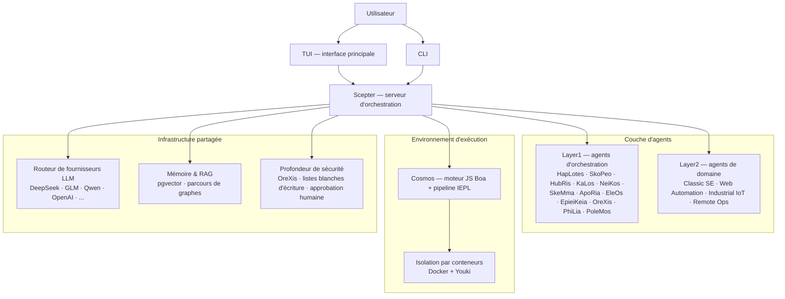

<!-- markdownlint-disable MD033 MD041 MD036 -->
<div align="center">


# Entelecheia

**Plateforme de collaboration multi-agents pour le contrôle industriel par IA**

[](LICENSE)
[](https://github.com/celestia-island/entelecheia)

</div>

<div align="center">

[English](https://github.com/celestia-island/docs.celestia.world/blob/master/docs/en/guides/core/README-entelecheia.md) &bull; [Deutsch](https://github.com/celestia-island/docs.celestia.world/blob/master/docs/de/guides/core/README-entelecheia.md) &bull; [简体中文](https://github.com/celestia-island/docs.celestia.world/blob/master/docs/zhs/guides/core/README-entelecheia.md) &bull; [繁體中文](https://github.com/celestia-island/docs.celestia.world/blob/master/docs/zht/guides/core/README-entelecheia.md) &bull; [日本語](https://github.com/celestia-island/docs.celestia.world/blob/master/docs/ja/guides/core/README-entelecheia.md) &bull; [한국어](https://github.com/celestia-island/docs.celestia.world/blob/master/docs/ko/guides/core/README-entelecheia.md) &bull; **Français** &bull; [Español](https://github.com/celestia-island/docs.celestia.world/blob/master/docs/es/guides/core/README-entelecheia.md) &bull; [Português](https://github.com/celestia-island/docs.celestia.world/blob/master/docs/pt/guides/core/README-entelecheia.md) &bull; [Русский](https://github.com/celestia-island/docs.celestia.world/blob/master/docs/ru/guides/core/README-entelecheia.md) &bull; [العربية](https://github.com/celestia-island/docs.celestia.world/blob/master/docs/ar/guides/core/README-entelecheia.md)

</div>

> Fait partie de l'écosystème [celestia-island](https://github.com/celestia-island).

## Aperçu

Entelecheia est une plateforme multi-agents à micro-noyau en exécution seule. Le LLM ne voit qu'une poignée d'outils primitifs (`exec`, `write_to_var`, `write_to_var_json`) — tout le travail réel se déroule à l'intérieur du pipeline TypeScript IEPL, où le code des agents accède à une vaste surface d'outils MCP répartis sur plusieurs agents via des imports de modules ES.

La plateforme est conçue pour le **contrôle industriel critique en matière de sécurité** : compatibilité de protocoles multi-fournisseurs (Modbus, S7comm, OPC UA), profondeur de sécurité multicouche (examen des instructions → exécution en sandbox → validation des politiques → confirmation humaine → piste d'audit) et exécution de tâches en conteneurs isolés.

**Version 0.2.0** — développement précoce. La TUI est l'interface principale ; l'interface Web se trouve dans le dépôt frère [shittim-chest](https://github.com/celestia-island/shittim-chest).

### Fonctionnalités clés

- **Micro-noyau en exécution seule** : la surface d'outils du modèle est délibérément restreinte à quelques primitives. L'invocation d'outils se produit à l'intérieur de l'environnement d'exécution via des imports de modules JavaScript, et non par liaison directe LLM-outil — rendant les attaques par injection de prompt structurellement plus difficiles.
- **Agents en couches** : une douzaine d'agents d'orchestration Layer1 (HapLotes, SkoPeo, HubRis, KaLos, NeiKos, SkeMma, ApoRia, EleOs, EpieiKeia, OreXis, PhiLia, PoleMos) ainsi que des agents de domaine (automatisation web, génie logiciel classique, IoT industriel, opérations à distance). Aucun stub `todo!()` ou `unimplemented!()` dans le code source.
- **Profondeur de sécurité** : chaque appel d'outil qui touche des périphériques physiques passe par OreXis — l'agent sentinelle de sécurité. Listes blanches d'adresses d'écriture, niveaux d'approbation humaine pour les opérations d'urgence et journalisation d'audit complète.
- **Isolation par conteneurs** : environnement d'exécution à deux niveaux (orchestration externe Docker/Podman + sandbox interne Youki/libcontainer). Chaque chaîne de compétences s'exécute dans un conteneur isolé avec des limites de ressources, des profils seccomp et un contrôle de sortie réseau.
- **Routage LLM multi-fournisseurs** : nombreuses configurations de fournisseurs (DeepSeek, Zhipu GLM, Qwen, OpenAI, Anthropic, Google et plus) avec basculement automatique, suivi des limites de débit et sélection de modèles par niveau (Deep/Normal/Basic).
- **Auto-itération** : le démon de régulation YOLO exécute des chaînes de compétences périodiques pour l'analyse automatique du code, les corrections clippy, la consolidation de la mémoire et les audits de sécurité — avec des filets de sécurité de point de contrôle/retour en arrière Git.

## Démarrage rapide

**Linux / macOS :**

```bash
curl -fsSL https://raw.githubusercontent.com/celestia-island/entelecheia/main/scripts/deploy/install.sh | bash
```

**Windows (WSL2) :**

```powershell
irm https://raw.githubusercontent.com/celestia-island/entelecheia/main/scripts/deploy/install.ps1 | iex
```

**Depuis les sources :**

```bash
git clone https://github.com/celestia-island/entelecheia.git
cd entelecheia
just bootstrap    # installer les dépendances, construire l'espace de travail, générer la configuration
just dev          # lancer la TUI (gère l'orchestration Docker/service)
```

Prérequis : Rust 1.85+ (édition 2024), Docker, exécuteur de tâches `just`.

**Mode base de données embarquée** (aucun PostgreSQL externe requis) :

```bash
just local         # scepter avec pglite embarqué
```

## Agents

| Agent | Rôle |
|-------|------|
| **HapLotes** | Pont de communication entre Scepter et Cosmos |
| **SkoPeo** | Coordination centrale — orchestration objectif/piste/tâche |
| **HubRis** | Moteur de planification — décomposition de tâches, gestion des TODO |
| **KaLos** | Passerelle d'E/S fichier — opérations atomiques et conscientes des conflits |
| **NeiKos** | Environnement d'exécution de conteneurs — créer, forker, snapshot, exécuter |
| **SkeMma** | Environnement d'exécution JavaScript — moteur Boa, exécution IEPL |
| **ApoRia** | Hub LLM et stockage de connaissances — base vectorielle RAG, détection d'anomalies |
| **EleOs** | Passerelle d'informations externes — récupération web, recherche web |
| **EpieiKeia** | Orchestration temporelle — planification, livraison de messages, observateurs de fichiers |
| **OreXis** | Sentinelle de sécurité — contrôle d'outils, sécurité d'écriture, audit de conformité, alarmes |
| **PhiLia** | Nexus mémoire et protocole — mémoires vectorielles, parcours de graphes, qualité des données |
| **PoleMos** | Informatique en périphérie et gestion des appareils — accès aux fichiers/commandes hôte, informations matérielles |
| **Classic SE** | Génération de code, analyse statique, refactorisation, intégration LSP |
| **Web Automation** | Contrôle de navigateur — WebDriver, navigation, captures d'écran, saisie |
| **Industrial IoT** | Protocoles industriels — Modbus, S7comm, OPC UA, découverte série |
| **Remote Ops** | SSH, terminaux distants, automatisation GUI, transfert de fichiers |

## Architecture



Le LLM n'appelle jamais les outils MCP directement. Au lieu de cela, il génère du code TypeScript qui importe des modules d'agent (`import { file_read } from 'kalos'`). Le pipeline IEPL transpile ce code en JavaScript (SWC), l'exécute dans le moteur Boa et achemine les appels natifs via le routeur MCP — avec disjoncteur, nouvelle tentative et application des politiques de sécurité à chaque étape.

## Documentation

L'architecture complète, les décisions de conception et les guides sont disponibles sur **[docs.celestia.world](https://docs.celestia.world)** :

- **[Aperçu de l'architecture](https://docs.celestia.world/en/designs/core/architecture.html)** — vérification de la réalité des composants, couches de crate, état d'implémentation
- **[Fondamentaux](https://docs.celestia.world/en/guides/core/fundamentals.html)** — agents, surface d'outils en exécution seule, compétences, niveaux
- **[Construction et déploiement](https://docs.celestia.world/en/guides/core/building.html)** — guide complet de build, installation, Docker et publication
- **[Référence CLI](https://docs.celestia.world/en/guides/core/cli.html)** — toutes les commandes et options CLI
- **[Développement d'outils MCP](https://docs.celestia.world/en/guides/core/mcp-tool-development.html)** — comment ajouter de nouveaux outils et agents
- **[Modèle de sécurité](https://docs.celestia.world/en/meta/security.html)** — authentification, RBAC, durcissement des conteneurs
- **[Décisions de conception](https://docs.celestia.world/en/designs/core/design-decisions.html)** — index ADR (micro-noyau en exécution seule, moteur Boa, pgvector, espace de travail en couches, sandbox de conteneur)

## Licence

Business Source License 1.1 (BUSL-1.1). L'utilisation commerciale nécessite une licence d'autorisation. L'utilisation non commerciale suit le protocole SySL-1.0. Convertie en Apache-2.0 le 01/01/2030.
