# Contribuer à Shittim Chest

Merci de votre intérêt pour contribuer ! Ce guide couvre tout ce dont vous avez besoin pour commencer.

## Politique de contribution (lisez ceci en premier)

Shittim Chest est la surface utilisateur d'une plateforme qui peut piloter des systèmes
physiques et industriels, donc **la stabilité et la sécurité priment sur le débit
de contribution**. Veuillez lire ceci avant d'ouvrir une pull request.

- **Barre de fusion élevée, pas une feuille de route publique.** Ouvrir une PR n'implique pas qu'elle sera

fusionnée. Nous acceptons un nombre délibérément restreint de modifications, et seulement lorsqu'elles
correspondent à l'architecture et passent la revue. C'est par conception, pas par impolitesse.

- **Ce que nous accueillons :** rapports de bugs, correctifs ciblés, améliorations bien délimitées de

la **périphérie** (plugins IDE, applications Tauri, intégrations de canaux, adaptateurs
de fournisseurs et documentation), et discussions de conception préalables avant le code.

- **Ce que nous ne fusionnerons généralement pas :** réécritures massives non sollicitées,

changements architecturaux sans discussion de conception préalable, PR « vibe-codées »
en masse, tout ce qui abaisse la barre de sécurité ou de justesse du cœur, et
les modifications du cœur critique pour la sécurité (auth, JWT/OAuth, routage LLM, validation
webhook, RBAC) sans invitation explicite et revue approfondie.

- **Cœur vs. périphérie.** Le backend cœur et le modèle auth/RBAC sont tenus à la

barre la plus stricte et maintenus principalement par l'équipe cœur. La périphérie
(frontends, applications IDE/mobile, connecteurs de canaux) est là où les contributions
externes sont les plus utiles et les plus susceptibles d'être acceptées.

- **CLA requis.** Chaque contribution acceptée nécessite un Accord de Licence du Contributeur

signé. Voir [`CLA.md`](../meta/cla.md). Les commits doivent porter une
ligne `Signed-off-by` (`git commit -s`).

> **La licence peut s'ouvrir ; la barre de fusion ne le fera pas.** Le **2030-01-01** ce
> projet passe de BUSL-1.1 à la Synthetic Source License (SySL-1.0) — voir
> [`LICENSE`](LICENSE). Cela élargit *ce que vous pouvez faire avec le code* ; cela n'abaisse
> **pas** la barre de revue, ne supprime pas le CLA, et ne signifie pas que nous acceptons plus de PR. La
> politique de contribution est inchangée avant et après la date de changement.

## Sécurité

N'ouvrez **pas** de tickets publics pour les vulnérabilités de sécurité. Signalez-les en privé
via [les Avis de Sécurité GitHub](https://github.com/celestia-island/shittim-chest/security/advisories/new).
Voir [`SECURITY.md`](../meta/security.md).

## Code de Conduite

Soyez respectueux, constructif et inclusif. Nous suivons le [Code de Conduite Rust](https://www.rust-lang.org/policies/code-of-conduct).

## Configuration de l'Environnement de Développement

### Prérequis

- **Rust** 1.85+ (`rustup default stable`)
- **Node.js** 20+ et **pnpm** 9+
- **just** command runner (`cargo install just`)
- **PostgreSQL** 18+
- Une instance scepter [entelecheia](https://github.com/celestia-island/entelecheia) en cours d'exécution sur `:8424` (optionnel — shittim-chest peut fonctionner en autonome pour le chat/la génération d'images)

### Démarrage Rapide

```bash
git clone https://github.com/celestia-island/shittim-chest.git
cd shittim-chest
cp .env.example .env
# Modifier .env — définir DATABASE_URL, JWT_SECRET, ENCRYPTION_KEY
# Pour LLM autonome : définir les variables LLM_DEFAULT_PROVIDER_*
# Pour le proxy scepter : définir ENTELECHEIA_SCEPTER_URL

 # Pile de développement complète (via Docker)
 just install  # pré-stocker TOUTES les dépendances pour les builds hors ligne (nécessite réseau une fois :
                #   cargo fetch + pnpm install + résout le checkout arona
                #   avec lequel ce dépôt partage les scripts devtool)
 just dev      # Démarre postgres + construit + migre + sert, et surveille les modifications
               # (reconstruction automatique frontend/backend ; avec --mock redémarre aussi scepter + LLM simulé)

 # `just watch` est un alias déprécié pour `just dev` (la surveillance est le défaut).
 ```

> **Réseau :** le premier build nécessite internet (registre cargo, dépendances git, les
> checkouts arona + entelecheia). Exécutez `just install` une fois sur une machine
> connectée et les exécutions suivantes de `just dev` peuvent se faire hors ligne. Les
> scripts devtool Python partagés (garde de cache cible, logger, …) résident dans le dépôt `arona`
> et sont localisés automatiquement via le chemin cargo `[patch]`, un checkout
> frère, ou un `git clone` de dernier recours dans `targets/`.

### Développement Autonome (sans entelecheia)

shittim-chest peut fonctionner indépendamment pour le développement frontend + chat. Définissez ceci dans `.env` :

```bash
LLM_DEFAULT_PROVIDER_ENDPOINT=https://api.deepseek.com/v1
LLM_DEFAULT_PROVIDER_API_KEY=sk-xxx
LLM_DEFAULT_PROVIDER_MODELS=deepseek-chat,deepseek-reasoner
LLM_DEFAULT_PROVIDER_CATEGORY=chat
```

Puis `just dev` — le chat, la génération d'images et l'authentification fonctionnent sans scepter. Les fonctionnalités de proxy et de périphériques afficheront des erreurs mais ne planteront pas.

### Dépendances Inter-Projets (dév local)

Lorsque vous travaillez simultanément sur entelecheia et shittim-chest, configurez les patches Cargo locaux dans `~/.cargo/config.toml` pour toutes les dépendances inter-dépôts :

```toml
# ~/.cargo/config.toml

# Dépendances crates.io avec surcharges locales
[patch.crates-io]
libnoa = { path = "/path/to/noa" }

# Dépendances git avec surcharges locales
[patch."https://github.com/celestia-island/arona.git"]
arona = { path = "/path/to/arona" }

[patch."https://github.com/celestia-island/hifumi.git"]
hifumi = { path = "/path/to/hifumi/packages/types" }

[patch."https://github.com/celestia-island/evernight.git"]
evernight = { path = "/path/to/evernight" }
```

**Ne commitez jamais `~/.cargo/config.toml` dans un dépôt.** La CI utilise les références git.

## Structure du Projet

```mermaid
flowchart TD
    root["shittim-chest/"] --> pkg["packages/"]
    root --> docs_dir["docs/"]
    root --> scripts_dir["scripts/"]
    root --> cargo_toml["Cargo.toml — racine workspace Rust"]
    root --> pkg_json["package.json — racine workspace pnpm"]
    root --> pnpm_ws["pnpm-workspace.yaml"]

    pkg --> cli_pkg["cli/ — Wrapper CLI, orchestre les services Docker"]
    pkg --> sc_pkg["core/ — Backend Rust + Axum"]
    pkg --> webui_pkg["webui/ — Frontend Vue 3 + Vite (TSX)"]
    pkg --> app_pkg["app/"]
    pkg --> ide_pkg["ide/"]

    sc_pkg --> sc_main["main.rs — Point d'entrée CLI (DbInit/Migrate/Reset/Serve)"]
    sc_pkg --> sc_lib["lib.rs — Déclarations de modules (33 modules)"]
    sc_pkg --> sc_config["config.rs — Configuration d'environnement"]
    sc_pkg --> sc_auth["auth/ — Connexion, inscription, JWT, OAuth, sessions"]
    sc_pkg --> sc_api["api.rs — Bootstrap du routeur + gestion DB"]
    sc_pkg --> sc_chat["chat/ — Conversations, messages, streaming SSE/WS"]
    sc_pkg --> sc_llm["llm/ — Client LLM, routeur, gestion des fournisseurs"]
    sc_pkg --> sc_gen["generation/ — Génération d'images"]
    sc_pkg --> sc_webhook["webhook.rs — Webhooks GitHub/GitLab/Gitee/personnalisés"]
    sc_pkg --> sc_devices["devices/ — Gestion de périphériques distants + signalisation"]
    sc_pkg --> sc_channel["channel/ — Intégrations de canaux 12 plateformes"]
    sc_pkg --> sc_proxy["proxy/ — Pont HTTP/WS Scepter"]
    sc_pkg --> sc_entity["entity/ — Modèles d'entité SeaORM (25 tables)"]
    sc_pkg --> sc_migration["migration/ — Migrations de base de données (5)"]
    sc_pkg --> sc_static["static_files.rs"]
    sc_pkg --> sc_cargo["Cargo.toml"]

    webui_pkg --> webui_views["views/ — demiurge (chat), auth, admin, topology, holographic"]
    webui_pkg --> webui_comp["components/ — base/ (50+ S-design-system), chat/, layout/, preview/, ..."]
    webui_pkg --> webui_stores["stores/ — Stores Pinia"]
    webui_pkg --> webui_composables["composables/ — useChatStream, useSceneManager, ..."]
    webui_pkg --> webui_i18n["i18n/ — vue-i18n, 11 langues, 17 fichiers namespace par locale"]
    webui_pkg --> webui_api["api/ — Modules client API"]
    webui_pkg --> webui_types["types/ — Types TypeScript"]

    app_pkg --> app_tauri["tauri/ — Application de bureau Tauri"]
    app_pkg --> app_shared["tauri_shared/ — DTOs partagés pour applis Tauri"]
    app_pkg --> app_mobile["tauri_mobile/ — Application mobile Tauri"]
    app_pkg --> app_harmony["harmony/ — Application HarmonyOS (ArkTS)"]

    ide_pkg --> ide_vscode["vscode/ — Extension VS Code (TypeScript)"]
    ide_pkg --> ide_idea["idea/ — Plugin IntelliJ (Kotlin)"]
    ide_pkg --> ide_zed["zed/ — Extension Zed (Rust)"]
    ide_pkg --> ide_neovim["neovim/ — Plugin Neovim (Lua)"]
    ide_pkg --> ide_lsp["lsp-bridge/ — Pont LSP (Rust)"]
    ide_pkg --> ide_e2e["e2e/ — Tests E2E partagés (TypeScript)"]

    docs_dir --> docs_guides["guides/ — Docs multilingues (en, zhs, zht, ja, ko, fr, es, ru)"]

    scripts_dir --> scripts_images["images/ — Dockerfile"]
    scripts_dir --> scripts_utils["utils/ — Scripts utilitaires Python"]
```



## Style de Code

### Rust

```bash
cargo fmt                  # formatage automatique
cargo clippy               # lint
cargo clippy --fix         # correction automatique
```

- Suivre les conventions Rust standard (`snake_case` pour fonctions/variables, CamelCase pour types)
- Utiliser `workspace = true` pour les versions de dépendances partagées dans les fichiers `Cargo.toml` des crates
- Gestion d'erreurs : utiliser `anyhow::Result` pour le code applicatif, `thiserror` pour les types d'erreur des crates bibliothèque

### TypeScript / Vue

```bash
pnpm -r lint               # ESLint sur tous les packages
pnpm -r typecheck          # Vérification stricte TypeScript
pnpm -r build              # Vérifier le build de production
```

- Vue 3 avec TSX (`defineComponent`, `@vitejs/plugin-vue-jsx`)
- Mode strict TypeScript
- Pinia pour la gestion d'état
- Suivre les patterns existants dans `webui/`

### i18n

Lors de l'ajout de chaînes UI dans la webui, utilisez la fonction `t()` de `vue-i18n` via `packages/webui/src/i18n/` :

```ts
import { t } from '@/i18n'
// Dans le template : {t('cle.nom')}
// Avec arguments : {t('msg.toolCalls', count, count > 1 ? t('msg.toolCalls.plural') : '')}
```

Les fichiers de locale sont organisés en 17 fichiers JSON namespace par langue sous `i18n/locales/{lang}/` (admin, auth, chat, cmd, common, devices, errors, footer, help, logs, models, reports, skills, timeline, tokenUsage, tools, workspace). Lors de l'ajout d'une clé, ajoutez-la aux 11 locales supportées : `ar`, `de`, `en`, `es`, `fr`, `ja`, `ko`, `pt`, `ru`, `zhs`, `zht`.

### Conventions de Nommage

Tous les noms de répertoire sous `packages/` utilisent **`snake_case`** :

| Type | Convention | Exemple |
| --- | --- | --- |
| Répertoire de crate Rust | snake_case | `core/` |
| Nom de crate Rust | snake_case | `core` |

## Commandes Justfile

```bash
just                       # lister toutes les commandes
just dev                   # pile de développement complète via Docker (postgres + backend), surveillance des modifications
just dev --clean           # démarrage propre (supprimer volumes, .env, redémarrer)
just dev --mock            # pile simulée complète (vrai scepter + LLM simulé) + backend, surveillance ;
                           # le scepter/LLM simulés sont reconstruits+redémarrés à chaque exécution
just up                    # construire et démarrer tous les services dans Docker
just down                  # arrêter tous les services
just down --clean          # arrêter et supprimer les volumes
just migrate               # exécuter les migrations en attente dans le conteneur
just logs                  # suivre les logs de tous les conteneurs
just status                # vérifier l'état des services
just watch                 # (alias déprécié pour `just dev`)
just build                 # construire le binaire release
just build-frontend        # construire les frontends Vue uniquement
just build-release         # construire frontend + binaire release avec frontend intégré
just test                  # exécuter tous les tests
just lint                  # lint tout (cargo clippy + eslint)
just fmt                   # formatage automatique de tout
just clean                 # nettoyer les artefacts de build
```

## Processus de Pull Request

1. Créer une branche de fonctionnalité depuis `dev` : `git checkout -b feat/ma-fonctionnalite dev`
1. Faire des modifications avec des commits clairs et atomiques
1. Exécuter `just lint && just test` avant de pousser
1. Ouvrir une PR contre la branche `dev`
1. S'assurer que la CI passe (build Rust, build npm, lint)

## Convention de Commit

Utiliser [Conventional Commits](https://www.conventionalcommits.org/) :

```text
feat(auth): ajouter le point de terminaison de connexion par mot de passe
fix(proxy): gérer la reconnexion WebSocket
docs(readme): ajouter le logo et les badges
refactor(config): extraire le chargement des variables d'environnement
chore(deps): mettre à jour axum vers 0.8
```

## Licence & CLA

Shittim Chest est sous **Business Source License 1.1 (BUSL-1.1)**
avec une **Date de Changement au 2030-01-01**, à laquelle il passe à la
**Synthetic Source License (SySL-1.0)**. Pour tout usage interne, académique, gouvernemental,
éducatif et non commercial, il est déjà équivalent à SySL-1.0
aujourd'hui (voir la Concession d'Usage Supplémentaire dans [`LICENSE`](LICENSE)). Les usages
commerciaux restreints (hébergement, revente ou rebranding en tant que service) nécessitent une licence
commerciale séparée jusqu'à la Date de Changement.

En contribuant, vous acceptez que vos contributions soient sous licence du
projet et que vous signez le CLA ([`CLA.md`](../meta/cla.md)). Le CLA accorde
au projet une licence permissive **incluant le droit de re-licencier**, afin que le
projet puisse conserver son chemin BUSL→SySL et adapter sa licence à l'avenir.
