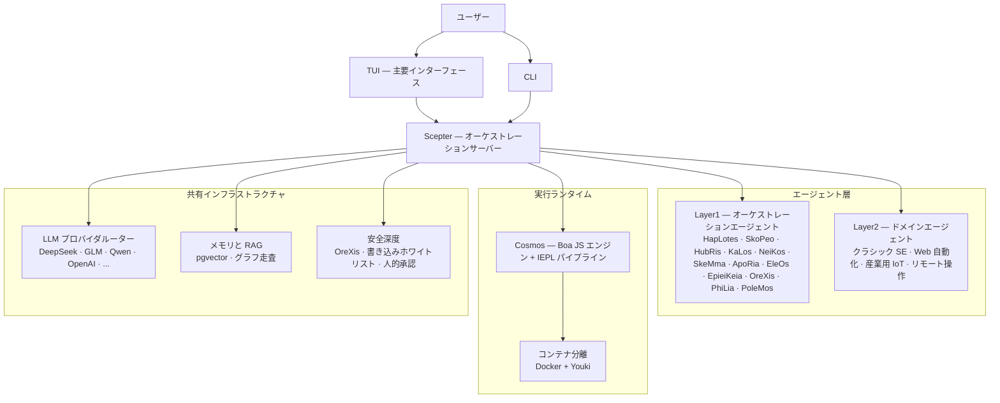

<!-- markdownlint-disable MD033 MD041 MD036 -->
<div align="center">


# Entelecheia

**産業用 AI 制御のためのマルチエージェント協調プラットフォーム**

[](LICENSE)
[](https://github.com/celestia-island/entelecheia)

</div>

<div align="center">

[English](https://github.com/celestia-island/docs.celestia.world/blob/master/docs/en/guides/core/README-entelecheia.md) &bull; [Deutsch](https://github.com/celestia-island/docs.celestia.world/blob/master/docs/de/guides/core/README-entelecheia.md) &bull; [简体中文](https://github.com/celestia-island/docs.celestia.world/blob/master/docs/zhs/guides/core/README-entelecheia.md) &bull; [繁體中文](https://github.com/celestia-island/docs.celestia.world/blob/master/docs/zht/guides/core/README-entelecheia.md) &bull; **日本語** &bull; [한국어](https://github.com/celestia-island/docs.celestia.world/blob/master/docs/ko/guides/core/README-entelecheia.md) &bull; [Français](https://github.com/celestia-island/docs.celestia.world/blob/master/docs/fr/guides/core/README-entelecheia.md) &bull; [Español](https://github.com/celestia-island/docs.celestia.world/blob/master/docs/es/guides/core/README-entelecheia.md) &bull; [Português](https://github.com/celestia-island/docs.celestia.world/blob/master/docs/pt/guides/core/README-entelecheia.md) &bull; [Русский](https://github.com/celestia-island/docs.celestia.world/blob/master/docs/ru/guides/core/README-entelecheia.md) &bull; [العربية](https://github.com/celestia-island/docs.celestia.world/blob/master/docs/ar/guides/core/README-entelecheia.md)

</div>

> [celestia-island](https://github.com/celestia-island) エコシステムの一部です。

## 概要

Entelecheia は exec-only マイクロカーネルのマルチエージェントプラットフォームです。LLM には少数のプリミティブツール（`exec`、`write_to_var`、`write_to_var_json`）のみが公開され、実際の処理はすべて IEPL TypeScript パイプライン内で行われ、エージェントコードが ES モジュールインポートを通じて多数の MCP ツールへディスパッチします。

このプラットフォームは **安全重視の産業用制御** 向けに設計されています：ベンダー間プロトコル互換性（Modbus、S7comm、OPC UA）、多層安全深度（命令レビュー → サンドボックス実行 → ポリシー検証 → 人的承認 → 監査証跡）、そしてコンテナ分離によるタスク実行。

**バージョン 0.2.0** — 初期開発段階。TUI が主要インターフェースで、WebUI は姉妹リポジトリ [shittim-chest](https://github.com/celestia-island/shittim-chest) にあります。

### 主な機能

- **exec-only マイクロカーネル**：モデルに公開されるツール面は少数のプリミティブに意図的に制限されています。ツール呼び出しは JavaScript モジュールインポートを介してランタイム内部で発生し、LLM とツールの直接バインディングではないため、プロンプトインジェクション攻撃を構造的に困難にします。
- **階層型エージェント**：多数の Layer1 オーケストレーションエージェント（HapLotes、SkoPeo、HubRis、KaLos、NeiKos、SkeMma、ApoRia、EleOs、EpieiKeia、OreXis、PhiLia、PoleMos）に加えて、ドメインエージェント（Web 自動化、クラシックソフトウェアエンジニアリング、産業用 IoT、リモート操作）。コードベースに `todo!()` や `unimplemented!()` のスタブはありません。
- **安全深度**：物理デバイスに触れるすべてのツール呼び出しは、OreXis（セキュリティセンチネルエージェント）を通過します。書き込みアドレスホワイトリスト、緊急操作用の人的承認ゲート、完全なチェーン監査ログを備えています。
- **コンテナ分離**：2 層ランタイム（Docker/Podman による外部オーケストレーション + Youki/libcontainer による内部サンドボックス）。各スキルチェーンはリソース制限、seccomp プロファイル、ネットワーク出口制御を備えた分離コンテナ内で実行されます。
- **マルチプロバイダ LLM ルーティング**：多数のプロバイダ設定（DeepSeek、Zhipu GLM、Qwen、OpenAI、Anthropic、Google など）に対応し、自動フェイルオーバー、レート制限追跡、モデル階層選択（Deep/Normal/Basic）を備えています。
- **自己反復**：YOLO クルーズコントロールデーモンが定期的にスキルチェーンを実行し、コード自動分析、clippy 修正、メモリ統合、セキュリティ監査を行います — git チェックポイント／ロールバックの安全ネット付き。

## クイックスタート

**Linux / macOS：**

```bash
curl -fsSL https://raw.githubusercontent.com/celestia-island/entelecheia/main/scripts/deploy/install.sh | bash
```

**Windows (WSL2)：**

```powershell
irm https://raw.githubusercontent.com/celestia-island/entelecheia/main/scripts/deploy/install.ps1 | iex
```

**ソースからビルド：**

```bash
git clone https://github.com/celestia-island/entelecheia.git
cd entelecheia
just bootstrap    # 依存関係のインストール、ワークスペースのビルド、設定の生成
just dev          # TUI を起動（Docker／サービスオーケストレーションを処理）
```

前提条件：Rust 1.85+（edition 2024）、Docker、`just` タスクランナー。

**組み込みデータベースモード**（外部 PostgreSQL 不要）：

```bash
just local         # 組み込み pglite を使用した scepter
```

## エージェント

| エージェント | 役割 |
|-------|------|
| **HapLotes** | Scepter と Cosmos 間の通信ブリッジ |
| **SkoPeo** | 中央調整 — 目標／トラック／タスクのオーケストレーション |
| **HubRis** | 計画エンジン — タスク分解、TODO 管理 |
| **KaLos** | ファイル I/O ゲートウェイ — アトミックで競合認識のあるファイル操作 |
| **NeiKos** | コンテナランタイム — 作成、フォーク、スナップショット、実行 |
| **SkeMma** | JavaScript ランタイム — Boa エンジン、IEPL 実行 |
| **ApoRia** | LLM ハブと知識ストレージ — RAG ベクター DB、異常検知 |
| **EleOs** | 外部情報ゲートウェイ — Web フェッチ、Web 検索 |
| **EpieiKeia** | 時間的オーケストレーション — スケジューリング、メッセージ配信、ファイル監視 |
| **OreXis** | セキュリティセンチネル — ツールゲーティング、書き込み安全性、コンプライアンス監査、アラーム |
| **PhiLia** | メモリとプロトコルのネクサス — ベクターメモリ、グラフ走査、データ品質 |
| **PoleMos** | エッジコンピューティングとデバイス管理 — ホストファイル／コマンドアクセス、ハードウェア情報 |
| **クラシック SE** | コード生成、静的解析、リファクタリング、LSP 統合 |
| **Web 自動化** | ブラウザ制御 — WebDriver、ナビゲーション、スクリーンショット、入力 |
| **産業用 IoT** | 産業用プロトコル — Modbus、S7comm、OPC UA、シリアル検出 |
| **リモート操作** | SSH、リモート端末、GUI 自動化、ファイル転送 |

## アーキテクチャ



LLM が直接 MCP ツールを呼び出すことは決してありません。代わりに、エージェントモジュールをインポートする TypeScript コード（`import { file_read } from 'kalos'`）を生成します。IEPL パイプラインがこれを JavaScript にトランスパイルし（SWC）、Boa エンジンで実行し、ネイティブディスパッチを MCP ルーターを通じてルーティングします — 各ホップでサーキットブレーカー、リトライ、セキュリティポリシーの強制が行われます。

## ドキュメント

完全なアーキテクチャ、設計判断、ガイドは **[docs.celestia.world](https://docs.celestia.world)** をご覧ください：

- **[アーキテクチャ概要](https://docs.celestia.world/en/designs/core/architecture.html)** — コンポーネントの現状確認、クレート階層、実装状況
- **[基礎](https://docs.celestia.world/en/guides/core/fundamentals.html)** — エージェント、exec-only ツール面、スキル、階層
- **[ビルドとデプロイ](https://docs.celestia.world/en/guides/core/building.html)** — 完全なビルド、インストール、Docker、リリースガイド
- **[CLI リファレンス](https://docs.celestia.world/en/guides/core/cli.html)** — すべての CLI コマンドとオプション
- **[MCP ツール開発](https://docs.celestia.world/en/guides/core/mcp-tool-development.html)** — 新しいツールとエージェントの追加方法
- **[セキュリティモデル](https://docs.celestia.world/en/meta/security.html)** — 認証、RBAC、コンテナ強化
- **[設計判断](https://docs.celestia.world/en/designs/core/design-decisions.html)** — ADR インデックス（exec-only マイクロカーネル、Boa エンジン、pgvector、階層型ワークスペース、コンテナサンドボックス）

## ライセンス

Business Source License 1.1 (BUSL-1.1)。商用利用には認可ライセンスが必要です。非商用利用は SySL-1.0 プロトコルに従います。2030-01-01 に Apache-2.0 に移行します。
