# Shittim Chest への貢献

貢献に関心をお寄せいただきありがとうございます。本ガイドでは、開始に必要なすべての情報を網羅しています。

## 貢献ポリシー（最初にお読みください）

Shittim Chestは、物理システムや産業システムを駆動できるプラットフォームのユーザー向けサーフェスであるため、**安定性と安全性が貢献のスループットよりも優先されます**。プルリクエストを作成する前に、本セクションをお読みください。

- **高いマージ基準、公開ロードマップではありません。** PRの作成は、それがマージされることを意味するものではありません。アーキテクチャに適合し、レビューに合格した場合にのみ、意図的に少数の変更のみを受け入れます。これは設計上の方針であり、無礼によるものではありません。
- **歓迎するもの:** バグ報告、焦点を絞った修正、**周辺領域**（IDEプラグイン、Tauriアプリ、チャネル統合、プロバイダーアダプター、ドキュメント）に対する適切に範囲設定された改善、コードに先立つ設計議論。
- **原則としてマージしないもの:** 大規模で一方的な書き換え、事前の設計議論を経ないアーキテクチャ変更、大量の「バイブコーディング」PR、コアのセキュリティや正確性の基準を下げるあらゆるもの、明示的な招待と拡張レビューなしのセキュリティクリティカルなコア（認証、JWT/OAuth、LLMルーティング、webhook検証、RBAC）への変更。
- **コア vs. 周辺。** コアバックエンドと認証/RBACモデルは、最も厳格な基準が適用され、主にコアチームによってメンテナンスされます。周辺領域（フロントエンド、IDE/モバイルアプリ、チャネルコネクタ）は、外部貢献が最も有用で、最も受け入れられやすい領域です。
- **CLA必須。** 受理されるすべての貢献には、署名済みのコントリビューターライセンス同意書が必要です。[`CLA.md`](../meta/cla.md)を参照してください。コミットには`Signed-off-by`行が必要です（`git commit -s`）。

> **ライセンスはオープンになる可能性がありますが、マージ基準は変わりません。** **2030年1月1日**に、本プロジェクトはBUSL-1.1からSynthetic Source License (SySL-1.0)に移行します（[`LICENSE`](LICENSE)を参照）。これにより、*コードを用いて行えること*の範囲は広がりますが、レビュー基準が**下がるわけではなく**、CLAが削除されるわけでも、より多くのPRを受け入れるようになるわけでもありません。貢献ポリシーは変更日の前後で変わりません。

## セキュリティ

セキュリティ脆弱性について公開Issueを**作成しないでください**。脆弱性は[GitHub Security Advisories](https://github.com/celestia-island/shittim-chest/security/advisories/new)を通じて非公開で報告してください。[`SECURITY.md`](../meta/security.md)を参照してください。

## 行動規範

敬意を持ち、建設的で、包摂的であってください。私たちは[Rust Code of Conduct](https://www.rust-lang.org/policies/code-of-conduct)に従います。

## 開発環境のセットアップ

### 前提条件

- **Rust** 1.85以上（`rustup default stable`）
- **Node.js** 20以上および**pnpm** 9以上
- **just**コマンドランナー（`cargo install just`）
- **PostgreSQL** 18以上
- 動作中の[entelecheia](https://github.com/celestia-island/entelecheia) scepterインスタンス（`:8424`）（任意 — shittim-chestはチャット/画像生成においてスタンドアロンで実行可能）

### クイックスタート

```bash
git clone https://github.com/celestia-island/shittim-chest.git
cd shittim-chest
cp .env.example .env
# .envを編集 — DATABASE_URL、JWT_SECRET、ENCRYPTION_KEYを設定
# スタンドアロンLLMの場合: LLM_DEFAULT_PROVIDER_*変数を設定
# scepterプロキシの場合: ENTELECHEIA_SCEPTER_URLを設定

 # フル開発スタック（Docker経由）
 just install  # 全依存関係をオフラインビルド用に事前準備（ネットワークが一度だけ必要:
               #   cargo fetch + pnpm install + このリポジトリが開発ツールスクリプトを
               #   共有するaronaチェックアウトを解決）
 just dev      # postgres起動 + ビルド + マイグレーション + サーブ、変更を監視
               # （フロントエンド/バックエンドを自動再ビルド。--mock付きではscepter + モックLLMも再起動）

 # `just watch`は`just dev`の非推奨エイリアスです（監視はデフォルト）。
 ```

> **ネットワーク:** 初回ビルドにはインターネットが必要です（cargoレジストリ、git依存関係、arona + entelecheiaチェックアウト）。接続されたマシンで`just install`を一度実行すれば、後続の`just dev`実行はオフラインで可能です。共有Python開発ツールスクリプト（ターゲットキャッシュガード、ロガーなど）は`arona`リポジトリにあり、cargo `[patch]`パス、兄弟チェックアウト、または最終手段の`git clone`で`targets/`に自動的に配置されます。

### スタンドアロン開発（entelecheiaなし）

shittim-chestはフロントエンド + チャット開発のために独立して実行できます。`.env`に以下を設定してください:

```bash
LLM_DEFAULT_PROVIDER_ENDPOINT=https://api.deepseek.com/v1
LLM_DEFAULT_PROVIDER_API_KEY=sk-xxx
LLM_DEFAULT_PROVIDER_MODELS=deepseek-chat,deepseek-reasoner
LLM_DEFAULT_PROVIDER_CATEGORY=chat
```

その後`just dev`を実行 — チャット、画像生成、認証がscepterなしで動作します。プロキシとデバイス機能はエラーを表示しますが、クラッシュしません。

### クロスプロジェクト依存関係（ローカル開発）

entelecheiaとshittim-chestの両方で同時に作業する場合、すべてのクロスリポジトリ依存関係について`~/.cargo/config.toml`にローカルCargoパッチを設定します:

```toml
# ~/.cargo/config.toml

# ローカルオーバーライド付きcrates.io依存関係
[patch.crates-io]
libnoa = { path = "/path/to/noa" }

# ローカルオーバーライド付きgit依存関係
[patch."https://github.com/celestia-island/arona.git"]
arona = { path = "/path/to/arona" }

[patch."https://github.com/celestia-island/hifumi.git"]
hifumi = { path = "/path/to/hifumi/packages/types" }

[patch."https://github.com/celestia-island/evernight.git"]
evernight = { path = "/path/to/evernight" }
```

**決して`~/.cargo/config.toml`をリポジトリにコミットしないでください。** CIはgit参照を使用します。

## プロジェクト構造

```mermaid
flowchart TD
    root["shittim-chest/"] --> pkg["packages/"]
    root --> docs_dir["docs/"]
    root --> scripts_dir["scripts/"]
    root --> cargo_toml["Cargo.toml — Rustワークスペースルート"]
    root --> pkg_json["package.json — pnpmワークスペースルート"]
    root --> pnpm_ws["pnpm-workspace.yaml"]

    pkg --> cli_pkg["cli/ — CLIラッパー、Dockerサービスをオーケストレーション"]
    pkg --> sc_pkg["core/ — Rust + Axumバックエンド"]
    pkg --> webui_pkg["webui/ — Vue 3 + Viteフロントエンド (TSX)"]
    pkg --> app_pkg["app/"]
    pkg --> ide_pkg["ide/"]

    sc_pkg --> sc_main["main.rs — CLIエントリポイント (DbInit/Migrate/Reset/Serve)"]
    sc_pkg --> sc_lib["lib.rs — モジュール宣言 (33モジュール)"]
    sc_pkg --> sc_config["config.rs — 環境設定"]
    sc_pkg --> sc_auth["auth/ — ログイン、登録、JWT、OAuth、セッション"]
    sc_pkg --> sc_api["api.rs — ルーターブートストラップ + DB管理"]
    sc_pkg --> sc_chat["chat/ — 会話、メッセージ、SSE/WSストリーミング"]
    sc_pkg --> sc_llm["llm/ — LLMクライアント、ルーター、プロバイダー管理"]
    sc_pkg --> sc_gen["generation/ — 画像生成"]
    sc_pkg --> sc_webhook["webhook.rs — GitHub/GitLab/Gitee/カスタムwebhook"]
    sc_pkg --> sc_devices["devices/ — リモートデバイス管理 + シグナリング"]
    sc_pkg --> sc_channel["channel/ — 12プラットフォームチャネル統合"]
    sc_pkg --> sc_proxy["proxy/ — Scepter HTTP/WSブリッジ"]
    sc_pkg --> sc_entity["entity/ — SeaORMエンティティモデル (25テーブル)"]
    sc_pkg --> sc_migration["migration/ — データベースマイグレーション (5)"]
    sc_pkg --> sc_static["static_files.rs"]
    sc_pkg --> sc_cargo["Cargo.toml"]

    webui_pkg --> webui_views["views/ — demiurge (チャット), auth, admin, topology, holographic"]
    webui_pkg --> webui_comp["components/ — base/ (50以上のSデザインシステム), chat/, layout/, preview/, ..."]
    webui_pkg --> webui_stores["stores/ — Piniaストア"]
    webui_pkg --> webui_composables["composables/ — useChatStream, useSceneManager, ..."]
    webui_pkg --> webui_i18n["i18n/ — vue-i18n, 11言語, ロケールあたり17名前空間ファイル"]
    webui_pkg --> webui_api["api/ — APIクライアントモジュール"]
    webui_pkg --> webui_types["types/ — TypeScript型"]

    app_pkg --> app_tauri["tauri/ — Tauriデスクトップアプリ"]
    app_pkg --> app_shared["tauri_shared/ — Tauriアプリ用共有DTO"]
    app_pkg --> app_mobile["tauri_mobile/ — Tauriモバイルアプリ"]
    app_pkg --> app_harmony["harmony/ — HarmonyOSアプリ (ArkTS)"]

    ide_pkg --> ide_vscode["vscode/ — VS Code拡張 (TypeScript)"]
    ide_pkg --> ide_idea["idea/ — IntelliJプラグイン (Kotlin)"]
    ide_pkg --> ide_zed["zed/ — Zed拡張 (Rust)"]
    ide_pkg --> ide_neovim["neovim/ — Neovimプラグイン (Lua)"]
    ide_pkg --> ide_lsp["lsp-bridge/ — LSPブリッジ (Rust)"]
    ide_pkg --> ide_e2e["e2e/ — 共有E2Eテスト (TypeScript)"]

    docs_dir --> docs_guides["guides/ — 多言語ドキュメント (en, zhs, zht, ja, ko, fr, es, ru)"]

    scripts_dir --> scripts_images["images/ — Dockerfile"]
    scripts_dir --> scripts_utils["utils/ — Pythonユーティリティスクリプト"]
```



## コードスタイル

### Rust

```bash
cargo fmt                  # 自動フォーマット
cargo clippy               # リント
cargo clippy --fix         # 自動修正
```

- 標準のRust規約に従う（関数/変数にはsnake_case、型にはCamelCase）
- クレートの`Cargo.toml`ファイルでは共有依存関係バージョンに`workspace = true`を使用
- エラー処理: アプリケーションコードには`anyhow::Result`、ライブラリクレートのエラー型には`thiserror`を使用

### TypeScript / Vue

```bash
pnpm -r lint               # 全パッケージのESLint
pnpm -r typecheck          # TypeScript厳密チェック
pnpm -r build              # プロダクションビルド検証
```

- TSX付きVue 3（`defineComponent`、`@vitejs/plugin-vue-jsx`）
- TypeScript strictモード
- 状態管理にPinia
- `webui/`内の既存パターンに従う

### i18n

webuiでUI文字列を追加する際は、`packages/webui/src/i18n/`経由で`vue-i18n`の`t()`関数を使用してください:

```ts
import { t } from '@/i18n'
// テンプレート内: {t('key.name')}
// 引数付き: {t('msg.toolCalls', count, count > 1 ? t('msg.toolCalls.plural') : '')}
```

ロケールファイルは`i18n/locales/{lang}/`の下に言語ごとに17の名前空間JSONファイルとして編成されています（admin、auth、chat、cmd、common、devices、errors、footer、help、logs、models、reports、skills、timeline、tokenUsage、tools、workspace）。キーを追加する際は、サポートされる11ロケールすべてに追加してください: `ar`、`de`、`en`、`es`、`fr`、`ja`、`ko`、`pt`、`ru`、`zhs`、`zht`。

### 命名規則

`packages/`配下のすべてのディレクトリ名は**`snake_case`**を使用します:

| 型 | 規則 | 例 |
| --- | --- | --- |
| Rustクレートディレクトリ | snake_case | `core/` |
| Rustクレート名 | snake_case | `core` |

## Justfileコマンド

```bash
just                       # 全コマンド一覧
just dev                   # Docker経由のフル開発スタック（postgres + バックエンド）、変更を監視
just dev --clean           # クリーンスタート（ボリューム削除、.env、再起動）
just dev --mock            # フルモックスタック（本物のscepter + モックLLM）+ バックエンド、監視。
                           # モックscepter/LLMは毎回再ビルド+再起動
just up                    # Docker内の全サービスをビルドして起動
just down                  # 全サービス停止
just down --clean          # 停止してボリューム削除
just migrate               # コンテナ内で保留中のマイグレーションを実行
just logs                  # 全コンテナからログをストリーム
just status                # サービス状態を確認
just watch                 # （`just dev`の非推奨エイリアス）
just build                 # リリースバイナリをビルド
just build-frontend        # Vueフロントエンドのみビルド
just build-release         # フロントエンド + フロントエンド埋め込みリリースバイナリをビルド
just test                  # 全テスト実行
just lint                  # 全リント（cargo clippy + eslint）
just fmt                   # 全自動フォーマット
just clean                 # ビルド成果物をクリーン
```

## プルリクエストプロセス

1. `dev`からフィーチャーブランチを作成: `git checkout -b feat/my-feature dev`
1. 明確でアトミックなコミットで変更を行う
1. プッシュ前に`just lint && just test`を実行
1. `dev`ブランチに対してPRを作成
1. CIが通過することを確認（Rustビルド、npmビルド、リント）

## コミット規約

[Conventional Commits](https://www.conventionalcommits.org/)を使用:

```text
feat(auth): パスワードログインエンドポイントを追加
fix(proxy): WebSocket再接続を処理
docs(readme): ロゴとバッジを追加
refactor(config): 環境変数読み込みを抽出
chore(deps): axumを0.8にアップデート
```

## ライセンスとCLA

Shittim Chestは**Business Source License 1.1 (BUSL-1.1)**の下でライセンスされており、**変更日は2030年1月1日**です。変更日以降は**Synthetic Source License (SySL-1.0)**に移行します。内部利用、学術、政府、教育、および非商用目的の利用については、今日すでにSySL-1.0と同等です（[`LICENSE`](LICENSE)の追加利用許諾を参照）。制限された商用利用（ホスティング、再販、またはサービスとしてのリブランディング）には、変更日まで別途商用ライセンスが必要です。

貢献することにより、あなたの貢献がプロジェクトのライセンスの下でライセンスされること、およびCLA（[`CLA.md`](../meta/cla.md)）に署名することに同意したものとみなされます。CLAは、プロジェクトに対し、**再ライセンスの権利を含む**許諾的ライセンスを付与します。これにより、プロジェクトはBUSL→SySLの経路を維持し、将来的にライセンスを変更することができます。
