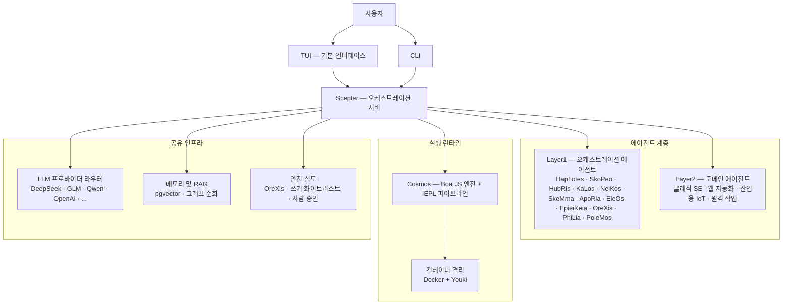

<!-- markdownlint-disable MD033 MD041 MD036 -->
<div align="center">


# Entelecheia

**산업용 AI 제어를 위한 멀티 에이전트 협업 플랫폼**

[](LICENSE)
[](https://github.com/celestia-island/entelecheia)

</div>

<div align="center">

[English](https://github.com/celestia-island/docs.celestia.world/blob/master/docs/en/guides/core/README-entelecheia.md) &bull; [Deutsch](https://github.com/celestia-island/docs.celestia.world/blob/master/docs/de/guides/core/README-entelecheia.md) &bull; [简体中文](https://github.com/celestia-island/docs.celestia.world/blob/master/docs/zhs/guides/core/README-entelecheia.md) &bull; [繁體中文](https://github.com/celestia-island/docs.celestia.world/blob/master/docs/zht/guides/core/README-entelecheia.md) &bull; [日本語](https://github.com/celestia-island/docs.celestia.world/blob/master/docs/ja/guides/core/README-entelecheia.md) &bull; **한국어** &bull; [Français](https://github.com/celestia-island/docs.celestia.world/blob/master/docs/fr/guides/core/README-entelecheia.md) &bull; [Español](https://github.com/celestia-island/docs.celestia.world/blob/master/docs/es/guides/core/README-entelecheia.md) &bull; [Português](https://github.com/celestia-island/docs.celestia.world/blob/master/docs/pt/guides/core/README-entelecheia.md) &bull; [Русский](https://github.com/celestia-island/docs.celestia.world/blob/master/docs/ru/guides/core/README-entelecheia.md) &bull; [العربية](https://github.com/celestia-island/docs.celestia.world/blob/master/docs/ar/guides/core/README-entelecheia.md)

</div>

> [celestia-island](https://github.com/celestia-island) 생태계의 일부입니다.

## 개요

Entelecheia는 실행 전용(exec-only) 마이크로커널 멀티 에이전트 플랫폼입니다. LLM은 소수의 프리미티브 도구(`exec`, `write_to_var`, `write_to_var_json`)만 볼 수 있으며, 모든 실제 작업은 IEPL TypeScript 파이프라인 내에서 이루어지고, 에이전트 코드가 ES 모듈 임포트를 통해 다수의 MCP 도구로 디스패치합니다.

이 플랫폼은 **안전이 중요한 산업 제어**를 위해 설계되었습니다: 벤더 간 프로토콜 호환성(Modbus, S7comm, OPC UA), 다중 계층 안전 심도(명령 검토 → 샌드박스 실행 → 정책 검증 → 사람 승인 → 감사 추적), 그리고 컨테이너 격리 작업 실행.

**버전 0.2.0** — 초기 개발 단계. TUI가 주요 인터페이스이며, WebUI는 형제 저장소 [shittim-chest](https://github.com/celestia-island/shittim-chest)에 있습니다.

### 주요 기능

- **실행 전용 마이크로커널**: 모델에 노출되는 도구 표면이 소수의 프리미티브로 의도적으로 제한됩니다. 도구 호출은 JavaScript 모듈 임포트를 통해 런타임 내부에서 발생하며, 직접적인 LLM-도구 바인딩이 아니므로 프롬프트 인젝션 공격을 구조적으로 더 어렵게 만듭니다.
- **계층형 에이전트**: 다수의 Layer1 오케스트레이션 에이전트(HapLotes, SkoPeo, HubRis, KaLos, NeiKos, SkeMma, ApoRia, EleOs, EpieiKeia, OreXis, PhiLia, PoleMos)와 도메인 에이전트(웹 자동화, 클래식 소프트웨어 엔지니어링, 산업용 IoT, 원격 작업). 코드베이스에 `todo!()` 또는 `unimplemented!()` 스텁이 없습니다.
- **안전 심도**: 물리적 장치에 접촉하는 모든 도구 호출은 OreXis(보안 센티넬 에이전트)를 통과합니다. 쓰기 주소 화이트리스트, 긴급 작업을 위한 사람 승인 게이트, 그리고 전체 체인 감사 로깅을 갖추고 있습니다.
- **컨테이너 격리**: 2계층 런타임(Docker/Podman 외부 오케스트레이션 + Youki/libcontainer 내부 샌드박스). 각 스킬 체인은 리소스 제한, seccomp 프로필, 네트워크 송신 제어가 적용된 격리 컨테이너에서 실행됩니다.
- **멀티 프로바이더 LLM 라우팅**: 다양한 프로바이더 설정(DeepSeek, Zhipu GLM, Qwen, OpenAI, Anthropic, Google 등)과 자동 장애 조치, 속도 제한 추적, 계층 기반 모델 선택(Deep/Normal/Basic)을 제공합니다.
- **자기 반복**: YOLO 크루즈 컨트롤 데몬이 주기적으로 스킬 체인을 실행하여 자동화된 코드 분석, clippy 수정, 메모리 통합, 보안 감사를 수행하며, git 체크포인트/롤백 안전망을 갖추고 있습니다.

## 빠른 시작

**Linux / macOS:**

```bash
curl -fsSL https://raw.githubusercontent.com/celestia-island/entelecheia/main/scripts/deploy/install.sh | bash
```

**Windows (WSL2):**

```powershell
irm https://raw.githubusercontent.com/celestia-island/entelecheia/main/scripts/deploy/install.ps1 | iex
```

**소스에서 빌드:**

```bash
git clone https://github.com/celestia-island/entelecheia.git
cd entelecheia
just bootstrap    # 의존성 설치, 워크스페이스 빌드, 설정 생성
just dev          # TUI 실행 (Docker/서비스 오케스트레이션 처리)
```

전제 조건: Rust 1.85+ (edition 2024), Docker, `just` 작업 실행기.

**임베디드 데이터베이스 모드** (외부 PostgreSQL 불필요):

```bash
just local         # 임베디드 pglite를 사용한 scepter
```

## 에이전트

| 에이전트 | 역할 |
|-------|------|
| **HapLotes** | Scepter와 Cosmos 간의 통신 브리지 |
| **SkoPeo** | 중앙 조정 — 목표/트랙/작업 오케스트레이션 |
| **HubRis** | 계획 엔진 — 작업 분해, TODO 관리 |
| **KaLos** | 파일 I/O 게이트웨이 — 원자적이고 충돌 인식이 가능한 파일 작업 |
| **NeiKos** | 컨테이너 런타임 — 생성, 포크, 스냅샷, 실행 |
| **SkeMma** | JavaScript 런타임 — Boa 엔진, IEPL 실행 |
| **ApoRia** | LLM 허브 및 지식 저장소 — RAG 벡터 DB, 이상 탐지 |
| **EleOs** | 외부 정보 게이트웨이 — 웹 페치, 웹 검색 |
| **EpieiKeia** | 시간적 오케스트레이션 — 스케줄링, 메시지 전달, 파일 감시자 |
| **OreXis** | 보안 센티넬 — 도구 게이팅, 쓰기 안전성, 규정 준수 감사, 경보 |
| **PhiLia** | 메모리 및 프로토콜 넥서스 — 벡터 메모리, 그래프 순회, 데이터 품질 |
| **PoleMos** | 엣지 컴퓨팅 및 장치 관리 — 호스트 파일/명령 접근, 하드웨어 정보 |
| **클래식 SE** | 코드 생성, 정적 분석, 리팩토링, LSP 통합 |
| **웹 자동화** | 브라우저 제어 — WebDriver, 내비게이션, 스크린샷, 입력 |
| **산업용 IoT** | 산업용 프로토콜 — Modbus, S7comm, OPC UA, 시리얼 검색 |
| **원격 작업** | SSH, 원격 터미널, GUI 자동화, 파일 전송 |

## 아키텍처



LLM은 절대 직접 MCP 도구를 호출하지 않습니다. 대신, 에이전트 모듈을 임포트하는 TypeScript 코드(`import { file_read } from 'kalos'`)를 생성합니다. IEPL 파이프라인이 이를 JavaScript로 트랜스파일하고(SWC), Boa 엔진에서 실행하며, 네이티브 디스패치를 MCP 라우터를 통해 라우팅합니다 — 각 홉마다 서킷 브레이커, 재시도, 보안 정책 적용이 이루어집니다.

## 문서

전체 아키텍처, 설계 결정 및 가이드는 **[docs.celestia.world](https://docs.celestia.world)** 에서 확인하세요:

- **[아키텍처 개요](https://docs.celestia.world/en/designs/core/architecture.html)** — 컴포넌트 현황 확인, 크레이트 계층, 구현 상태
- **[기본 사항](https://docs.celestia.world/en/guides/core/fundamentals.html)** — 에이전트, 실행 전용 도구 표면, 스킬, 계층
- **[빌드 및 배포](https://docs.celestia.world/en/guides/core/building.html)** — 전체 빌드, 설치, Docker 및 릴리스 가이드
- **[CLI 참조](https://docs.celestia.world/en/guides/core/cli.html)** — 모든 CLI 명령어와 옵션
- **[MCP 도구 개발](https://docs.celestia.world/en/guides/core/mcp-tool-development.html)** — 새 도구와 에이전트를 추가하는 방법
- **[보안 모델](https://docs.celestia.world/en/meta/security.html)** — 인증, RBAC, 컨테이너 강화
- **[설계 결정](https://docs.celestia.world/en/designs/core/design-decisions.html)** — ADR 인덱스(실행 전용 마이크로커널, Boa 엔진, pgvector, 계층형 워크스페이스, 컨테이너 샌드박스)

## 라이선스

Business Source License 1.1 (BUSL-1.1). 상업적 사용에는 인가 라이선스가 필요합니다. 비상업적 사용은 SySL-1.0 프로토콜을 따릅니다. 2030-01-01에 Apache-2.0으로 전환됩니다.
