# Shittim Chest에 기여하기

기여에 관심을 가져 주셔서 감사합니다! 본 가이드는 시작하는 데 필요한 모든 것을 다룹니다.

## 기여 정책 (먼저 읽어 주십시오)

Shittim Chest는 물리적 및 산업 시스템을 구동할 수 있는 플랫폼의 사용자 대면 표면이므로,
**안정성과 안전이 기여 처리량보다 우선합니다**. 풀 리퀘스트를 열기 전에 반드시 읽어 주십시오.

- **높은 병합 기준, 공개 로드맵이 아닙니다.** PR을 열었다고 해서 병합이 보장되지는 않습니다.

의도적으로 적은 수의 변경만 수락하며, 아키텍처에 부합하고 검토를 통과한 경우에만 허용됩니다.
이는 무례함이 아니라 설계에 의한 것입니다.

- **환영하는 대상:** 버그 신고, 집중된 수정, **주변부**에 대한 잘 범위가 정해진 개선

(IDE 플러그인, Tauri 앱, 채널 통합, 제공자 어댑터, 문서), 코드 작성 전 사전 설계 논의.

- **일반적으로 병합하지 않는 대상:** 요청되지 않은 대규모 재작성, 사전 설계 논의 없는

아키텍처 변경, 대량의 "분위기 코딩" PR, 코어의 보안 또는 정확성 기준을 낮추는 모든 것,
명시적 초대 및 확장 검토 없이 보안 중요 코어(인증, JWT/OAuth, LLM 라우팅, 웹훅 검증, RBAC)에 대한 변경.

- **핵심 vs. 주변부.** 핵심 백엔드와 인증/RBAC 모델은 가장 엄격한 기준이 적용되며

주로 핵심 팀이 유지 관리합니다. 주변부(프론트엔드, IDE/모바일 앱, 채널 커넥터)는
외부 기여가 가장 유용하고 수락될 가능성이 가장 높은 영역입니다.

- **CLA 필수.** 수락된 모든 기여에는 서명된 기여자 라이선스 동의서가 필요합니다.

[`CLA.md`](../meta/cla.md)를 참조하십시오. 커밋에는 `Signed-off-by` 줄이 포함되어야 합니다
(`git commit -s`).

> **라이선스는 개방될 수 있지만, 병합 기준은 그렇지 않습니다.** **2030-01-01**에
> 본 프로젝트는 BUSL-1.1에서 Synthetic Source License (SySL-1.0)로 전환됩니다.
> [`LICENSE`](LICENSE)를 참조하십시오. 이는 *코드로 할 수 있는 것*을 확대할 뿐,
> 검토 기준을 **낮추거나** CLA를 제거하거나 더 많은 PR을 수락한다는 의미가 아닙니다.
> 기여 정책은 변경일 이전과 이후 모두 동일합니다.

## 보안

보안 취약점에 대해 공개 이슈를 열지 **마십시오**.
[GitHub Security Advisories](https://github.com/celestia-island/shittim-chest/security/advisories/new)를 통해
비공개로 신고하십시오. [`SECURITY.md`](../meta/security.md)를 참조하십시오.

## 행동 강령

존중하고, 건설적이며, 포용적으로 행동하십시오. 우리는 [Rust 행동 강령](https://www.rust-lang.org/policies/code-of-conduct)을 따릅니다.

## 개발 환경 설정

### 전제 조건

- **Rust** 1.85+ (`rustup default stable`)
- **Node.js** 20+ 및 **pnpm** 9+
- **just** 명령 실행기 (`cargo install just`)
- **PostgreSQL** 18+
- `:8424`에서 실행 중인 [entelecheia](https://github.com/celestia-island/entelecheia) scepter 인스턴스 (선택 사항 — shittim-chest는 채팅/이미지 생성을 위해 독립형으로 실행 가능)

### 빠른 시작

```bash
git clone https://github.com/celestia-island/shittim-chest.git
cd shittim-chest
cp .env.example .env
# .env 편집 — DATABASE_URL, JWT_SECRET, ENCRYPTION_KEY 설정
# 독립형 LLM용: LLM_DEFAULT_PROVIDER_* 변수 설정
# scepter 프록시용: ENTELECHEIA_SCEPTER_URL 설정

 # 전체 개발 스택 (Docker를 통해)
 just install  # 오프라인 빌드용 모든 의존성 사전 준비 (네트워크 한 번 필요:
               #   cargo fetch + pnpm install + 이 저장소가 devtool 스크립트를
               #   공유하는 arona 체크아웃 해결)
 just dev      # postgres 시작 + 빌드 + 마이그레이션 + 서비스 제공, 변경 감시
               # (프론트엔드/백엔드 자동 재빌드; --mock 포함 시 scepter + mock LLM도 다시 시작)

 # `just watch`는 `just dev`의 폐기된 별칭입니다 (감시가 기본값).
 ```

> **네트워크:** 첫 빌드는 인터넷이 필요합니다 (cargo 레지스트리, git 의존성,
> arona + entelecheia 체크아웃). 연결된 머신에서 `just install`을 한 번 실행하면
> 이후 `just dev` 실행은 오프라인으로 진행할 수 있습니다. 공유 Python devtool
> 스크립트(대상 캐시 가드, 로거 등)는 arona 저장소에 있으며 cargo `[patch]` 경로,
> 형제 체크아웃, 또는 `targets/`로의 최후 수단 `git clone`을 통해 자동으로 위치합니다.

### 독립형 개발 (entelecheia 없이)

shittim-chest는 프론트엔드 + 채팅 개발을 위해 독립적으로 실행할 수 있습니다. `.env`에 다음을 설정:

```bash
LLM_DEFAULT_PROVIDER_ENDPOINT=https://api.deepseek.com/v1
LLM_DEFAULT_PROVIDER_API_KEY=sk-xxx
LLM_DEFAULT_PROVIDER_MODELS=deepseek-chat,deepseek-reasoner
LLM_DEFAULT_PROVIDER_CATEGORY=chat
```

그런 다음 `just dev` — 채팅, 이미지 생성, 인증이 scepter 없이 작동합니다. 프록시 및 장치 기능은 오류를 표시하지만 충돌하지 않습니다.

### 프로젝트 간 의존성 (로컬 개발)

entelecheia와 shittim-chest를 동시에 작업할 때는 `~/.cargo/config.toml`에 모든 교차 저장소 의존성에 대한 로컬 Cargo 패치를 구성하십시오:

```toml
# ~/.cargo/config.toml

# 로컬 재정의가 있는 crates.io 의존성
[patch.crates-io]
libnoa = { path = "/path/to/noa" }

# 로컬 재정의가 있는 git 의존성
[patch."https://github.com/celestia-island/arona.git"]
arona = { path = "/path/to/arona" }

[patch."https://github.com/celestia-island/hifumi.git"]
hifumi = { path = "/path/to/hifumi/packages/types" }

[patch."https://github.com/celestia-island/evernight.git"]
evernight = { path = "/path/to/evernight" }
```

**`~/.cargo/config.toml`을 어떤 저장소에도 커밋하지 마십시오.** CI는 git 참조를 사용합니다.

## 프로젝트 구조

```mermaid
flowchart TD
    root["shittim-chest/"] --> pkg["packages/"]
    root --> docs_dir["docs/"]
    root --> scripts_dir["scripts/"]
    root --> cargo_toml["Cargo.toml — Rust 워크스페이스 루트"]
    root --> pkg_json["package.json — pnpm 워크스페이스 루트"]
    root --> pnpm_ws["pnpm-workspace.yaml"]

    pkg --> cli_pkg["cli/ — CLI 래퍼, Docker 서비스 오케스트레이션"]
    pkg --> sc_pkg["core/ — Rust + Axum 백엔드"]
    pkg --> webui_pkg["webui/ — Vue 3 + Vite 프론트엔드 (TSX)"]
    pkg --> app_pkg["app/"]
    pkg --> ide_pkg["ide/"]

    sc_pkg --> sc_main["main.rs — CLI 진입점 (DbInit/Migrate/Reset/Serve)"]
    sc_pkg --> sc_lib["lib.rs — 모듈 선언 (33개 모듈)"]
    sc_pkg --> sc_config["config.rs — 환경 설정"]
    sc_pkg --> sc_auth["auth/ — 로그인, 등록, JWT, OAuth, 세션"]
    sc_pkg --> sc_api["api.rs — 라우터 부트스트랩 + DB 관리"]
    sc_pkg --> sc_chat["chat/ — 대화, 메시지, SSE/WS 스트리밍"]
    sc_pkg --> sc_llm["llm/ — LLM 클라이언트, 라우터, 제공자 관리"]
    sc_pkg --> sc_gen["generation/ — 이미지 생성"]
    sc_pkg --> sc_webhook["webhook.rs — GitHub/GitLab/Gitee/사용자 정의 웹훅"]
    sc_pkg --> sc_devices["devices/ — 원격 장치 관리 + 시그널링"]
    sc_pkg --> sc_channel["channel/ — 12개 플랫폼 채널 통합"]
    sc_pkg --> sc_proxy["proxy/ — Scepter HTTP/WS 브리지"]
    sc_pkg --> sc_entity["entity/ — SeaORM 엔티티 모델 (25개 테이블)"]
    sc_pkg --> sc_migration["migration/ — 데이터베이스 마이그레이션 (5개)"]
    sc_pkg --> sc_static["static_files.rs"]
    sc_pkg --> sc_cargo["Cargo.toml"]

    webui_pkg --> webui_views["views/ — demiurge (채팅), auth, admin, topology, holographic"]
    webui_pkg --> webui_comp["components/ — base/ (50개 이상 S-디자인 시스템), chat/, layout/, preview/, ..."]
    webui_pkg --> webui_stores["stores/ — Pinia 스토어"]
    webui_pkg --> webui_composables["composables/ — useChatStream, useSceneManager, ..."]
    webui_pkg --> webui_i18n["i18n/ — vue-i18n, 11개 언어, 로케일당 17개 네임스페이스 파일"]
    webui_pkg --> webui_api["api/ — API 클라이언트 모듈"]
    webui_pkg --> webui_types["types/ — TypeScript 타입"]

    app_pkg --> app_tauri["tauri/ — Tauri 데스크톱 앱"]
    app_pkg --> app_shared["tauri_shared/ — Tauri 앱용 공유 DTO"]
    app_pkg --> app_mobile["tauri_mobile/ — Tauri 모바일 앱"]
    app_pkg --> app_harmony["harmony/ — HarmonyOS 앱 (ArkTS)"]

    ide_pkg --> ide_vscode["vscode/ — VS Code 확장 (TypeScript)"]
    ide_pkg --> ide_idea["idea/ — IntelliJ 플러그인 (Kotlin)"]
    ide_pkg --> ide_zed["zed/ — Zed 확장 (Rust)"]
    ide_pkg --> ide_neovim["neovim/ — Neovim 플러그인 (Lua)"]
    ide_pkg --> ide_lsp["lsp-bridge/ — LSP 브리지 (Rust)"]
    ide_pkg --> ide_e2e["e2e/ — 공유 E2E 테스트 (TypeScript)"]

    docs_dir --> docs_guides["guides/ — 다국어 문서 (en, zhs, zht, ja, ko, fr, es, ru)"]

    scripts_dir --> scripts_images["images/ — Dockerfile"]
    scripts_dir --> scripts_utils["utils/ — Python 유틸리티 스크립트"]
```



## 코드 스타일

### Rust

```bash
cargo fmt                  # 자동 포맷
cargo clippy               # 린트
cargo clippy --fix         # 자동 수정
```

- 표준 Rust 규칙 따르기 (함수/변수는 `snake_case`, 타입은 CamelCase)
- 크레이트 `Cargo.toml` 파일에서 공유 의존성 버전에 `workspace = true` 사용
- 오류 처리: 애플리케이션 코드는 `anyhow::Result`, 라이브러리 크레이트 오류 타입은 `thiserror` 사용

### TypeScript / Vue

```bash
pnpm -r lint               # 모든 패키지에 대해 ESLint
pnpm -r typecheck          # TypeScript 엄격 검사
pnpm -r build              # 프로덕션 빌드 확인
```

- TSX로 Vue 3 (`defineComponent`, `@vitejs/plugin-vue-jsx`)
- TypeScript 엄격 모드
- 상태 관리용 Pinia
- `webui/`의 기존 패턴 따르기

### i18n

webui에서 UI 문자열을 추가할 때 `packages/webui/src/i18n/`을 통해 `vue-i18n`의 `t()` 함수를 사용:

```ts
import { t } from '@/i18n'
// 템플릿에서: {t('key.name')}
// 인수 포함: {t('msg.toolCalls', count, count > 1 ? t('msg.toolCalls.plural') : '')}
```

로케일 파일은 `i18n/locales/{lang}/` 아래 언어별로 17개 네임스페이스 JSON 파일로 구성됩니다 (admin, auth, chat, cmd, common, devices, errors, footer, help, logs, models, reports, skills, timeline, tokenUsage, tools, workspace). 키를 추가할 때 지원되는 11개 로케일 모두에 추가하십시오: `ar`, `de`, `en`, `es`, `fr`, `ja`, `ko`, `pt`, `ru`, `zhs`, `zht`.

### 명명 규칙

`packages/` 아래의 모든 디렉터리 이름은 **`snake_case`**를 사용합니다:

| 유형 | 규칙 | 예시 |
| --- | --- | --- |
| Rust 크레이트 디렉터리 | snake_case | `core/` |
| Rust 크레이트 이름 | snake_case | `core` |

## Justfile 명령

```bash
just                       # 모든 명령 나열
just dev                   # Docker를 통한 전체 개발 스택 (postgres + 백엔드), 변경 감시
just dev --clean           # 클린 시작 (볼륨, .env 제거, 다시 시작)
just dev --mock            # 전체 모의 스택 (실제 scepter + 모의 LLM) + 백엔드, 감시;
                           # 모의 scepter/LLM은 매번 새로 빌드되고 다시 시작됨
just up                    # Docker에서 모든 서비스 빌드 및 시작
just down                  # 모든 서비스 중지
just down --clean          # 중지 및 볼륨 제거
just migrate               # 컨테이너 내에서 보류 중인 마이그레이션 실행
just logs                  # 모든 컨테이너의 로그 스트리밍
just status                # 서비스 상태 확인
just watch                 # (`just dev`의 폐기된 별칭)
just build                 # 릴리스 바이너리 빌드
just build-frontend        # Vue 프론트엔드만 빌드
just build-release         # 임베디드 프론트엔드로 프론트엔드 + 릴리스 바이너리 빌드
just test                  # 모든 테스트 실행
just lint                  # 모두 린트 (cargo clippy + eslint)
just fmt                   # 모두 자동 포맷
just clean                 # 빌드 아티팩트 정리
```

## 풀 리퀘스트 절차

1. `dev`에서 기능 브랜치 생성: `git checkout -b feat/my-feature dev`
1. 명확하고 원자적인 커밋으로 변경
1. 푸시 전에 `just lint && just test` 실행
1. `dev` 브랜치에 대해 PR 열기
1. CI 통과 확인 (Rust 빌드, npm 빌드, 린트)

## 커밋 규칙

[Conventional Commits](https://www.conventionalcommits.org/) 사용:

```text
feat(auth): 비밀번호 로그인 엔드포인트 추가
fix(proxy): WebSocket 재연결 처리
docs(readme): 로고 및 배지 추가
refactor(config): 환경 로딩 추출
chore(deps): axum을 0.8로 업데이트
```

## 라이선스 및 CLA

Shittim Chest는 **변경일 2030-01-01**의 **Business Source License 1.1 (BUSL-1.1)**에 따라
라이선스가 부여되며, 변경일에 **Synthetic Source License (SySL-1.0)**로 전환됩니다.
모든 내부, 학술, 정부, 교육 및 비상업적 사용에 대해서는 이미 오늘날 SySL-1.0과
동등합니다([`LICENSE`](LICENSE)의 추가 사용 허가 참조). 제한된 상업적 사용(호스팅,
재판매, 서비스로서의 재브랜딩)은 변경일까지 별도의 상업 라이선스가 필요합니다.

기여함으로써 귀하는 귀하의 기여물이 프로젝트 라이선스에 따라 라이선스가 부여되며,
CLA([`CLA.md`](../meta/cla.md))에 서명함에 동의합니다. CLA는 프로젝트에 **재라이선스 권리를 포함한**
허용적 라이선스를 부여하므로, 프로젝트는 BUSL→SySL 경로를 유지하고 향후 라이선스를 변경할 수 있습니다.
