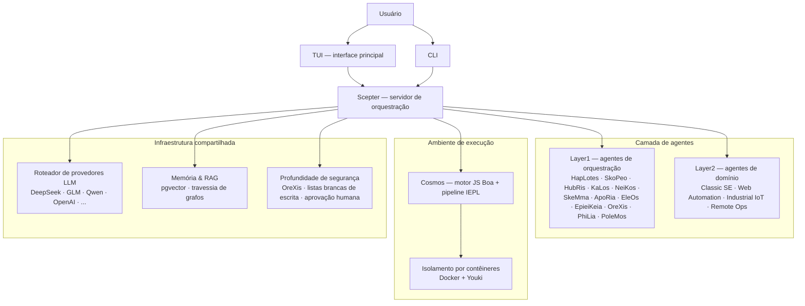

<!-- markdownlint-disable MD033 MD041 MD036 -->
<div align="center">


# Entelecheia

**Plataforma de colaboração multi-agente para controle industrial com IA**

[](LICENSE)
[](https://github.com/celestia-island/entelecheia)

</div>

<div align="center">

[English](https://github.com/celestia-island/docs.celestia.world/blob/master/docs/en/guides/core/README-entelecheia.md) &bull; [Deutsch](https://github.com/celestia-island/docs.celestia.world/blob/master/docs/de/guides/core/README-entelecheia.md) &bull; [简体中文](https://github.com/celestia-island/docs.celestia.world/blob/master/docs/zhs/guides/core/README-entelecheia.md) &bull; [繁體中文](https://github.com/celestia-island/docs.celestia.world/blob/master/docs/zht/guides/core/README-entelecheia.md) &bull; [日本語](https://github.com/celestia-island/docs.celestia.world/blob/master/docs/ja/guides/core/README-entelecheia.md) &bull; [한국어](https://github.com/celestia-island/docs.celestia.world/blob/master/docs/ko/guides/core/README-entelecheia.md) &bull; [Français](https://github.com/celestia-island/docs.celestia.world/blob/master/docs/fr/guides/core/README-entelecheia.md) &bull; [Español](https://github.com/celestia-island/docs.celestia.world/blob/master/docs/es/guides/core/README-entelecheia.md) &bull; **Português** &bull; [Русский](https://github.com/celestia-island/docs.celestia.world/blob/master/docs/ru/guides/core/README-entelecheia.md) &bull; [العربية](https://github.com/celestia-island/docs.celestia.world/blob/master/docs/ar/guides/core/README-entelecheia.md)

</div>

> Parte do ecossistema [celestia-island](https://github.com/celestia-island).

## Visão geral

Entelecheia é uma plataforma multi-agente de microkernel de apenas execução. O LLM vê apenas um punhado de ferramentas primitivas (`exec`, `write_to_var`, `write_to_var_json`) — todo o trabalho real acontece dentro do pipeline TypeScript IEPL, onde o código do agente despacha para uma ampla superfície de ferramentas MCP em vários agentes via importações de módulos ES.

A plataforma é projetada para **controle industrial de segurança crítica**: compatibilidade de protocolos entre fornecedores (Modbus, S7comm, OPC UA), profundidade de segurança multicamada (revisão de instruções → execução em sandbox → validação de políticas → confirmação humana → trilha de auditoria) e execução de tarefas isolada por contêineres.

**Versão 0.2.0** — desenvolvimento inicial. A TUI é a interface principal; a WebUI reside no repositório irmão [shittim-chest](https://github.com/celestia-island/shittim-chest).

### Principais recursos

- **Microkernel de apenas execução**: a superfície de ferramentas do modelo é deliberadamente restrita a algumas primitivas. A invocação de ferramentas ocorre dentro do ambiente de execução via importações de módulos JavaScript, não por vinculação direta LLM-ferramenta — tornando ataques de injeção de prompt estruturalmente mais difíceis.
- **Agentes em camadas**: uma dúzia de agentes de orquestração Layer1 (HapLotes, SkoPeo, HubRis, KaLos, NeiKos, SkeMma, ApoRia, EleOs, EpieiKeia, OreXis, PhiLia, PoleMos) mais agentes de domínio (automação web, engenharia de software clássica, IoT industrial, operações remotas). Sem stubs `todo!()` ou `unimplemented!()` no código fonte.
- **Profundidade de segurança**: cada chamada de ferramenta que toca dispositivos físicos passa pelo OreXis — o agente sentinela de segurança. Listas brancas de endereços de escrita, níveis de aprovação humana para operações de emergência e registro de auditoria de cadeia completa.
- **Isolamento por contêineres**: ambiente de execução em dois níveis (orquestração externa Docker/Podman + sandbox interno Youki/libcontainer). Cada cadeia de habilidades é executada em um contêiner isolado com limites de recursos, perfis seccomp e controle de saída de rede.
- **Roteamento LLM multi-provedor**: várias configurações de provedores (DeepSeek, Zhipu GLM, Qwen, OpenAI, Anthropic, Google e mais) com failover automático, rastreamento de limite de taxa e seleção de modelo por níveis (Deep/Normal/Basic).
- **Auto-iteração**: o daemon de controle de cruzeiro YOLO executa cadeias de habilidades periódicas para análise automática de código, correções clippy, consolidação de memória e auditorias de segurança — com redes de segurança de ponto de controle/reversão Git.

## Início rápido

**Linux / macOS:**

```bash
curl -fsSL https://raw.githubusercontent.com/celestia-island/entelecheia/main/scripts/deploy/install.sh | bash
```

**Windows (WSL2):**

```powershell
irm https://raw.githubusercontent.com/celestia-island/entelecheia/main/scripts/deploy/install.ps1 | iex
```

**A partir do código fonte:**

```bash
git clone https://github.com/celestia-island/entelecheia.git
cd entelecheia
just bootstrap    # instalar dependências, compilar o espaço de trabalho, gerar configuração
just dev          # iniciar a TUI (gerencia a orquestração do Docker/serviços)
```

Pré-requisitos: Rust 1.85+ (edição 2024), Docker, executor de tarefas `just`.

**Modo de banco de dados embarcado** (não requer PostgreSQL externo):

```bash
just local         # scepter com pglite embarcado
```

## Agentes

| Agente | Função |
|-------|------|
| **HapLotes** | Ponte de comunicação entre Scepter e Cosmos |
| **SkoPeo** | Coordenação central — orquestração de objetivo/trilha/tarefa |
| **HubRis** | Motor de planejamento — decomposição de tarefas, gerenciamento de TODO |
| **KaLos** | Gateway de E/S de arquivos — operações atômicas e conscientes de conflitos |
| **NeiKos** | Ambiente de execução de contêineres — criar, bifurcar, snapshot, executar |
| **SkeMma** | Ambiente de execução JavaScript — motor Boa, execução IEPL |
| **ApoRia** | Hub LLM e armazenamento de conhecimento — banco vetorial RAG, detecção de anomalias |
| **EleOs** | Gateway de informações externas — busca web, pesquisa web |
| **EpieiKeia** | Orquestração temporal — agendamento, entrega de mensagens, observadores de arquivos |
| **OreXis** | Sentinela de segurança — controle de ferramentas, segurança de escrita, auditoria de conformidade, alarmes |
| **PhiLia** | Nexus de memória e protocolo — memórias vetoriais, travessia de grafos, qualidade de dados |
| **PoleMos** | Computação de borda e gerenciamento de dispositivos — acesso a arquivos/comandos do host, informações de hardware |
| **Classic SE** | Geração de código, análise estática, refatoração, integração LSP |
| **Web Automation** | Controle de navegador — WebDriver, navegação, capturas de tela, entrada |
| **Industrial IoT** | Protocolos industriais — Modbus, S7comm, OPC UA, descoberta serial |
| **Remote Ops** | SSH, terminais remotos, automação GUI, transferência de arquivos |

## Arquitetura



O LLM nunca chama ferramentas MCP diretamente. Em vez disso, ele gera código TypeScript que importa módulos de agente (`import { file_read } from 'kalos'`). O pipeline IEPL transpila isso para JavaScript (SWC), executa no motor Boa e encaminha os despachos nativos através do roteador MCP — com disjuntor, repetição e aplicação de políticas de segurança em cada etapa.

## Documentação

A arquitetura completa, decisões de design e guias estão em **[docs.celestia.world](https://docs.celestia.world)**:

- **[Visão geral da arquitetura](https://docs.celestia.world/en/designs/core/architecture.html)** — verificação de componentes, camadas de crate, status de implementação
- **[Fundamentos](https://docs.celestia.world/en/guides/core/fundamentals.html)** — agentes, superfície de ferramentas de apenas execução, habilidades, níveis
- **[Compilação e implantação](https://docs.celestia.world/en/guides/core/building.html)** — guia completo de build, instalação, Docker e lançamento
- **[Referência CLI](https://docs.celestia.world/en/guides/core/cli.html)** — todos os comandos e opções CLI
- **[Desenvolvimento de ferramentas MCP](https://docs.celestia.world/en/guides/core/mcp-tool-development.html)** — como adicionar novas ferramentas e agentes
- **[Modelo de segurança](https://docs.celestia.world/en/meta/security.html)** — autenticação, RBAC, fortalecimento de contêineres
- **[Decisões de design](https://docs.celestia.world/en/designs/core/design-decisions.html)** — índice ADR (microkernel de apenas execução, motor Boa, pgvector, espaço de trabalho em camadas, sandbox de contêiner)

## Licença

Business Source License 1.1 (BUSL-1.1). O uso comercial requer uma licença de autorização. O uso não comercial segue o protocolo SySL-1.0. Converte-se para Apache-2.0 em 01/01/2030.
