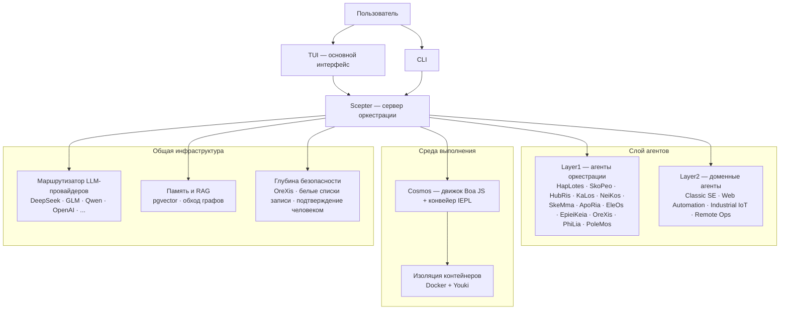

<!-- markdownlint-disable MD033 MD041 MD036 -->
<div align="center">


# Entelecheia

**Мультиагентная платформа для промышленного управления на базе ИИ**

[](LICENSE)
[](https://github.com/celestia-island/entelecheia)

</div>

<div align="center">

[English](https://github.com/celestia-island/docs.celestia.world/blob/master/docs/en/guides/core/README-entelecheia.md) &bull; [Deutsch](https://github.com/celestia-island/docs.celestia.world/blob/master/docs/de/guides/core/README-entelecheia.md) &bull; [简体中文](https://github.com/celestia-island/docs.celestia.world/blob/master/docs/zhs/guides/core/README-entelecheia.md) &bull; [繁體中文](https://github.com/celestia-island/docs.celestia.world/blob/master/docs/zht/guides/core/README-entelecheia.md) &bull; [日本語](https://github.com/celestia-island/docs.celestia.world/blob/master/docs/ja/guides/core/README-entelecheia.md) &bull; [한국어](https://github.com/celestia-island/docs.celestia.world/blob/master/docs/ko/guides/core/README-entelecheia.md) &bull; [Français](https://github.com/celestia-island/docs.celestia.world/blob/master/docs/fr/guides/core/README-entelecheia.md) &bull; [Español](https://github.com/celestia-island/docs.celestia.world/blob/master/docs/es/guides/core/README-entelecheia.md) &bull; [Português](https://github.com/celestia-island/docs.celestia.world/blob/master/docs/pt/guides/core/README-entelecheia.md) &bull; **Русский** &bull; [العربية](https://github.com/celestia-island/docs.celestia.world/blob/master/docs/ar/guides/core/README-entelecheia.md)

</div>

> Часть экосистемы [celestia-island](https://github.com/celestia-island).

## Обзор

Entelecheia — это мультиагентная платформа на микроядре с моделью только-exec. LLM видит лишь несколько примитивных инструментов (`exec`, `write_to_var`, `write_to_var_json`) — вся реальная работа происходит внутри TypeScript-конвейера IEPL, где код агентов через импорт ES-модулей обращается к широкому набору MCP-инструментов нескольких агентов.

Платформа разработана для **промышленного управления с критическими требованиями к безопасности**: межвендорная совместимость протоколов (Modbus, S7comm, OPC UA), многослойная глубина безопасности (проверка инструкций → изолированное выполнение → валидация политик → подтверждение человеком → аудиторский след) и изолированное в контейнерах выполнение задач.

**Версия 0.2.0** — ранняя стадия разработки. TUI является основным интерфейсом; WebUI находится в смежном репозитории [shittim-chest](https://github.com/celestia-island/shittim-chest).

### Ключевые возможности

- **Микроядро только-exec**: инструментальная поверхность модели намеренно ограничена несколькими примитивами. Вызов инструментов происходит внутри среды выполнения через импорт модулей JavaScript, а не через прямую привязку LLM к инструменту — что делает атаки с инъекцией подсказок структурно более сложными.
- **Многослойные агенты**: дюжина агентов оркестрации Layer1 (HapLotes, SkoPeo, HubRis, KaLos, NeiKos, SkeMma, ApoRia, EleOs, EpieiKeia, OreXis, PhiLia, PoleMos) плюс доменные агенты (Web Automation, Classic Software Engineering, Industrial IoT, Remote Operations). Никаких заглушек `todo!()` или `unimplemented!()` в кодовой базе.
- **Глубина безопасности**: каждый вызов инструмента, затрагивающий физические устройства, проходит через OreXis — агента-стража безопасности. Белые списки адресов записи, шлюзы подтверждения человеком для аварийных операций и полный аудиторский журнал всей цепочки.
- **Изоляция контейнеров**: двухуровневая среда выполнения (внешняя оркестрация Docker/Podman + внутренняя песочница Youki/libcontainer). Каждая цепочка навыков выполняется в изолированном контейнере с ограничениями ресурсов, профилями seccomp и контролем сетевого выхода.
- **Мультипровайдерная маршрутизация LLM**: множество конфигураций провайдеров (DeepSeek, Zhipu GLM, Qwen, OpenAI, Anthropic, Google и другие) с автоматическим переключением при сбое, отслеживанием лимитов скорости и многоуровневым выбором модели (Deep/Normal/Basic).
- **Самоитерация**: демон автопилота YOLO запускает периодические цепочки навыков для автоматического анализа кода, исправлений clippy, консолидации памяти и аудита безопасности — с защитными сетями контрольных точек git и отката.

## Быстрый старт

**Linux / macOS:**

```bash
curl -fsSL https://raw.githubusercontent.com/celestia-island/entelecheia/main/scripts/deploy/install.sh | bash
```

**Windows (WSL2):**

```powershell
irm https://raw.githubusercontent.com/celestia-island/entelecheia/main/scripts/deploy/install.ps1 | iex
```

**Из исходников:**

```bash
git clone https://github.com/celestia-island/entelecheia.git
cd entelecheia
just bootstrap    # установка зависимостей, сборка рабочего пространства, генерация конфигурации
just dev          # запуск TUI (управляет оркестрацией Docker/сервисов)
```

Предварительные требования: Rust 1.85+ (edition 2024), Docker, менеджер задач `just`.

**Режим встроенной базы данных** (не требуется внешний PostgreSQL):

```bash
just local         # scepter со встроенным pglite
```

## Агенты

| Агент | Роль |
|-------|------|
| **HapLotes** | Коммуникационный мост между Scepter и Cosmos |
| **SkoPeo** | Центральная координация — оркестрация целей/треков/задач |
| **HubRis** | Движок планирования — декомпозиция задач, управление TODO |
| **KaLos** | Шлюз файлового ввода-вывода — атомарные операции с файлами с учетом конфликтов |
| **NeiKos** | Среда выполнения контейнеров — создание, форк, снимки, выполнение |
| **SkeMma** | Среда выполнения JavaScript — движок Boa, выполнение IEPL |
| **ApoRia** | LLM-хаб и хранилище знаний — векторная БД RAG, обнаружение аномалий |
| **EleOs** | Шлюз внешней информации — веб-запросы, веб-поиск |
| **EpieiKeia** | Временная оркестрация — планирование, доставка сообщений, наблюдатели файлов |
| **OreXis** | Страж безопасности — контроль инструментов, безопасность записи, аудит соответствия, сигнализация |
| **PhiLia** | Узел памяти и протоколов — векторная память, обход графов, качество данных |
| **PoleMos** | Периферийные вычисления и управление устройствами — доступ к файлам/командам хоста, информация об оборудовании |
| **Classic SE** | Генерация кода, статический анализ, рефакторинг, интеграция с LSP |
| **Web Automation** | Управление браузером — WebDriver, навигация, снимки экрана, ввод |
| **Industrial IoT** | Промышленные протоколы — Modbus, S7comm, OPC UA, последовательное обнаружение |
| **Remote Ops** | SSH, удаленные терминалы, автоматизация GUI, передача файлов |

## Архитектура



LLM никогда не вызывает MCP-инструменты напрямую. Вместо этого он генерирует TypeScript-код, который импортирует модули агентов (`import { file_read } from 'kalos'`). Конвейер IEPL транспилирует этот код в JavaScript (SWC), выполняет его в движке Boa и направляет нативные вызовы через MCP-маршрутизатор — с автоматическим выключателем, повторными попытками и принудительным соблюдением политик безопасности на каждом шаге.

## Документация

Полная архитектура, проектные решения и руководства доступны на **[docs.celestia.world](https://docs.celestia.world)**:

- **[Обзор архитектуры](https://docs.celestia.world/en/designs/core/architecture.html)** — проверка компонентов, слои крейтов, статус реализации
- **[Основы](https://docs.celestia.world/en/guides/core/fundamentals.html)** — агенты, инструментальная поверхность только-exec, навыки, уровни
- **[Сборка и развертывание](https://docs.celestia.world/en/guides/core/building.html)** — полное руководство по сборке, установке, Docker и релизам
- **[Справка по CLI](https://docs.celestia.world/en/guides/core/cli.html)** — все команды и опции CLI
- **[Разработка MCP-инструментов](https://docs.celestia.world/en/guides/core/mcp-tool-development.html)** — как добавлять новые инструменты и агенты
- **[Модель безопасности](https://docs.celestia.world/en/meta/security.html)** — аутентификация, RBAC, усиление контейнеров
- **[Проектные решения](https://docs.celestia.world/en/designs/core/design-decisions.html)** — индекс ADR (микроядро только-exec, движок Boa, pgvector, многослойное рабочее пространство, песочница контейнеров)

## Лицензия

Business Source License 1.1 (BUSL-1.1). Коммерческое использование требует лицензии авторизации. Некоммерческое использование регулируется протоколом SySL-1.0. Переходит в Apache-2.0 с 01.01.2030.
