# Участие в разработке Shittim Chest

Спасибо за интерес к участию в проекте! Это руководство охватывает всё, что вам нужно для начала работы.

## Политика вклада (прочитайте это в первую очередь)

Shittim Chest — это пользовательская поверхность платформы, которая может управлять физическими
и промышленными системами, поэтому **стабильность и безопасность важнее пропускной
способности вкладов**. Пожалуйста, прочитайте это перед открытием pull request.

- **Высокая планка принятия, не публичная дорожная карта.** Открытие PR не означает, что он будет

принят. Мы принимаем намеренно небольшое количество изменений и только тогда, когда
они соответствуют архитектуре и проходят проверку. Это сделано намеренно, а не из грубости.

- **Что мы приветствуем:** отчёты об ошибках, целевые исправления, хорошо ограниченные улучшения

**периферии** (плагины IDE, приложения Tauri, интеграции каналов, адаптеры
провайдеров и документация), а также предварительные обсуждения дизайна до написания кода.

- **Что мы, как правило, не принимаем:** крупные несогласованные переписывания,

архитектурные изменения без предварительного обсуждения дизайна, массовые PR «vibe-coded»,
всё, что снижает планку безопасности или корректности ядра, и
изменения в критически важном для безопасности ядре (аутентификация, JWT/OAuth, маршрутизация LLM, проверка
вебхуков, RBAC) без явного приглашения и расширенной проверки.

- **Ядро и периферия.** Основной бэкенд и модель аутентификации/RBAC удерживаются на

самой строгой планке и поддерживаются в первую очередь основной командой. Периферия
(фронтенды, приложения IDE/мобильные, коннекторы каналов) — это то, где внешние
вклады наиболее полезны и наиболее вероятно будут приняты.

- **Требуется CLA.** Каждый принятый вклад требует подписанного Лицензионного соглашения

с контрибьютором. См. [`CLA.md`](../meta/cla.md). Коммиты должны содержать строку
`Signed-off-by` (`git commit -s`).

> **Лицензия может открыться; планка принятия — нет.** **2030-01-01** этот
> проект переходит с BUSL-1.1 на Synthetic Source License (SySL-1.0) — см.
> [`LICENSE`](LICENSE). Это расширяет *то, что вы можете делать с кодом*; это
> **не** снижает планку проверки, не отменяет CLA и не означает, что мы принимаем больше PR.
> Политика вклада неизменна до и после даты изменения.

## Безопасность

**Не** открывайте публичные issues для уязвимостей безопасности. Сообщайте о них конфиденциально
через [GitHub Security Advisories](https://github.com/celestia-island/shittim-chest/security/advisories/new).
См. [`SECURITY.md`](../meta/security.md).

## Кодекс поведения

Будьте уважительны, конструктивны и инклюзивны. Мы следуем [Rust Code of Conduct](https://www.rust-lang.org/policies/code-of-conduct).

## Настройка среды разработки

### Предварительные требования

- **Rust** 1.85+ (`rustup default stable`)
- **Node.js** 20+ и **pnpm** 9+
- **just** запускатор команд (`cargo install just`)
- **PostgreSQL** 18+
- Работающий экземпляр [entelecheia](https://github.com/celestia-island/entelecheia) scepter на `:8424` (опционально — shittim-chest может работать автономно для чата/генерации изображений)

### Быстрый старт

```bash
git clone https://github.com/celestia-island/shittim-chest.git
cd shittim-chest
cp .env.example .env
# Отредактируйте .env — установите DATABASE_URL, JWT_SECRET, ENCRYPTION_KEY
# Для автономного LLM: установите переменные LLM_DEFAULT_PROVIDER_*
# Для прокси scepter: установите ENTELECHEIA_SCEPTER_URL

 # Полный dev-стек (через Docker)
 just install  # предварительная подготовка ВСЕХ зависимостей для офлайн-сборок (требуется сеть один раз:
               #   cargo fetch + pnpm install + разрешает checkout arona,
               #   с которым этот репозиторий делит скрипты devtool)
 just dev      # Запускает postgres + собирает + мигрирует + обслуживает и отслеживает изменения
               # (автопересборка фронтенда/бэкенда; с --mock также перезапускает scepter + mock LLM)

 # `just watch` — устаревший псевдоним для `just dev` (отслеживание включено по умолчанию).
 ```

> **Сеть:** первая сборка требует интернета (реестр cargo, git-зависимости,
> checkouts arona + entelecheia). Запустите `just install` один раз на подключённой
> машине, и последующие запуски `just dev` могут работать офлайн. Общие
> скрипты Python devtool (защита кеша целей, логгер, …) находятся в репозитории
> `arona` и находятся автоматически через путь cargo `[patch]`, родственный
> checkout или `git clone` последней надежды в `targets/`.

### Автономная разработка (без entelecheia)

shittim-chest может работать независимо для разработки фронтенда + чата. Установите это в `.env`:

```bash
LLM_DEFAULT_PROVIDER_ENDPOINT=https://api.deepseek.com/v1
LLM_DEFAULT_PROVIDER_API_KEY=sk-xxx
LLM_DEFAULT_PROVIDER_MODELS=deepseek-chat,deepseek-reasoner
LLM_DEFAULT_PROVIDER_CATEGORY=chat
```

Затем `just dev` — чат, генерация изображений и аутентификация работают без scepter. Функции прокси и устройств будут показывать ошибки, но не упадут.

### Межпроектные зависимости (локальная разработка)

При одновременной работе над entelecheia и shittim-chest настройте локальные патчи Cargo в `~/.cargo/config.toml` для всех межрепозиторных зависимостей:

```toml
# ~/.cargo/config.toml

# зависимости crates.io с локальными переопределениями
[patch.crates-io]
libnoa = { path = "/path/to/noa" }

# git-зависимости с локальными переопределениями
[patch."https://github.com/celestia-island/arona.git"]
arona = { path = "/path/to/arona" }

[patch."https://github.com/celestia-island/hifumi.git"]
hifumi = { path = "/path/to/hifumi/packages/types" }

[patch."https://github.com/celestia-island/evernight.git"]
evernight = { path = "/path/to/evernight" }
```

**Никогда не коммитьте `~/.cargo/config.toml` ни в какой репозиторий.** CI использует git-ссылки.

## Структура проекта

```mermaid
flowchart TD
    root["shittim-chest/"] --> pkg["packages/"]
    root --> docs_dir["docs/"]
    root --> scripts_dir["scripts/"]
    root --> cargo_toml["Cargo.toml — корень рабочего пространства Rust"]
    root --> pkg_json["package.json — корень рабочего пространства pnpm"]
    root --> pnpm_ws["pnpm-workspace.yaml"]

    pkg --> cli_pkg["cli/ — обёртка CLI, оркеструет сервисы Docker"]
    pkg --> sc_pkg["core/ — бэкенд Rust + Axum"]
    pkg --> webui_pkg["webui/ — фронтенд Vue 3 + Vite (TSX)"]
    pkg --> app_pkg["app/"]
    pkg --> ide_pkg["ide/"]

    sc_pkg --> sc_main["main.rs — точка входа CLI (DbInit/Migrate/Reset/Serve)"]
    sc_pkg --> sc_lib["lib.rs — объявления модулей (33 модуля)"]
    sc_pkg --> sc_config["config.rs — конфигурация окружения"]
    sc_pkg --> sc_auth["auth/ — Вход, регистрация, JWT, OAuth, сессии"]
    sc_pkg --> sc_api["api.rs — Загрузка маршрутизатора + управление БД"]
    sc_pkg --> sc_chat["chat/ — Диалоги, сообщения, SSE/WS поток"]
    sc_pkg --> sc_llm["llm/ — Клиент LLM, маршрутизатор, управление провайдерами"]
    sc_pkg --> sc_gen["generation/ — Генерация изображений"]
    sc_pkg --> sc_webhook["webhook.rs — Вебхуки GitHub/GitLab/Gitee/свои"]
    sc_pkg --> sc_devices["devices/ — Управление удалёнными устройствами + сигнализация"]
    sc_pkg --> sc_channel["channel/ — Интеграции 12 платформ"]
    sc_pkg --> sc_proxy["proxy/ — Мост HTTP/WS Scepter"]
    sc_pkg --> sc_entity["entity/ — Модели сущностей SeaORM (25 таблиц)"]
    sc_pkg --> sc_migration["migration/ — Миграции базы данных (5)"]
    sc_pkg --> sc_static["static_files.rs"]
    sc_pkg --> sc_cargo["Cargo.toml"]

    webui_pkg --> webui_views["views/ — demiurge (чат), auth, admin, topology, holographic"]
    webui_pkg --> webui_comp["components/ — base/ (50+ S-design-system), chat/, layout/, preview/, ..."]
    webui_pkg --> webui_stores["stores/ — Хранилища Pinia"]
    webui_pkg --> webui_composables["composables/ — useChatStream, useSceneManager, ..."]
    webui_pkg --> webui_i18n["i18n/ — vue-i18n, 11 языков, 17 файлов пространств имён на локаль"]
    webui_pkg --> webui_api["api/ — Модули API-клиента"]
    webui_pkg --> webui_types["types/ — Типы TypeScript"]

    app_pkg --> app_tauri["tauri/ — Настольное приложение Tauri"]
    app_pkg --> app_shared["tauri_shared/ — Общие DTO для приложений Tauri"]
    app_pkg --> app_mobile["tauri_mobile/ — Мобильное приложение Tauri"]
    app_pkg --> app_harmony["harmony/ — Приложение HarmonyOS (ArkTS)"]

    ide_pkg --> ide_vscode["vscode/ — Расширение VS Code (TypeScript)"]
    ide_pkg --> ide_idea["idea/ — Плагин IntelliJ (Kotlin)"]
    ide_pkg --> ide_zed["zed/ — Расширение Zed (Rust)"]
    ide_pkg --> ide_neovim["neovim/ — Плагин Neovim (Lua)"]
    ide_pkg --> ide_lsp["lsp-bridge/ — Мост LSP (Rust)"]
    ide_pkg --> ide_e2e["e2e/ — Общие E2E-тесты (TypeScript)"]

    docs_dir --> docs_guides["guides/ — Многоязычная документация (en, zhs, zht, ja, ko, fr, es, ru)"]

    scripts_dir --> scripts_images["images/ — Dockerfile"]
    scripts_dir --> scripts_utils["utils/ — Утилитарные скрипты Python"]
```



## Стиль кода

### Rust

```bash
cargo fmt                  # автоформатирование
cargo clippy               # линтинг
cargo clippy --fix         # автоисправление
```

- Следуйте стандартным соглашениям Rust (`snake_case` для функций/переменных, CamelCase для типов)
- Используйте `workspace = true` для общих версий зависимостей в файлах `Cargo.toml` крейтов
- Обработка ошибок: используйте `anyhow::Result` для кода приложения, `thiserror` для типов ошибок библиотечных крейтов

### TypeScript / Vue

```bash
pnpm -r lint               # ESLint по всем пакетам
pnpm -r typecheck          # Строгая проверка TypeScript
pnpm -r build              # Проверка продакшен-сборки
```

- Vue 3 с TSX (`defineComponent`, `@vitejs/plugin-vue-jsx`)
- Строгий режим TypeScript
- Pinia для управления состоянием
- Следуйте существующим шаблонам в `webui/`

### i18n

При добавлении строк UI в webui используйте функцию `t()` из `vue-i18n` через `packages/webui/src/i18n/`:

```ts
import { t } from '@/i18n'
// В шаблоне: {t('key.name')}
// С аргументами: {t('msg.toolCalls', count, count > 1 ? t('msg.toolCalls.plural') : '')}
```

Файлы локалей организованы как 17 файлов JSON пространств имён на язык в `i18n/locales/{lang}/` (admin, auth, chat, cmd, common, devices, errors, footer, help, logs, models, reports, skills, timeline, tokenUsage, tools, workspace). При добавлении ключа добавьте его во все 11 поддерживаемых локалей: `ar`, `de`, `en`, `es`, `fr`, `ja`, `ko`, `pt`, `ru`, `zhs`, `zht`.

### Соглашения об именовании

Все имена директорий в `packages/` используют **`snake_case`**:

| Тип | Соглашение | Пример |
| --- | --- | --- |
| Директория крейта Rust | snake_case | `core/` |
| Имя крейта Rust | snake_case | `core` |

## Команды Justfile

```bash
just                       # список всех команд
just dev                   # полный dev-стек через Docker (postgres + бэкенд), отслеживание изменений
just dev --clean           # чистый старт (удалить тома, .env, перезапустить)
just dev --mock            # полный mock-стек (реальный scepter + mock LLM) + бэкенд, отслеживание;
                           # mock scepter/LLM пересобираются+перезапускаются заново при каждом запуске
just up                    # собрать и запустить все сервисы в Docker
just down                  # остановить все сервисы
just down --clean          # остановить и удалить тома
just migrate               # выполнить ожидающие миграции внутри контейнера
just logs                  # потоковый вывод логов из всех контейнеров
just status                # проверить статус сервисов
just watch                 # (устаревший псевдоним для `just dev`)
just build                 # собрать релизный бинарник
just build-frontend        # собрать только фронтенды Vue
just build-release         # собрать фронтенд + релизный бинарник с встроенным фронтендом
just test                  # запустить все тесты
just lint                  # линтинг всего (cargo clippy + eslint)
just fmt                   # автоформатирование всего
just clean                 # очистить артефакты сборки
```

## Процесс Pull Request

1. Создайте feature-ветку от `dev`: `git checkout -b feat/my-feature dev`
1. Внесите изменения с чёткими, атомарными коммитами
1. Запустите `just lint && just test` перед пушем
1. Откройте PR против ветки `dev`
1. Убедитесь, что CI проходит (сборка Rust, сборка npm, линтинг)

## Соглашение о коммитах

Используйте [Conventional Commits](https://www.conventionalcommits.org/):

```text
feat(auth): добавить конечную точку входа по паролю
fix(proxy): обработать переподключение WebSocket
docs(readme): добавить логотип и бейджи
refactor(config): выделить загрузку окружения
chore(deps): обновить axum до 0.8
```

## Лицензия и CLA

Shittim Chest лицензирован под **Business Source License 1.1 (BUSL-1.1)**
с **Датой изменения 2030-01-01**, после которой он переходит на
**Synthetic Source License (SySL-1.0)**. Для любого внутреннего, академического, государственного,
образовательного и некоммерческого использования он уже эквивалентен SySL-1.0
сегодня (см. Additional Use Grant в [`LICENSE`](LICENSE)). Ограниченное
коммерческое использование (хостинг, перепродажа или ребрендинг как услуги) требует отдельной
коммерческой лицензии до Даты изменения.

Внося вклад, вы соглашаетесь, что ваши вклады лицензируются под
лицензией проекта и что вы подписываете CLA ([`CLA.md`](../meta/cla.md)). CLA предоставляет
проекту разрешительную лицензию, **включая право на перелицензирование**, чтобы
проект мог сохранить свой путь BUSL→SySL и адаптировать лицензирование в будущем.
