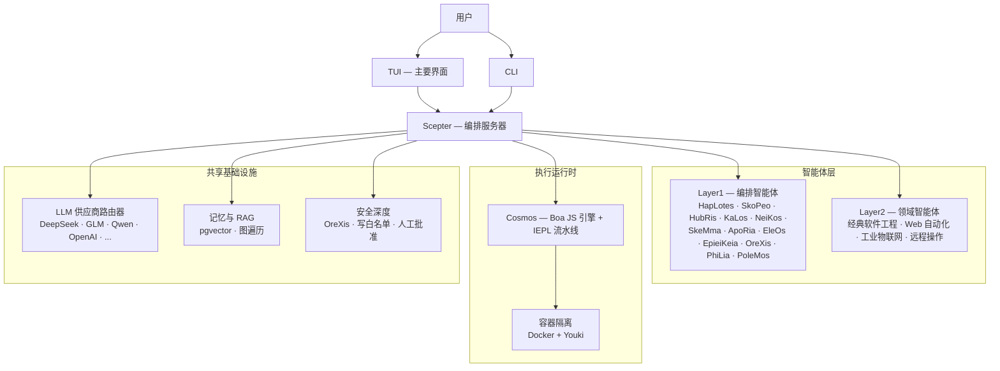

<!-- markdownlint-disable MD033 MD041 MD036 -->
<div align="center">


# Entelecheia

**面向工业AI控制的多智能体协作平台**

[](LICENSE)
[](https://github.com/celestia-island/entelecheia)

</div>

<div align="center">

[English](https://github.com/celestia-island/docs.celestia.world/blob/master/docs/en/guides/core/README-entelecheia.md) &bull; [Deutsch](https://github.com/celestia-island/docs.celestia.world/blob/master/docs/de/guides/core/README-entelecheia.md) &bull; **简体中文** &bull; [繁體中文](https://github.com/celestia-island/docs.celestia.world/blob/master/docs/zht/guides/core/README-entelecheia.md) &bull; [日本語](https://github.com/celestia-island/docs.celestia.world/blob/master/docs/ja/guides/core/README-entelecheia.md) &bull; [한국어](https://github.com/celestia-island/docs.celestia.world/blob/master/docs/ko/guides/core/README-entelecheia.md) &bull; [Français](https://github.com/celestia-island/docs.celestia.world/blob/master/docs/fr/guides/core/README-entelecheia.md) &bull; [Español](https://github.com/celestia-island/docs.celestia.world/blob/master/docs/es/guides/core/README-entelecheia.md) &bull; [Português](https://github.com/celestia-island/docs.celestia.world/blob/master/docs/pt/guides/core/README-entelecheia.md) &bull; [Русский](https://github.com/celestia-island/docs.celestia.world/blob/master/docs/ru/guides/core/README-entelecheia.md) &bull; [العربية](https://github.com/celestia-island/docs.celestia.world/blob/master/docs/ar/guides/core/README-entelecheia.md)

</div>

> [celestia-island](https://github.com/celestia-island) 生态系统的一部分。

## 概述

Entelecheia 是一个仅执行（exec-only）微内核多智能体平台。LLM 仅能看到少数几个原始工具（`exec`、`write_to_var`、`write_to_var_json`）——所有实际工作都在 IEPL TypeScript 流水线中完成，代理代码通过 ES 模块导入向大量 MCP 工具分发。

该平台专为 **安全关键的工业控制** 设计：跨供应商协议兼容（Modbus、S7comm、OPC UA）、多层安全深度（指令审查 → 沙箱化执行 → 策略验证 → 人工确认 → 审计追踪）以及容器隔离的任务执行。

**版本 0.2.0** —— 早期开发阶段。TUI 是主要界面；WebUI 位于同级仓库 [shittim-chest](https://github.com/celestia-island/shittim-chest) 中。

### 核心特性

- **仅执行微内核**：模型暴露的工具面被刻意限制为少量原始操作。工具调用通过 JavaScript 模块导入在运行时内部发生，而非直接的 LLM 到工具绑定——这使得提示词注入攻击在结构上更难实施。
- **分层智能体**：十余个 Layer1 编排智能体（HapLotes、SkoPeo、HubRis、KaLos、NeiKos、SkeMma、ApoRia、EleOs、EpieiKeia、OreXis、PhiLia、PoleMos）以及领域智能体（Web 自动化、经典软件工程、工业物联网、远程操作）。代码库中无 `todo!()` 或 `unimplemented!()` 占位桩代码。
- **安全深度**：每一个触及物理设备的工具调用都经过 OreXis——安全哨兵智能体。写地址白名单、紧急操作的人工批准门控以及全链路审计日志。
- **容器隔离**：两级运行时（Docker/Podman 外部编排 + Youki/libcontainer 内部沙箱）。每个技能链在资源限制、seccomp 配置文件和网络出口控制的隔离容器中运行。
- **多供应商 LLM 路由**：众多供应商配置（DeepSeek、智谱 GLM、Qwen、OpenAI、Anthropic、Google 等），具备自动故障转移、速率限制跟踪和分层模型选择（Deep/Normal/Basic）。
- **自我迭代**：YOLO 巡航控制守护进程定期运行技能链，进行自动化代码分析、clippy 修复、记忆整合和安全审计——并配备 git 检查点/回滚安全网。

## 快速开始

**Linux / macOS：**

```bash
curl -fsSL https://raw.githubusercontent.com/celestia-island/entelecheia/main/scripts/deploy/install.sh | bash
```

**Windows (WSL2)：**

```powershell
irm https://raw.githubusercontent.com/celestia-island/entelecheia/main/scripts/deploy/install.ps1 | iex
```

**从源码构建：**

```bash
git clone https://github.com/celestia-island/entelecheia.git
cd entelecheia
just bootstrap    # 安装依赖，构建工作区，生成配置
just dev          # 启动 TUI（处理 Docker/服务编排）
```

前置条件：Rust 1.85+（edition 2024）、Docker、`just` 任务运行器。

**嵌入式数据库模式**（无需外部 PostgreSQL）：

```bash
just local         # 使用嵌入式 pglite 的 scepter
```

## 智能体

| 智能体 | 角色 |
|-------|------|
| **HapLotes** | Scepter 与 Cosmos 之间的通信桥梁 |
| **SkoPeo** | 中央协调——目标/轨迹/任务编排 |
| **HubRis** | 规划引擎——任务分解、TODO 管理 |
| **KaLos** | 文件 I/O 网关——原子化、冲突感知的文件操作 |
| **NeiKos** | 容器运行时——创建、分叉、快照、执行 |
| **SkeMma** | JavaScript 运行时——Boa 引擎、IEPL 执行 |
| **ApoRia** | LLM 中心与知识存储——RAG 向量数据库、异常检测 |
| **EleOs** | 外部信息网关——网页获取、网页搜索 |
| **EpieiKeia** | 时序编排——调度、消息传递、文件监视器 |
| **OreXis** | 安全哨兵——工具门控、写安全、合规审计、警报 |
| **PhiLia** | 记忆与协议枢纽——向量记忆、图遍历、数据质量 |
| **PoleMos** | 边缘计算与设备管理——主机文件/命令访问、硬件信息 |
| **经典软件工程** | 代码生成、静态分析、重构、LSP 集成 |
| **Web 自动化** | 浏览器控制——WebDriver、导航、截图、输入 |
| **工业物联网** | 工业协议——Modbus、S7comm、OPC UA、串口发现 |
| **远程操作** | SSH、远程终端、GUI 自动化、文件传输 |

## 架构



LLM 从不直接调用 MCP 工具。相反，它生成导入智能体模块的 TypeScript 代码（`import { file_read } from 'kalos'`）。IEPL 流水线将其转译为 JavaScript（SWC），在 Boa 引擎中执行，并通过 MCP 路由器路由本地调度——每一步都带有断路器、重试和安全策略强制执行。

## 文档

完整的架构、设计决策和指南请访问 **[docs.celestia.world](https://docs.celestia.world)**：

- **[架构概览](https://docs.celestia.world/en/designs/core/architecture.html)** —— 组件实际状态、crate 层级、实现状态
- **[基础知识](https://docs.celestia.world/en/guides/core/fundamentals.html)** —— 智能体、仅执行工具面、技能、层级
- **[构建与部署](https://docs.celestia.world/en/guides/core/building.html)** —— 完整构建、安装、Docker 和发布指南
- **[CLI 参考](https://docs.celestia.world/en/guides/core/cli.html)** —— 所有 CLI 命令和选项
- **[MCP 工具开发](https://docs.celestia.world/en/guides/core/mcp-tool-development.html)** —— 如何添加新工具和智能体
- **[安全模型](https://docs.celestia.world/en/meta/security.html)** —— 认证、RBAC、容器加固
- **[设计决策](https://docs.celestia.world/en/designs/core/design-decisions.html)** —— ADR 索引（仅执行微内核、Boa 引擎、pgvector、分层工作区、容器沙箱）

## 许可证

Business Source License 1.1 (BUSL-1.1)。商业使用需获得授权许可。非商业使用遵循 SySL-1.0 协议。于 2030-01-01 转换为 Apache-2.0。
