# 为 Shittim Chest 贡献

感谢您的贡献兴趣！本指南涵盖了您入门所需的一切。

## 贡献政策（请先阅读）

Shittim Chest 是一个可以驱动物理和工业系统平台的面向用户界面，因此**稳定性和安全性优先于贡献吞吐量**。请在提交 Pull Request 之前阅读本文。

- **高标准合并门槛，而非公开路线图。** 提交 PR 并不意味着它会被合并。我们刻意接受少量变更，且仅在变更符合架构并通过审核时才合并。这是设计使然，并非无礼。
- **我们欢迎的：** Bug 报告、有针对性的修复、对**外围**（IDE 插件、Tauri 应用、频道集成、提供商适配器和文档）的有清晰范围改进，以及编码前的设计讨论。
- **我们通常不会合并的：** 大型主动重写、未经事先设计讨论的架构变更、批量"氛围编码"的 PR、任何降低核心安全性或正确性门槛的内容，以及未经明确邀请和深入审核对安全关键核心（认证、JWT/OAuth、LLM 路由、Webhook 验证、RBAC）的更改。
- **核心 vs. 外围。** 核心后端和认证/RBAC 模型遵循最严格的标准，主要由核心团队维护。外围（前端、IDE/移动应用、频道连接器）是外部贡献最有价值和最有可能被接受的地方。
- **需要 CLA。** 每个被接受的贡献都需要签署贡献者许可协议。请参阅 [`CLA.md`](../meta/cla.md)。提交必须带有 `Signed-off-by` 行（`git commit -s`）。

> **许可证可能开放；合并门槛不会降低。** 于 **2030-01-01** 本项目从 BUSL-1.1 转换为 Synthetic Source License (SySL-1.0)——详见 [`LICENSE`](LICENSE)。这扩大了*您可以对代码做什么*的范围；但**不会**降低审核门槛、移除 CLA、或意味着我们会接受更多 PR。贡献政策在变更日期前后保持不变。

## 安全

请**不要**为安全漏洞开放公开 Issue。请通过 [GitHub 安全公告](https://github.com/celestia-island/shittim-chest/security/advisories/new) 私下报告。请参阅 [`SECURITY.md`](../meta/security.md)。

## 行为准则

保持尊重、建设性和包容性。我们遵循 [Rust 行为准则](https://www.rust-lang.org/policies/code-of-conduct)。

## 开发环境搭建

### 前置条件

- **Rust** 1.85+（`rustup default stable`）
- **Node.js** 20+ 和 **pnpm** 9+
- **just** 命令运行器（`cargo install just`）
- **PostgreSQL** 18+
- 在 `:8424` 运行的 [entelecheia](https://github.com/celestia-island/entelecheia) scepter 实例（可选——shittim-chest 可在独立模式下运行进行聊天/图像生成）

### 快速开始

```bash
git clone https://github.com/celestia-island/shittim-chest.git
cd shittim-chest
cp .env.example .env
# 编辑 .env——设置 DATABASE_URL、JWT_SECRET、ENCRYPTION_KEY
# 独立 LLM 模式：设置 LLM_DEFAULT_PROVIDER_* 变量
# scepter 代理模式：设置 ENTELECHEIA_SCEPTER_URL

 # 完整开发栈（通过 Docker）
 just install  # 预置所有离线构建依赖（需要联网一次：
               #   cargo fetch + pnpm install + 解析 arona 检出目录
               #   本仓库与之共享开发工具脚本）
 just dev      # 启动 postgres + 构建 + 迁移 + 提供服务，并监视变更
               # （自动重建前端/后端；使用 --mock 也会重启 scepter + mock LLM）

 # `just watch` 是 `just dev` 的已弃用别名（监视是默认行为）。
 ```

> **网络：** 首次构建需要互联网（cargo 注册表、git 依赖、arona + entelecheia 检出目录）。在联网机器上运行一次 `just install`，后续 `just dev` 运行可以离线进行。共享的 Python 开发工具脚本（目标缓存守护、日志器等）位于 `arona` 仓库中，通过 cargo `[patch]` 路径、同级检出目录或最后手段的 `git clone` 到 `targets/` 自动定位。

### 独立开发（无 entelecheia）

shittim-chest 可以独立运行用于前端 + 聊天开发。在 `.env` 中设置以下变量：

```bash
LLM_DEFAULT_PROVIDER_ENDPOINT=https://api.deepseek.com/v1
LLM_DEFAULT_PROVIDER_API_KEY=sk-xxx
LLM_DEFAULT_PROVIDER_MODELS=deepseek-chat,deepseek-reasoner
LLM_DEFAULT_PROVIDER_CATEGORY=chat
```

然后运行 `just dev`——聊天、图像生成和认证在没有 scepter 的情况下也能正常工作。代理和设备功能会显示错误但不会崩溃。

### 跨项目依赖（本地开发）

当同时开发 entelecheia 和 shittim-chest 时，在 `~/.cargo/config.toml` 中为所有跨仓库依赖配置本地 Cargo 补丁：

```toml
# ~/.cargo/config.toml

# 带有本地覆盖的 crates.io 依赖
[patch.crates-io]
libnoa = { path = "/path/to/noa" }

# 带有本地覆盖的 git 依赖
[patch."https://github.com/celestia-island/arona.git"]
arona = { path = "/path/to/arona" }

[patch."https://github.com/celestia-island/hifumi.git"]
hifumi = { path = "/path/to/hifumi/packages/types" }

[patch."https://github.com/celestia-island/evernight.git"]
evernight = { path = "/path/to/evernight" }
```

**切勿将 `~/.cargo/config.toml` 提交到任何仓库。** CI 使用 git 引用。

## 项目结构

```mermaid
flowchart TD
    root["shittim-chest/"] --> pkg["packages/"]
    root --> docs_dir["docs/"]
    root --> scripts_dir["scripts/"]
    root --> cargo_toml["Cargo.toml — Rust workspace 根"]
    root --> pkg_json["package.json — pnpm workspace 根"]
    root --> pnpm_ws["pnpm-workspace.yaml"]

    pkg --> cli_pkg["cli/ — CLI 封装，编排 Docker 服务"]
    pkg --> sc_pkg["core/ — Rust + Axum 后端"]
    pkg --> webui_pkg["webui/ — Vue 3 + Vite 前端 (TSX)"]
    pkg --> app_pkg["app/"]
    pkg --> ide_pkg["ide/"]

    sc_pkg --> sc_main["main.rs — CLI 入口 (DbInit/Migrate/Reset/Serve)"]
    sc_pkg --> sc_lib["lib.rs — 模块声明 (33 个模块)"]
    sc_pkg --> sc_config["config.rs — 环境配置"]
    sc_pkg --> sc_auth["auth/ — 登录、注册、JWT、OAuth、会话"]
    sc_pkg --> sc_api["api.rs — 路由引导 + 数据库管理"]
    sc_pkg --> sc_chat["chat/ — 对话、消息、SSE/WS 流式传输"]
    sc_pkg --> sc_llm["llm/ — LLM 客户端、路由器、提供商管理"]
    sc_pkg --> sc_gen["generation/ — 图像生成"]
    sc_pkg --> sc_webhook["webhook.rs — GitHub/GitLab/Gitee/自定义 Webhook"]
    sc_pkg --> sc_devices["devices/ — 远程设备管理 + 信令"]
    sc_pkg --> sc_channel["channel/ — 12 平台频道集成"]
    sc_pkg --> sc_proxy["proxy/ — Scepter HTTP/WS 桥接"]
    sc_pkg --> sc_entity["entity/ — SeaORM 实体模型 (25 张表)"]
    sc_pkg --> sc_migration["migration/ — 数据库迁移 (5 个)"]
    sc_pkg --> sc_static["static_files.rs"]
    sc_pkg --> sc_cargo["Cargo.toml"]

    webui_pkg --> webui_views["views/ — demiurge (聊天)、auth、admin、topology、holographic"]
    webui_pkg --> webui_comp["components/ — base/ (50+ S-design-system)、chat/、layout/、preview/、..."]
    webui_pkg --> webui_stores["stores/ — Pinia stores"]
    webui_pkg --> webui_composables["composables/ — useChatStream、useSceneManager、..."]
    webui_pkg --> webui_i18n["i18n/ — vue-i18n、11 种语言、每种语言 17 个命名空间文件"]
    webui_pkg --> webui_api["api/ — API 客户端模块"]
    webui_pkg --> webui_types["types/ — TypeScript 类型"]

    app_pkg --> app_tauri["tauri/ — Tauri 桌面应用"]
    app_pkg --> app_shared["tauri_shared/ — Tauri 应用共享 DTO"]
    app_pkg --> app_mobile["tauri_mobile/ — Tauri 移动应用"]
    app_pkg --> app_harmony["harmony/ — 鸿蒙应用 (ArkTS)"]

    ide_pkg --> ide_vscode["vscode/ — VS Code 扩展 (TypeScript)"]
    ide_pkg --> ide_idea["idea/ — IntelliJ 插件 (Kotlin)"]
    ide_pkg --> ide_zed["zed/ — Zed 扩展 (Rust)"]
    ide_pkg --> ide_neovim["neovim/ — Neovim 插件 (Lua)"]
    ide_pkg --> ide_lsp["lsp-bridge/ — LSP 桥接 (Rust)"]
    ide_pkg --> ide_e2e["e2e/ — 共享端到端测试 (TypeScript)"]

    docs_dir --> docs_guides["guides/ — 多语言文档 (en, zhs, zht, ja, ko, fr, es, ru)"]

    scripts_dir --> scripts_images["images/ — Dockerfile"]
    scripts_dir --> scripts_utils["utils/ — Python 工具脚本"]
```



## 代码风格

### Rust

```bash
cargo fmt                  # 自动格式化
cargo clippy               # 代码检查
cargo clippy --fix         # 自动修复
```

- 遵循标准 Rust 约定（函数/变量使用 `snake_case`，类型使用 CamelCase）
- 在 crate `Cargo.toml` 文件中使用 `workspace = true` 共享依赖版本
- 错误处理：应用代码使用 `anyhow::Result`，库 crate 错误类型使用 `thiserror`

### TypeScript / Vue

```bash
pnpm -r lint               # 所有包的 ESLint
pnpm -r typecheck          # TypeScript 严格检查
pnpm -r build              # 验证生产构建
```

- Vue 3 配合 TSX（`defineComponent`、`@vitejs/plugin-vue-jsx`）
- TypeScript 严格模式
- Pinia 状态管理
- 遵循 `webui/` 中的现有模式

### 国际化 (i18n)

在 webui 中添加 UI 字符串时，通过 `packages/webui/src/i18n/` 使用 `vue-i18n` 的 `t()` 函数：

```ts
import { t } from '@/i18n'
// 在模板中：{t('key.name')}
// 带参数：{t('msg.toolCalls', count, count > 1 ? t('msg.toolCalls.plural') : '')}
```

语言文件按每种语言 17 个命名空间的 JSON 文件组织在 `i18n/locales/{lang}/` 下（admin、auth、chat、cmd、common、devices、errors、footer、help、logs、models、reports、skills、timeline、tokenUsage、tools、workspace）。添加新 key 时，需要添加到所有 11 种支持的语言中：`ar`、`de`、`en`、`es`、`fr`、`ja`、`ko`、`pt`、`ru`、`zhs`、`zht`。

### 命名约定

`packages/` 下的所有目录名使用 **`snake_case`**：

| 类型 | 约定 | 示例 |
| --- | --- | --- |
| Rust crate 目录 | snake_case | `core/` |
| Rust crate 名称 | snake_case | `core` |

## Justfile 命令

```bash
just                       # 列出所有命令
just dev                   # 通过 Docker 完整开发栈 (postgres + 后端)，监视变更
just dev --clean           # 全新启动（移除 volumes、.env、重启）
just dev --mock            # 完整模拟栈 (真实 scepter + 模拟 LLM) + 后端，监视变更；
                           # 模拟 scepter/LLM 每次运行都会重建+重启
just up                    # 在 Docker 中构建并启动所有服务
just down                  # 停止所有服务
just down --clean          # 停止并移除 volumes
just migrate               # 在容器内运行待处理的迁移
just logs                  # 流式传输所有容器的日志
just status                # 检查服务状态
just watch                 # （`just dev` 的已弃用别名）
just build                 # 构建发布版本二进制文件
just build-frontend        # 仅构建 Vue 前端
just build-release         # 构建前端 + 嵌入前端的发布版本二进制文件
just test                  # 运行所有测试
just lint                  # 代码检查所有 (cargo clippy + eslint)
just fmt                   # 自动格式化所有
just clean                 # 清理构建产物
```

## Pull Request 流程

1. 从 `dev` 创建功能分支：`git checkout -b feat/my-feature dev`
1. 进行修改，保持提交清晰、原子化
1. 推送前运行 `just lint && just test`
1. 向 `dev` 分支发起 PR
1. 确保 CI 通过（Rust 构建、npm 构建、代码检查）

## 提交约定

使用 [Conventional Commits](https://www.conventionalcommits.org/)：

```text
feat(auth): add password login endpoint
fix(proxy): handle WebSocket reconnect
docs(readme): add logo and badges
refactor(config): extract env loading
chore(deps): bump axum to 0.8
```

## 许可证与 CLA

Shittim Chest 采用 **Business Source License 1.1 (BUSL-1.1)** 许可，**变更日期为 2030-01-01**，届时转换为 **Synthetic Source License (SySL-1.0)**。对于所有内部、学术、政府、教育和非商业用途，目前已等同于 SySL-1.0（参见 [`LICENSE`](LICENSE) 中的附加使用授权）。受限的商业用途（托管、转售或将品牌重新包装为服务）在变更日期之前需要单独的商用许可证。

通过贡献，您同意您的贡献在本项目的许可证下许可，并且您签署 CLA（[`CLA.md`](../meta/cla.md)）。CLA 授予项目宽松的许可权，**包括重新许可的权利**，因此项目可以保持其 BUSL→SySL 的路径，并适应未来的许可需求。
