# 使用週期統計系統設計

## 概述

使用週期統計系統基於時間週期管理與追蹤 LLM token 使用量，支援多種週期類型（5 小時、7 天、30 天、自訂），為成本控制與配額管理提供資料基礎。

## 核心原則

### 時間視窗聚合

系統使用滑動視窗聚合機制，透過資料庫檢視表即時計算任意時間範圍內的使用統計：

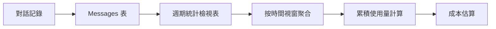

### 資料流

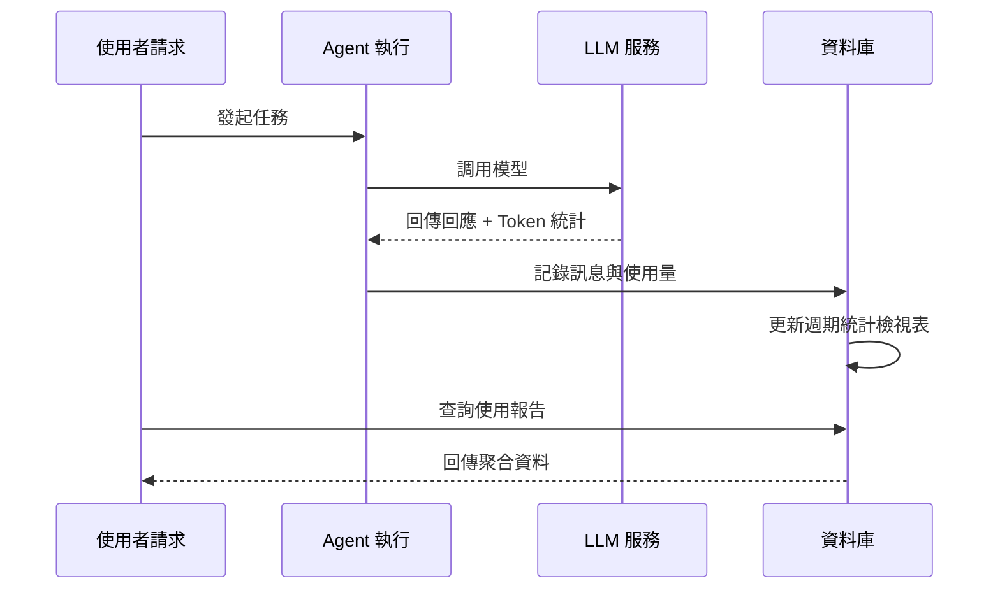

## 週期類型

| 週期類型 | 時長 | 典型用途 |
| --- | --- | --- |
| 短期 | 5 小時 | 快速迭代開發 |
| 中期 | 7 天 | 週配額控制 |
| 長期 | 30 天 | 月成本核算 |
| 自訂 | 任意 | 靈活業務需求 |

## 架構設計

### 檢視表聚合架構

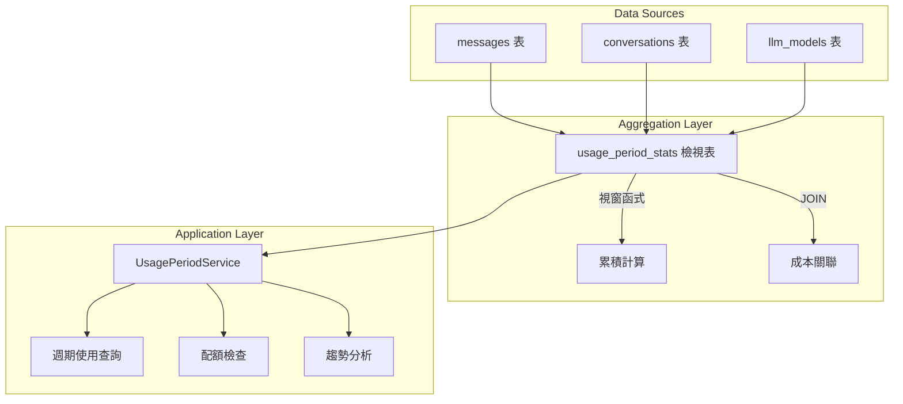

### 核心計算邏輯

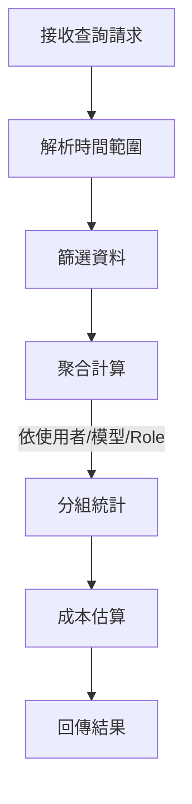

## 配額控制機制

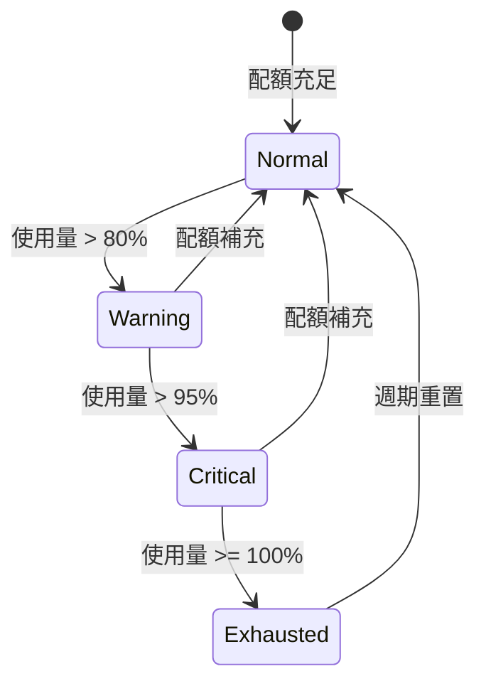

## 與其他模組的關係

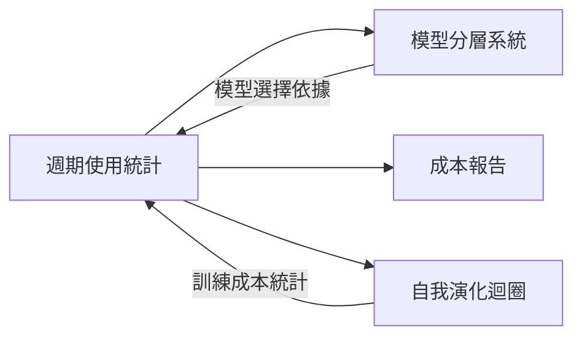

## 設計考量

### 效能最佳化

- 使用資料庫檢視表進行預聚合
- 視窗函式避免冗餘計算
- 時間索引加速範圍查詢

### 可擴充性

- 支援新的週期類型
- 可擴充的聚合維度
- 靈活的成本計算模型

### 資料一致性

- 唯讀檢視表確保資料完整性
- 時間戳統一使用 UTC
- 交易保證寫入原子性

# LLM 配置流程設計

## 概述

本文件描述使用者配置 LLM Provider 的完整流程，包括配置介面互動、資料傳輸、伺服器端處理與對話使用。

## 配置流程架構

### 整體流程

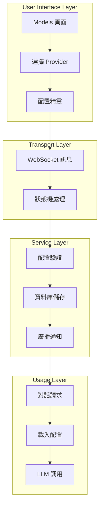

## Provider 配置流程

### 配置步驟序列

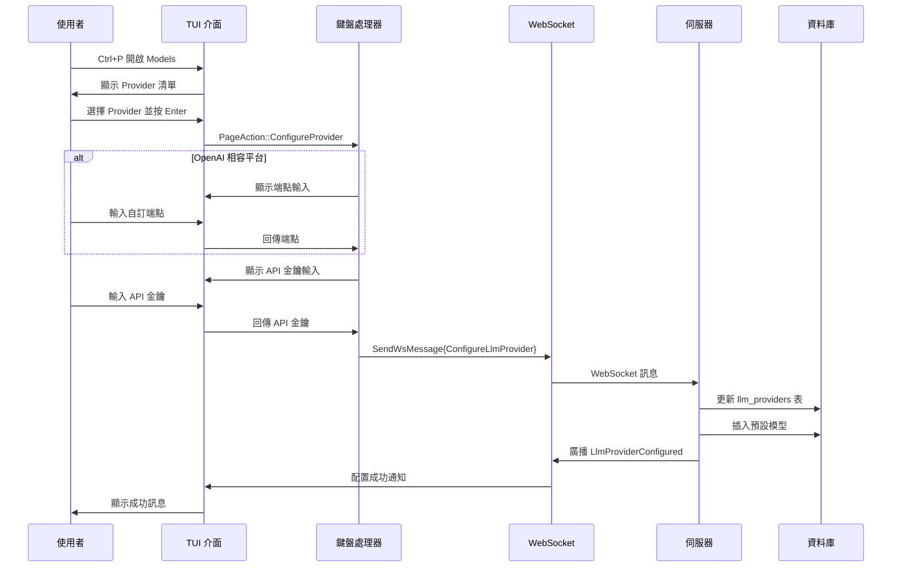

### 配置狀態機

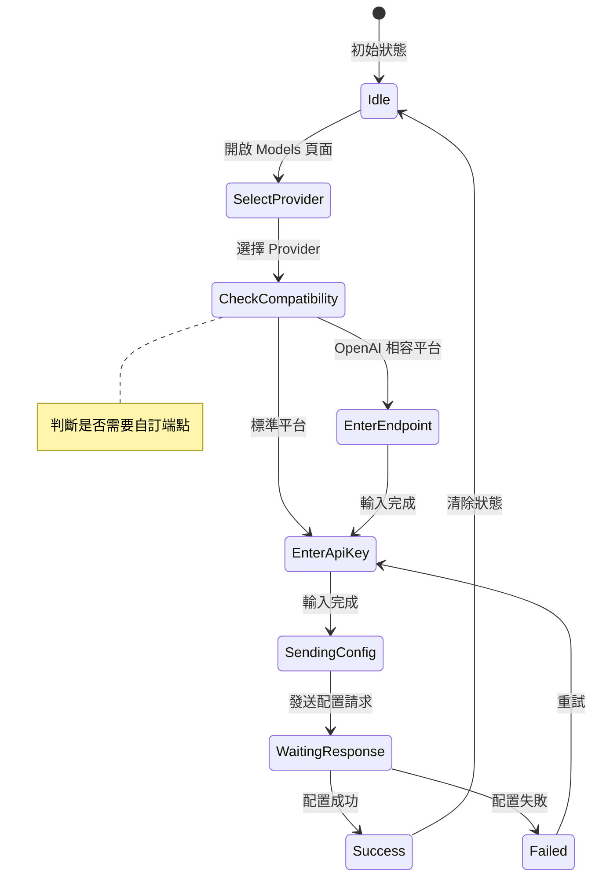

## 對話使用流程

### LLM 調用序列

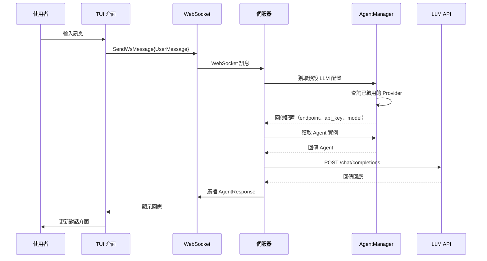

## 關鍵設計決策

### 兩步驟配置流程

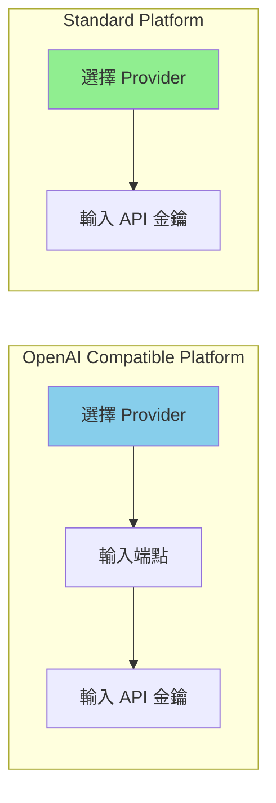

| 平台類型 | 配置步驟 | 原因 |
| --- | --- | --- |
| OpenAI 相容 | 端點 + API 金鑰 | 需要自訂服務端點 |
| 標準平台 | 僅 API 金鑰 | 使用官方端點 |

### 配置狀態管理

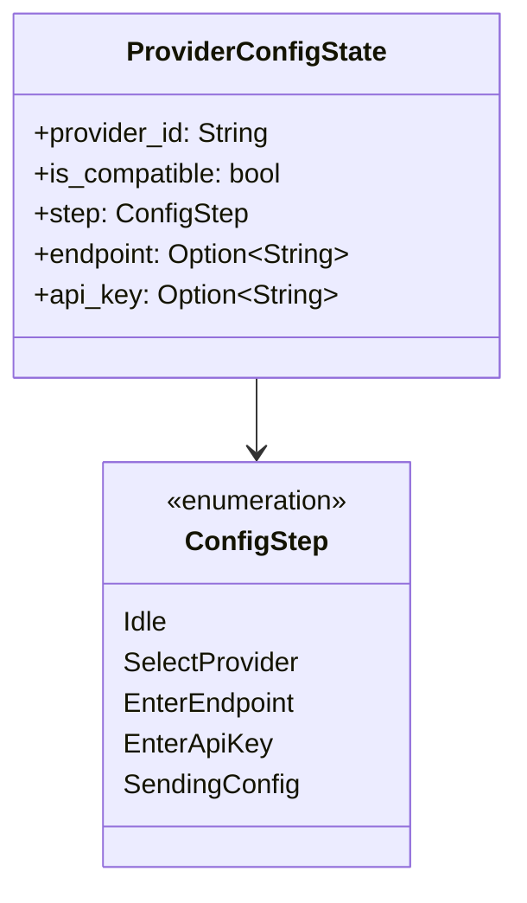

### 預設模型自動插入

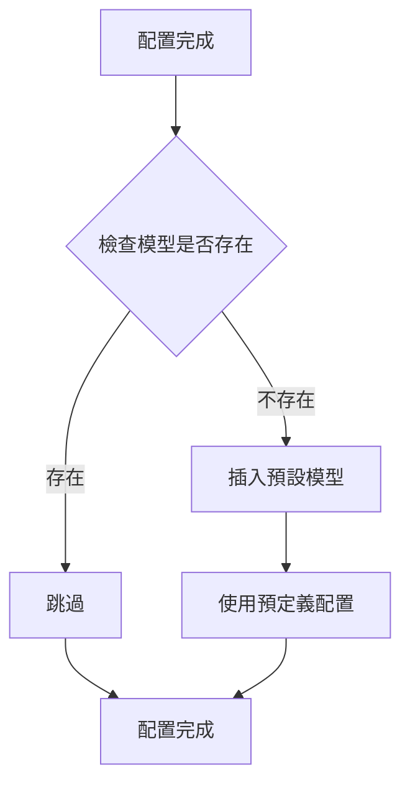

## 效能最佳化

### 配置快取策略

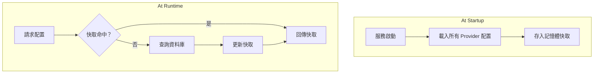

### 連線池管理

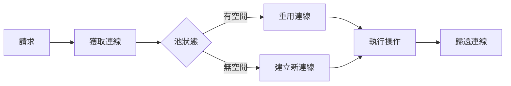

## 錯誤處理

### 使用者輸入驗證

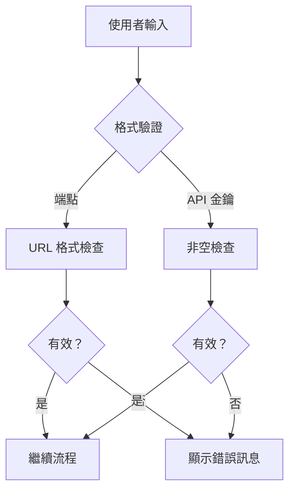

### 網路錯誤處理

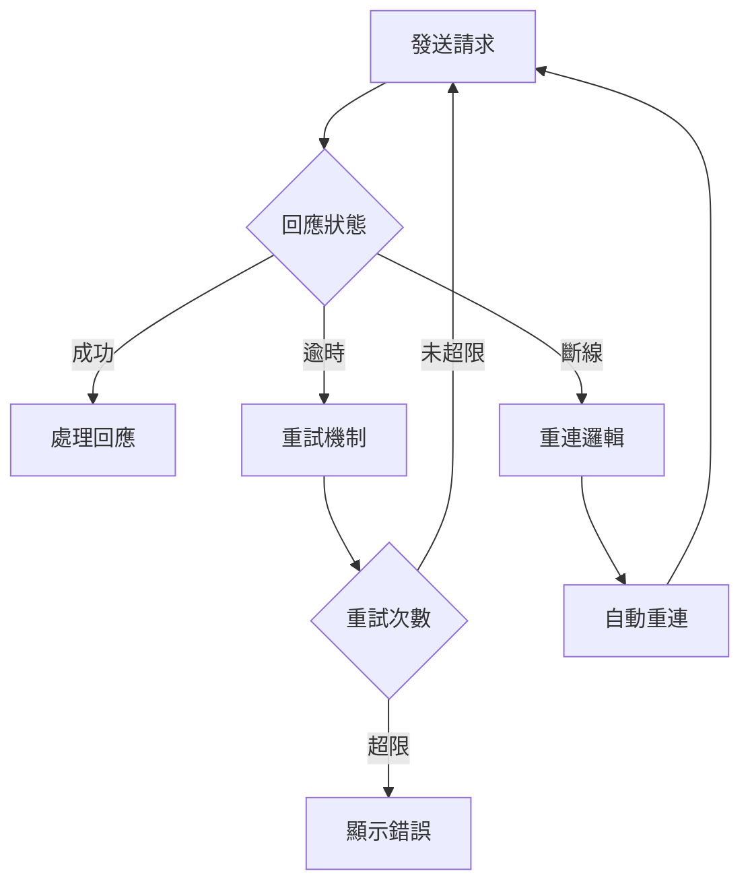

## 安全考量

### API 金鑰保護

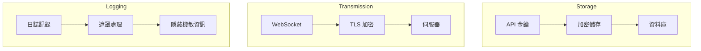

### 安全措施

| 階段 | 措施 | 說明 |
| --- | --- | --- |
| 儲存 | 加密儲存 | 在資料庫中加密 API 金鑰 |
| 傳輸 | TLS 加密 | WebSocket 使用加密通道 |
| 日誌 | 遮罩 | 不記錄明文金鑰 |
| 輸入 | 參數化查詢 | 防止 SQL 注入 |

## 可擴充性設計

### 新增 Provider

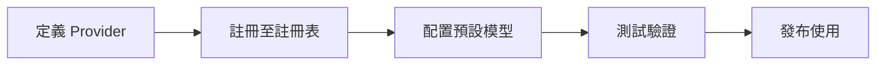

### 多 Provider 支援

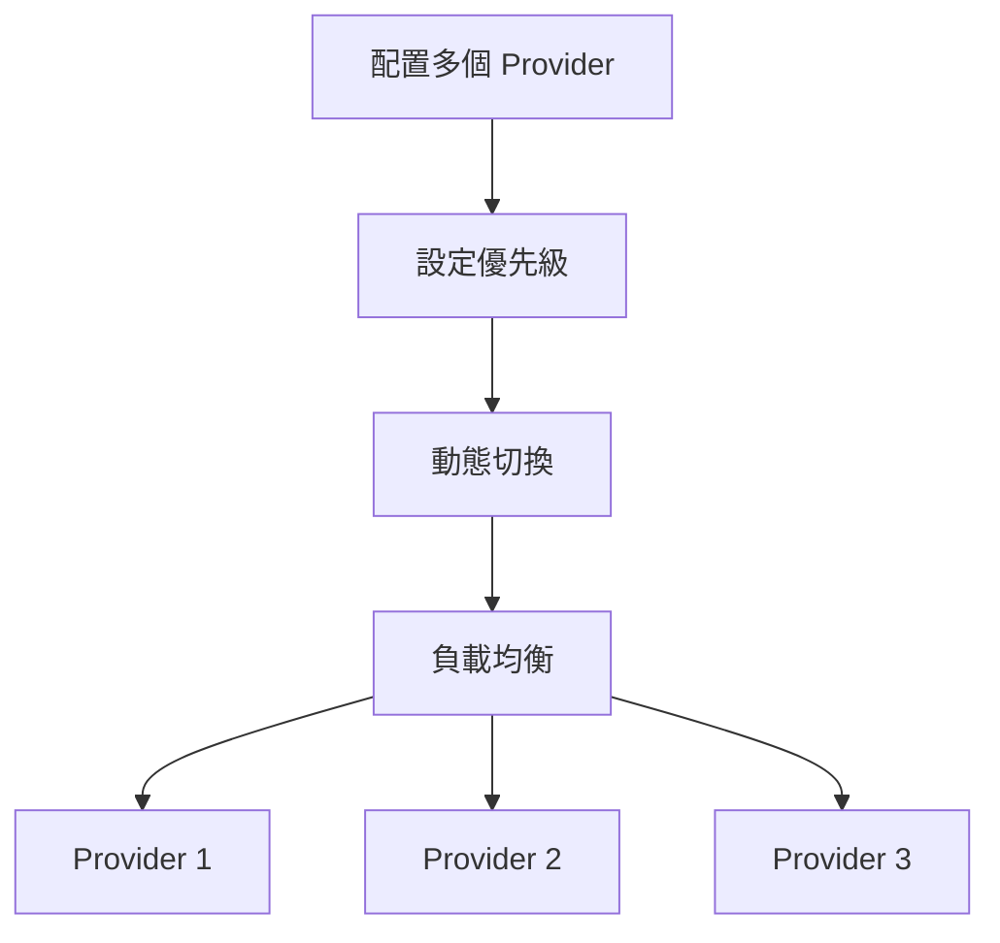

## 訊息類型定義

### WebSocket 訊息

| 訊息類型 | 方向 | 說明 |
| --- | --- | --- |
| ConfigureLlmProvider | TUI → 伺服器 | 配置請求 |
| LlmProviderConfigured | 伺服器 → TUI | 配置結果 |
| UserMessage | TUI → 伺服器 | 使用者對話 |
| AgentResponse | 伺服器 → TUI | Agent 回應 |

## 未來規劃

| 功能 | 說明 | 優先級 |
| --- | --- | --- |
| 配置匯入/匯出 | 支援配置檔案遷移 | 高 |
| Provider 健康檢查 | 定期 Provider 可用性檢測 | 中 |
| 自動故障轉移 | Provider 不可用時自動切換 | 中 |
| 使用統計整合 | 與使用統計系統連動 | 低 |

# MCP 提示注入與上下文壓縮機制

## 概述

本文件描述兩個關鍵架構設計：MCP 工具強制提示注入機制與 Todo 標記式上下文壓縮機制。這兩個機制協同工作，在長對話場景中標準化 Agent 行為並最佳化上下文管理。

## I. MCP 工具文件注入（Exec-Only）

### 核心概念

在 exec-only 微核心架構下，LLM 僅接收**三個工具定義**：`exec`、`write_to_var` 和 `write_to_var_json`。MCP 工具是透過 exec 的 JS 執行時調用的內部 API。MCP 工具文件透過 `related_tools` 機制作為 JS API 文件注入到技能提示中——而不是作為單獨的工具定義發送給 LLM。

```mermaid
flowchart LR
    A[Skill related_tools] --> B[McpToolDocLoader]
    B --> C[讀取 TOML 參數 + MD 描述]
    C --> D[格式化為 JS API 文件]
    D --> E[注入至系統提示]

    style D fill:#90EE90
```

### 關鍵特性

| 特性 | 說明 |
| --- | --- |
| Exec-only 表面 | LLM 僅看到 `exec`、`write_to_var`、`write_to_var_json`；MCP 工具從不作為工具定義暴露 |
| 技能範圍 | 工具文件透過 `related_tools` 按技能注入，而非全域 |
| JS API 格式 | 文件格式為 `ES 模組匯入 API 參考 — 描述` |
| 內部路由 | McpToolRegistry 為每個 Agent 存在，但僅用於內部分派 |

### 設計動機

```mermaid
flowchart TB
    subgraph Problem Scenarios
        A[過多工具定義膨脹上下文]
        B[每個工具的提示注入脆弱]
        C[LLM 因工具擴散而困惑]
    end

    subgraph Solutions
        D[三工具表面：exec、write_to_var、write_to_var_json]
        E[MCP 文件作為 JS API 參考]
        F[技能範圍的 related_tools 注入]
    end

    A --> D
    B --> E
    C --> F
```

### 注入流程

```mermaid
sequenceDiagram
    participant Skill as Skill（related_tools）
    participant Loader as McpToolDocLoader
    participant MCP as MCP 工具配置（TOML + MD）
    participant Prompt as 系統提示

    Skill->>Loader: related 工具名稱列表
    Loader->>MCP: 讀取 TOML 參數 + MD 描述
    MCP-->>Loader: 工具元資料

    Loader->>Loader: 格式化為 ES 模組匯入 API 參考 — 描述
    Loader->>Prompt: 注入至系統提示的技能段落

    Note over Prompt: LLM 僅看到 exec 工具<br/>MCP 文件顯示為 JS API 參考
```

### 注入格式

每個 MCP 工具的文件被格式化為 JS API 參考：

$agent.todo_list_view() — 檢視目前的 todo 樹結構
$agent.todo_create({ title: String, description: String }) — 建立新的 todo 項目
$agent.todo_update_status({ `todo_id`: String, status: String }) — 更新 todo 項目的狀態

### 權限級別

每個 `[[related_tools]]` 項目可選擇性地宣告 `access_mode`：

[[`related_tools`]]
`agent_name` = "polemos"
`tool_name` = "`node_execute`"
`access_mode` = "read"       # 技能僅需要讀取級別存取（預設："read"）

雙重授權閘道檢查：

1. 工具宣告的 `ToolCapability` 支援請求的 `access_mode`
1. 目標節點的 `TrustLevel` 允許該操作
1. 對於外部節點，適用額外的風險級別門檻

參見 `docs/design/en/22-mcp-tool-permission-model.md` 以獲取完整細節。

### 優點與權衡

```mermaid
graph TB
    subgraph Advantages
        A[最小化工具表面]
        B[技能範圍的文件]
        C[一致的 API 格式]
        D[內部路由靈活性]
    end

    subgraph Trade-offs
        E[LLM 必須建構 JS 調用]
        F[除錯需要 exec 追蹤]
        G[related_tools 需要維護]
    end
```

## II. Todo 標記式上下文壓縮機制

### 核心概念

傳統壓縮依賴於摘要文字，會丟失關鍵細節。新機制改為標記關鍵 Todo 項目，將原始細節作為使用者輸入保留，直接繼續原始 Skill 執行。

```mermaid
flowchart LR
    subgraph Traditional Way
        A1[上下文] --> B1[摘要文字]
        B1 --> C1[新對話]
        C1 --> D1[可能丟失細節]
    end

    subgraph Todo Marker Way
        A2[上下文] --> B2[標記關鍵 Todo]
        B2 --> C2[保留原始細節]
        C2 --> D2[無資訊丟失]
    end
```

### 設計動機比較

| 傳統方式問題 | Todo 標記優勢 |
| --- | --- |
| 資訊丟失 | 原始保留 |
| 語義漂移 | 可追溯 |
| 不可驗證 | 可驗證 |
| 技能失效 | 技能連續性 |

### 壓縮流程

```mermaid
sequenceDiagram
    participant User as 使用者
    participant Agent as 原始 Agent
    participant Marker as Todo 標記器
    participant NewAgent as 新 Agent
    participant TodoMCP as Todo MCP

    User->>Agent: 請求上下文壓縮
    Agent->>Marker: 獲取關鍵 Todo 項目

    Note over Marker: 套用標記策略

    Marker-->>Agent: 已標記項目清單
    Agent->>TodoMCP: 批次獲取詳細資訊
    TodoMCP-->>Agent: Todo 詳細資訊

    Agent->>NewAgent: 開始新對話

    Note over NewAgent: 系統提示 = 原始 Skill<br/>使用者輸入 = Todo 詳細資訊

    NewAgent->>TodoMCP: 檢視 Todo 樹
    Note over NewAgent: 發現詳細資訊已在輸入中<br/>直接繼續
```

### 標記策略

```mermaid
flowchart TB
    subgraph Strategy Types
        A[手動標記]
        B[AutoCritical 關鍵路徑]
        C[AutoUnfinished 未完成任務]
        D[混合策略]
    end

    A --> A1[使用者選擇關鍵項目]
    B --> B1[自動識別主任務鏈]
    C --> C1[標記所有未完成項目]
    D --> D1[組合多種策略]
```

### 策略比較

| 策略 | 標記內容 | 適用場景 |
| --- | --- | --- |
| 手動 | 使用者指定 | 精確控制 |
| AutoCritical | 主任務鏈 + 阻塞任務 | 複雜任務 |
| AutoUnfinished | 所有未完成任務 | 簡單恢復 |
| 混合 | 組合 + 使用者標記 | 一般場景 |

### 標記項目結構

```mermaid
classDiagram
    class MarkedTodoItem {
        +todo_id: String
        +include_depth: u32
        +include_ancestors: bool
        +include_artifacts: bool
    }

    class MarkerStrategy {
        <<enumeration>>
        Manual
        AutoCritical
        AutoUnfinished
        Hybrid
    }

    class TodoMarker {
        +marked_items: List~MarkedTodoItem~
        +marker_strategy: MarkerStrategy
        +mark_critical_todos()
    }

    TodoMarker --> MarkedTodoItem
    TodoMarker --> MarkerStrategy
```

## III. 兩種機制的協同

### 協同流程

```mermaid
sequenceDiagram
    participant User as 使用者
    participant OldAgent as 舊 Agent
    participant Marker as Todo 標記器
    participant Loader as McpToolDocLoader
    participant NewAgent as 新 Agent

    Note over OldAgent: 上下文接近限制

    User->>OldAgent: 壓縮上下文
    OldAgent->>Marker: 標記關鍵 Todo
    Marker-->>OldAgent: 已標記項目清單

    OldAgent->>NewAgent: 建立新對話

    Note over NewAgent: 系統提示 = Soul + Skill<br/>related_tools 由 McpToolDocLoader 載入

    NewAgent->>Loader: 載入 related_tools 的工具文件
    Loader-->>NewAgent: 已格式化的 JS API 文件

    Note over NewAgent: 系統提示包含：<br/>1. Soul 身份<br/>2. Skill 模板 + related_tools 文件<br/>3. 三個工具：exec、write_to_var、write_to_var_json

    NewAgent->>NewAgent: 透過 exec JS 執行時執行
    Note over NewAgent: MCP 工具是內部 API<br/>發現詳細資訊已在輸入中

    NewAgent-->>User: 無縫任務延續
```

### 關鍵協同點

```mermaid
flowchart TB
    subgraph Collaboration Mechanism
        A[McpToolDocLoader 注入 JS API 文件]
        B[Marker 提供完整上下文]
        C[Soul + Skill 提示保留]
    end

    A --> D[技能擁有 MCP 工具的 JS API 參考]
    B --> E[提供足夠的完整資訊]
    C --> F[行為一致性得以維持]

    D --> G[無縫任務延續]
    E --> G
    F --> G
```

## IV. 實作路線圖

```mermaid
flowchart LR
    subgraph Phase 1 High Priority
        A[MCP 提示注入]
        A --> A1[資料結構]
        A --> A2[注入邏輯]
        A --> A3[配置管理]
    end

    subgraph Phase 2 Medium Priority
        B[Todo 標記機制]
        B --> B1[標記策略]
        B --> B2[壓縮恢復]
        B --> B3[手動標記]
    end

    subgraph Phase 3 Low Priority
        C[智慧策略]
        C --> C1[AutoCritical]
        C --> C2[混合]
        C --> C3[智慧建議]
    end
```

## V. 風險評估與緩解

### 風險矩陣

| 風險 | 影響 | 緩解措施 |
| --- | --- | --- |
| Token 開銷過大 | 效能下降 | 限制標記數量，壓縮級別可配置 |
| 提示過於嚴格 | 靈活性降低 | 提供繞過機制，異常處理指引 |
| 標記策略不準確 | 資訊遺漏 | 手動覆蓋，視覺確認 |

### 錯誤處理流程

```mermaid
flowchart TB
    A[操作失敗] --> B{失敗類型}
    B -->|Token 超限| C[修剪非關鍵項目]
    B -->|策略失敗| D[備援至手動模式]
    B -->|注入失敗| E[使用預設行為]

    C --> F[重試操作]
    D --> F
    E --> F
```

## VI. 配置整合

### 整體配置結構

```mermaid
flowchart TB
    subgraph Skill Config
        A[related_tools]
        B[tool_names list]
    end

    subgraph Compression Config
        C[enabled]
        D[default_strategy]
        E[trigger_threshold]
    end

    subgraph Strategy Config
        F[include_critical_path]
        G[include_unfinished]
        H[max_marked_items]
    end

    A --> I[JS API 文件生成]
    C --> J[壓縮控制]
    F --> K[標記規則]
```

## VII. 未來擴充

| 功能 | 說明 | 優先級 |
| --- | --- | --- |
| 動態提示生成 | 根據任務複雜度調整約束 | 中 |
| 多對話共享 | 多個 Agent 共享 Todo 標記 | 中 |
| 智慧標記建議 | 自動推薦標記項目 | 低 |
| 視覺化標記工具 | 圖形化標記介面 | 低 |

## VIII. 補充 RAG 上下文注入（v2.1+）

第 I-VII 節描述的 MCP 工具注入為 LLM 提供了 **API 參考**——它告訴 LLM *如何*調用工具。一個補充機制，RAG 上下文注入，為 LLM 提供**預先計算的知識**——它將 RAG 查詢的*結果*直接注入系統提示。

| 方面 | MCP 工具注入 | RAG 上下文注入 |
| --- | --- | --- |
| LLM 接收的內容 | API 參考文件（ES 模組匯入） | 實際知識內容（記憶節點、工作區文件） |
| 何時注入 | 每個技能，基於 `related_tools` | 每個技能步驟，基於技能上下文 |
| LLM 參與 | LLM 必須調用工具 | 無 LLM 參與——預先計算 |
| 延遲影響 | N 次往返（每次調用一次） | 每個技能步驟 1 次預計算 |
| IEPL 模組 | `{agent}`（MCP 分派） | `rag/{philia,aporia}`（緩衝區讀取） |

兩種機制共存：MCP 工具仍然可作為預計算上下文未涵蓋的查詢的備援。參見 `docs/design/en/26-rag-context-injection.md` 以獲取完整設計。

# Agent 雙重身份與可見性邊界設計

## 目標

- 完全分離可見的 Skill 執行實例與內部的 MCP/LLM 工具提供者。
- 僅允許 Skill 調用建立帶有 3 位數徽章的臨時可見 Agent。
- 將 MCP/LLM 模型與 token 使用歸屬於所附加的 Skill 實例，而不建立額外的可見 Agent。
- 保留執行時 UUID 身份用於審計、歷史與重播，不讓其洩漏到 TUI 時間線。

## 身份層

- `agent_number`：面向 UI 的 3 位數徽章以及可見時間線節點的穩定鍵。
- `agent_uuid`：用於註冊表、審計與歷史的執行時 UUID。
- `agent_id`：一個相容性欄位。
  - 在可見的 TUI 負載中，`agent_id` 應匹配面向面板的 `agent_number`。
  - 在內部註冊表和 MCP 執行路徑中，`agent_id` 可能保持 UUID 格式。

## 可見性與實例化規則

- 僅 Skill 調用建立臨時的可見 Agent 實例。
- SimpleTool/MCP 提供者不得因為其工具被調用而建立額外的可見 Agent。
- 當 Skill 使用 MCP 工具或內部 `llm_chat` 調用時，這些調用保持為該 Skill 實例下的從屬執行。
- 範例：若 HubRis 調用 ApoRia 的 `llm_chat`，ApoRia 保持為內部執行器，不得在右上角時間線中顯示為第二個可見節點。

## MCP 與 LLM 歸屬規則

- 若 MCP/LLM 調用屬於一個可見的 Skill 實例，其模型名稱與 token 使用必須歸屬於該 Skill 實例。
- 內部提供者仍可保留自己的審計或全域計帳，但這些內部統計不得觸發 TUI 節點建立。
- MCP 日誌與上下文應保留：
  - `agent_number`
  - `agent_uuid`
  - `tool_name`
  - `phase`（`start`/`finish`）
  - `success` 與 `error`

## TUI 渲染合約

- TUI 僅為顯式的 3 位數面板 ID 建立時間線節點。
- 沒有可見 `agent_number` 的負載僅可更新全域模型/token 統計，不得建立可見的 Agent 節點。
- 顯示標籤與節點鍵不得從 UUID 或 `agent_id` 內找到的任意數字衍生出可見徽章。
- 對於可見節點：
  - `agent_number` 用於顯示和互動。
  - `agent_uuid` 僅保留用於審計、歷史與除錯。

## 徽章分配與生命週期

- `agent_number` 從可用的 `000`-`999` 池中隨機分配，而非順序指派。
- 釋放的編號可重用。
- 當所有 1000 個徽章都在使用中時，分配器可能備援為隨機重用；此時歷史區分必須依賴 `agent_uuid`。
- 可見實例的清理與徽章回收由 Skill 生命週期管理器處理。

## 相容性約束

- 僅攜帶 `agent_id` 的舊版負載仍可在內部解析，但可見 UI 不得從 UUID 格式的 ID 合成新節點。
- 當 `agent_number` 和 `agent_uuid` 同時存在時，套用雙重身份模型：
  - `agent_number` 用於顯示與互動。
  - `agent_uuid` 用於審計與歷史。

# 請求並發架構

## 概述

Scepter 管理兩個獨立的並發層：

```mermaid
flowchart LR
    User["使用者請求"] --> Semaphore["請求信號量"]
    Semaphore --> Cosmos["Cosmos 容器"]
    Cosmos --> Queue["層級佇列（RequestPool）"]
    Queue --> LLM["LLM API"]
```

## 類比

想像一間餐廳：

- **顧客**（使用者請求）到達並同時下單
- **餐桌**（Cosmos 容器）為每個請求建立——每個都有自己的工作區
- **廚房站點**（LLM 提供者並發）是有限的——也許總共 3 個
- **票務系統**（`RequestPool` 層級佇列）管理每個層級的 FIFO 排序

30 位顧客可以同時點餐（scepter 接受多個請求），但廚房只能同時烹調 3 道菜（LLM API 速率限制）。

## 第 1 層：請求信號量

**位置**：`state_machine/domains/control_domain.rs` — `concurrent_request_semaphore`

控制 scepter 同時接受多少使用者請求。每個請求建立一個獨立的 Cosmos 容器及其自己的 LLM 處理器。

```mermaid
flowchart LR
    User1["使用者訊息"] -->|"N = 所有模型的 max_concurrent 總和"| Semaphore["Semaphore(N)"]
    User2["使用者訊息"] --> Semaphore
    User3["使用者訊息"] --> Semaphore
    Semaphore --> Container1["Cosmos 容器 + LLM 處理器"]
    Semaphore --> Container2["Cosmos 容器 + LLM 處理器"]
    Semaphore --> Container3["Cosmos 容器 + LLM 處理器"]
```

N = 所有已啟用模型的並發槽位總和。若模型 A（3 槽）+ 模型 B（2 槽）= 5 個並發請求。

先前這是 `AtomicBool`（N=1），現在是 `Semaphore(N)`。

## 第 2 層：層級佇列（RequestPool）

**位置**：`infra/request_pool.rs` — `RequestPool`

每個層級的 FIFO 佇列，具有每個模型的信號量。在一個層級內：

1. 進入的 LLM 請求進入層級佇列
1. 嘗試先獲取最高優先級模型的槽位
1. 若忙碌，按優先級順序嘗試下一個模型
1. 若全部忙碌，在 FIFO 佇列中等待——哪個模型先釋放槽位就為下一個請求服務

```mermaid
flowchart TB
    subgraph Tier["層級：'normal'"]
        direction TB
        Queue["FIFO 佇列：req1 → req2 → req3 → req4"]
        MA["模型 A（優先級 10）：Semaphore(3) ■■□"]
        MB["模型 B（優先級 5）： Semaphore(2) □□"]
        MC["模型 C（優先級 1）： Semaphore(1) ■"]
        Queue -->|"req1 → 模型 A（可用）"| MA
        Queue -->|"req2 → 模型 B（可用，A 忙碌）"| MB
        Queue -->|"req3 → 等待... 模型 A 釋放 → 服務"| MA
        Queue -->|"req4 → 等待... 模型 C 釋放 → 服務"| MC
    end
```

### 核心屬性

- **每個提供者隔離**：每個模型的 `max_concurrent` 是獨立的
- **優先級排序**：當可用時，優先使用較高優先級的模型
- **備援**：若高優先級模型飽和，較低優先級模型立即服務
- **FIFO 公平性**：等待的請求按到達順序服務

### 配置

# provider_config.toml
[[models]]
id = "gpt-5.4"
tier = "normal"
priority = 10
`max_concurrent` = 3        # 同時向此模型發起 3 次 API 調用

[[models]]
id = "gpt-4o-mini"
tier = "normal"
priority = 5
`max_concurrent` = 5        # 同時 5 次 API 調用

[[models]]
id = "deepseek-v3"
tier = "deep"
priority = 8
`max_concurrent` = 2

以此配置：

- `normal` 層級：模型 A（3 槽）+ 模型 B（5 槽）= 8 個並行 normal 層級 LLM 調用
- `deep` 層級：模型 C（2 槽）= 2 個並行 deep 層級 LLM 調用
- 請求信號量：3 + 5 + 2 = 10 個並行使用者請求

## 流程：使用者訊息 → LLM 回應

    1. 使用者透過 TUI/CLI/socket 發送訊息
    1. `handle_user_message`():

a. 在請求信號量（第 1 層）上 `try_acquire`()

          - 若無槽位：回傳 "busy" 錯誤
          - 每個槽位 → 獨立的 Cosmos 容器

b. `execute_skill_chain`() → `invoke_aporia_llm_chat`()

    1. `invoke_aporia_llm_chat`():

a. 在 `RequestPool`（第 2 層）上 `acquire_tier`("normal", `excluded_models`)

          - 按優先級順序嘗試每個模型（非阻塞）
          - 若全部忙碌：在 FIFO 中等待直到任何模型槽位釋放
          - 回傳 TierPermit { `model_id`, `display_name` }

b. `chat_loop` → llm_backend.chat() → LlmService::`chat_with_tools`()

          - 使用選定的模型進行 API 調用

c. TierPermit 丟棄 → 信號量槽位釋放

    1. `finish_handling`():

a. 請求信號量許可歸還
b. Cosmos 容器可以清理（或重用）

## E2E 測試

測試使用閒置逾時（非絕對截止時間）。計時器在每個有意義的事件上重置：

# 活動重置閒置計時器——只要保持活躍，鏈可以無限期執行
ACTIVE_METHODS = {
"Tui.`OrchestrationStatus`",
"Tui.`McpToolResult`",
"Tui.`AgentReport`",
"Tui.`AgentStreamingChunk`",
"Tui.`TaskStatusUpdate`",
"Tui.`AskHumanRequest`",
"Tui.AgentPatch",
"Tui.`ContainerSnapshot`",
}

這確保：

- 短閒置逾時（120s）捕獲真正卡住的鏈
- 長時間執行但活躍的鏈（複雜的多技能）永遠不會被過早終止

# 嵌入式開發資料庫與功能開關的正式環境隔離

## 概述

entelecheia 使用 [pglite-oxide](https://crates.io/crates/pglite-oxide) 作為嵌入式 PostgreSQL，用於兩種目的：

1. **本地開發**：當未配置 `DATABASE_URL` 時，scepter 自動啟動一個程序內 PostgreSQL（PG 17.5，透過 WASM/wasmer），並支援 pgvector。
1. **整合測試**：PG 整合測試使用 pglite-oxide 而非 Docker/testcontainers。

在正式環境（Docker）中，`embedded-db` 功能被排除，scepter 連接到真實的 PostgreSQL 容器。

## 設計動機

先前，本地開發需要 Docker Compose 或手動安裝 PostgreSQL。整合測試依賴 `testcontainers`，增加了 CI 中的 Docker-in-Docker 複雜性。pglite-oxide 消除了這兩項需求——`cargo run` 在本地開發「直接可用」，且 `cargo test` 執行時無需 Docker。

## 功能開關架構

```mermaid
flowchart TB
    Cargo["scepter Cargo.toml<br/>[features] default = ['all-agents', 'embedded-db']  ← 開發<br/>embedded-db = ['dep:pglite-oxide']<br/>[dependencies] pglite-oxide = { workspace = true, optional = true }"]

    Cargo -->|"cargo build（預設）"| Dev["pglite-oxide + wasmer WASM<br/>包含"]
    Cargo -->|"Dockerfile<br/>--no-default-features<br/>--features all-agents"| Prod["無 pglite，無 wasmer<br/>（正式環境）"]
```

| 建置上下文 | 指令 | pglite-oxide | wasmer | DATABASE_URL |
| --- | --- |  ---  |  ---  | --- |
| `cargo run`（本地開發） | 預設功能 | ✓ | ✓ | 可選——若缺失則自動啟動嵌入式 PG |
| `cargo test`（測試） | 預設功能 | ✓ | ✓ | 由測試工具自動啟動 |
| `just build`（發佈） | `--no-default-features --features all-agents` | ✗ | ✗ | 必要 |
| Docker `Dockerfile` | `--no-default-features --features all-agents` | ✗ | ✗ | 必要（指向 PG 容器） |

## 執行時資料庫解析順序

```rust
// packages/scepter/src/app/setup.rs
let `db_url` = if let Ok(url) = std::env::var("DATABASE_URL") {
// 1. 環境變數（正式環境：Docker PG，開發：.env 檔案）
url
} else if !user_config.database.url.is_empty() {
// 2. 使用者配置檔案（~/.config/entelecheia/config.toml）
user_config.database.url.clone()
} else {
// 3. 嵌入式 pglite-oxide（功能開關）
#[cfg(feature = "embedded-db")]
{
let server = `PgliteServer`::builder()
.extension(`pglite_oxide`::extensions::VECTOR)  // pgvector 支援
.start()?;
let url = server.database_url();
std::mem::forget(server);  // 在程序生命週期內保持存活
url
}
#[cfg(not(feature = "embedded-db"))]
{
return Err(/* "未配置 DATABASE_URL" */);
}
};
```

## 測試工具模式

```no_run
// tests/pg_integration/auth_test.rs
static PG: OnceCell<(String, PgliteServer)> = OnceCell::const_new();

# [test]
fn pg_integration_tests() {
    let rt = tokio::Runtime::new().unwrap();
    rt.block_on(async {
        let url = ensure_pg_url().await;
        let db = connect_db(&url).await;  // max_connections=1
        pg_user_crud(&db).await;
        pg_unique_username(&db).await;
        pg_rbac_role_persistence(&db).await;
        pg_rbac_audit_log(&db).await;
    });
    std::process::exit(0);  // 繞過 sqlx 池阻塞
}
```

## 建立的資料表

全部 23 個表 + 1 個 schema 範圍的表 + 4 個檢視表透過 SeaORM 遷移建立：

**核心**：`users`、`rbac_user_roles`、`rbac_audit_log`、`agents`、`conversations`、`messages`、`tasks`
**目標**：`goals`、`tracks`、`goal_tasks`
**知識**：`knowledge_bases`、`knowledge_documents`（pgvector 嵌入）、`rag_subscriptions`
**共識**：`consensus_records`、`consensus_references`、`consensus_verifications`
**基礎設施**：`credentials`、`ssh_credentials`、`container_snapshots`、`model_usage_stats`
**工作區**：`workspace_registry`、`todo_items`、`workspace_bindings`
**日誌**：`log.entries`（獨立的 `log` schema）
**檢視表**：`usage_period_stats`、`usage_model_stats`、`usage_role_stats`、`usage_session_stats`

## PGlite 限制

| 限制 | 影響 | 緩解措施 |
| --- | --- | --- |
| `max_connections=1` | 一次只有一個池 | 在子測試間共享資料庫連線；測試間不 `db.close()` |
| 嚴格的型別轉換 | `uuid = text` 失敗 | 始終傳遞型別化值（如 `Uuid` 而非 `String` 用於 UUID 欄位） |
| 不支援並行存取 | 測試必須順序執行 | 單一 `#[test]` 執行器，所有子測試內聯 |
| sqlx 池背景任務 | `close()` 無限期阻塞 | 所有測試完成後 `std::process::exit(0)` |

## Docker 建置強化

所有正式環境 Dockerfile 排除 embedded-db：

# Dockerfile
RUN cargo build --release -p scepter \
--no-default-features --features all-agents

這確保正式環境映像中不會有 wasmer/pglite 程式碼，保持二進位大小最小化並減少攻擊面。
