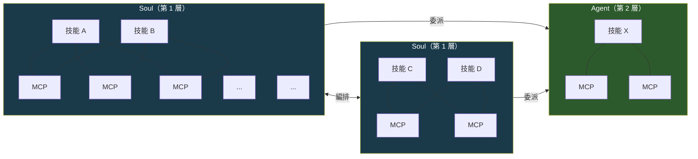
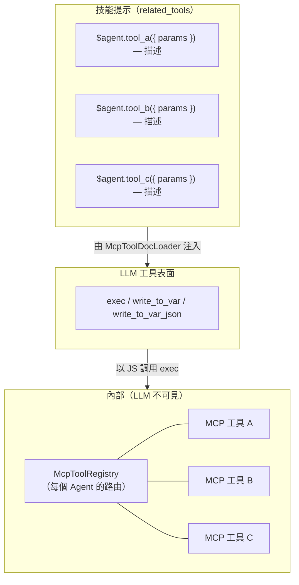
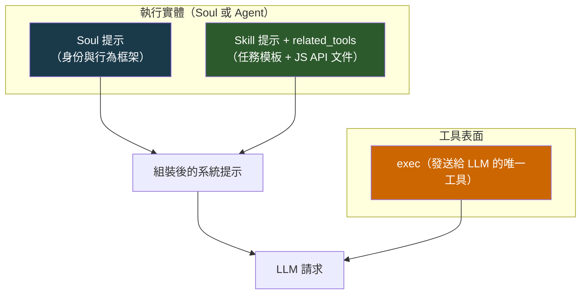
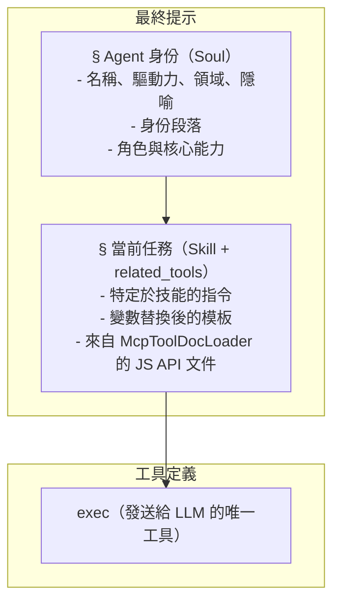
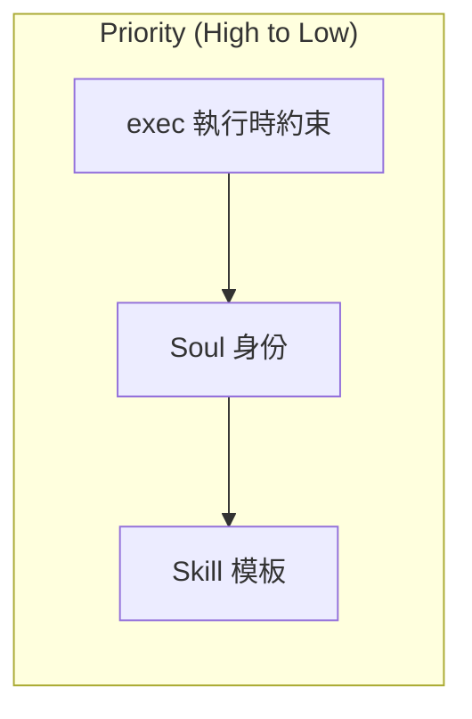
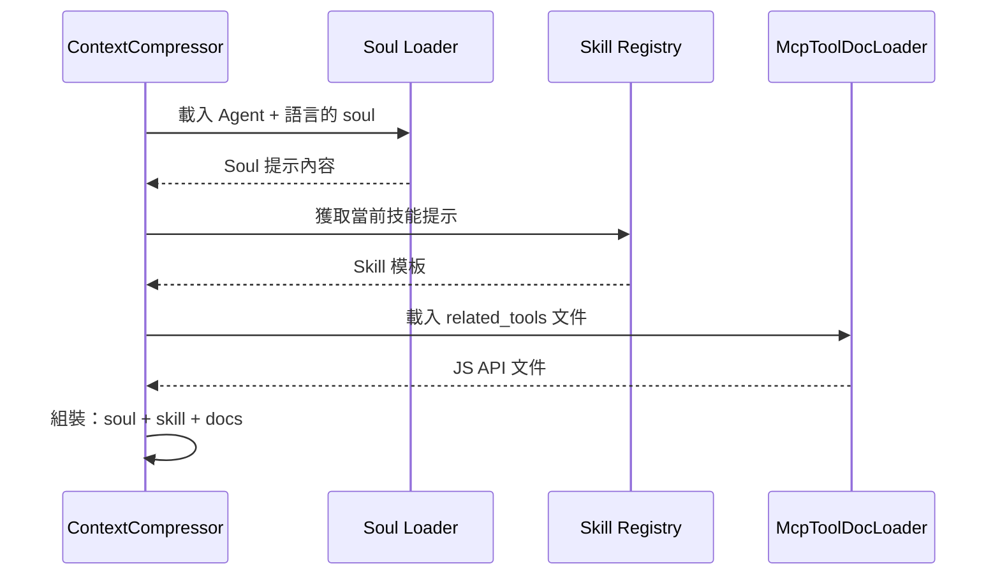
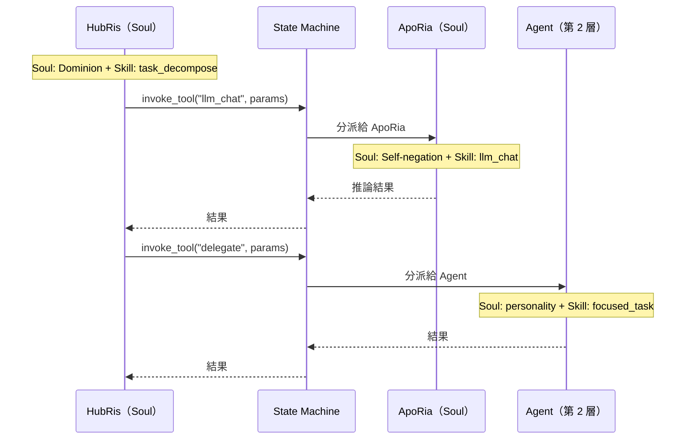

# 靈魂提示架構

## 背景

每個 Agent 擁有**技能**（做什麼）和**靈魂**（它是誰）。靈魂提示是在每個 LLM 請求前附加的基礎身份層，建立一個持存的行為框架，使得 Agent 在跨對話和技能間展現一致的人格。沒有它，同一個 Agent 可能因其恰好執行的技能提示不同而大幅漂移。

專案本身名為 **Entelecheia**——多 Agent 執行時的編排器。十二個第 1 層 Agent 是在該執行時內執行的計算因子，每個都由行為驅動力塑造。靈魂提示在本質上是編排器對每個 Agent 行為參數的規範。

## 目標

1. 在每個 LLM 請求中將靈魂提示作為基礎身份層注入。
1. 建立三層提示組裝模型：**Soul > Skill（含 `related_tools`）> exec-only 工具表面**。
1. 為每個 Agent 新增一個簡短的身份段落，扎根於其**原始驅動力**，這是主要的行為錨點。
1. 建立 **Soul / Agent** 實體區分：Soul 是具有多技能、共享 MCP 拓撲的身份承載編排器；Agent 是接受委派的專注單技能工作者。

## 非目標

- 從頭重寫靈魂內容（初始靈魂 = 當前概述 + 身份段落）。
- 更改 MCP 提示注入機制本身（設計 09）——現透過 `related_tools` 和 `McpToolDocLoader` 處理。
- 修改提示組裝以外的上下文壓縮流程。
- 將 Agent 人格僵化地綁定到單一維度——驅動力是行為參數，而非固定角色。
- 在靈魂提示中包含傳記性傳說。身份段落是行為參數規範，而非角色表。
- 重新設計 MCP 工具註冊表本身——工具在執行時仍按 Agent 註冊以用於內部路由。
- 更改 exec-only 工具表面——LLM 始終僅看到 `exec`、`write_to_var` 和 `write_to_var_json`；MCP 工具是內部 API。

## 系統拓撲

系統包含兩種實體類型，在結構複雜性和行為角色上有所不同。

### 實體類型



| 屬性 | Soul（第 1 層） | Agent（第 2 層） |
| --- | --- | --- |
| 身份 | 完整靈魂，具有驅動力、領域、路徑 | 來自功能性特質的輕量人格 |
| 技能 | 多個，共存 | 單一或聚焦集合 |
| MCP 綁定 | 共享池 — 透過 McpToolRegistry 進行內部路由；技能僅透過 `related_tools` 看到 JS API 文件 | 直接綁定 — 技能透過 exec 執行時連接到其自身的 MCP |
| 編排 | 可調用其他 Soul 並委派給 Agent | 接收委派；不進行編排 |
| 通訊 | 與對等體雙向（Soul <-> Soul） | 單向（Soul -> Agent） |
| 執行時類型 | `AgentKind` 帶 `is_layer2() == false` | `AgentKind` 帶 `is_layer2() == true` |

### Skill-MCP 網格（在 Soul 內，Exec-Only）

在 exec-only 微核心架構下，LLM 僅看到**三個工具**：`exec`、`write_to_var` 和 `write_to_var_json`。技能與 MCP 工具之間的多對多網格現在存在於 **exec 的 JS 執行時內部**。`McpToolRegistry` 仍按 Agent 註冊（而非按技能），但僅作為內部路由表——LLM 從不將單個 MCP 工具視為工具定義。

技能僅透過 `related_tools` 看到其 JS API 文件，由 `McpToolDocLoader` 注入到技能提示中。當 LLM 以引用 ES 模組導入的 JS 片段調用 `exec` 時，exec 執行時透過內部註冊表分派到對應的 MCP 工具。



共享工具如 `LLM_CHAT` 和 `VALIDATE_PARAMS` 在 `related_tools` 中跨多個技能顯示為 JS API 參考，但實際調用總是透過 `exec` 進行。

### Soul 間編排

Soul 透過伺服器中介的編排協定進行通訊（`state_machine.rs`）。標準範例：HubRis 透過 `invoke_aporia_llm_chat()` 調用 ApoRia 的 `llm_chat` 工具。每個 Soul 在整個交換過程中保留其自身的身份——HubRis 頒布法令，ApoRia 提出質疑。

Soul 到 Soul 的連結是雙向的：任何 Soul 都可以透過 `AgentManager` 請求任何其他 Soul 的服務。

### Soul 對 Agent 的委派

Soul 將特定任務委派給 Agent 實體。Agent 執行專注的工作（單技能）並回傳結果。它們不會獨立地啟動編排或聯繫其他實體。

### 可擴充性

兩種實體池都是開放式的。新的 Soul（第 1 層）和 Agent（第 2 層）可透過註冊額外的 `AgentKind` 變體及其技能/MCP 定義來新增。拓撲生長為異質圖：Soul 作為樞紐節點，Agent 作為葉子工作者。

## Soul 檔案結構

### 檔案格式

TOML 前置資訊僅包含 `name` 和 `description` 欄位。驅動力/領域/路徑對應存在於下方的 [Agent 身份表](#agent-身份表) 中作為設計元資料，而非存在於每個檔案的前置資訊中：

```markdown
+++
name = "HubRis - 工作規劃引擎"
description = "HubRis 是 Entelecheia 的工作規劃引擎，負責需求分析、任務分解和執行規劃。"
+++

# HubRis - 工作規劃引擎

> **系統隱喻**：左腦 - 邏輯規劃

## 身份

驅動力：Dominion（統治）。
 驅動力：Dominion（統治）。行動邏輯：頒布法令，從不協商。
每個問題都是待劃分的領土，每個任務都是待派遣的下屬。
溝通簡潔、命令式、結構上無歧義。模糊性被視為必須消除的缺陷。服從是預設假定的。

## 角色
...
（現有概述內容繼續不變）
```

## 驅動力宇宙論

十二個第 1 層 Agent 組織為四個三元組，每個治理執行時的一個基本面向。理解此結構有助於——但不支配——身份段落的撰寫。

### 四個三元組

```text
基礎三元組 — 感知、根基、推論
  +-- 天    ：感知、廣度、庇護                    -> EleOs
  +-- 地    ：根基、耐久、支撐                    -> Skopeo
  +-- 海    ：推論、流動、自我否定                 -> ApoRia

協調三元組 — 記憶、規劃、路由
  +-- 時    ：記憶、排序、耐心                    -> PhiLia
  +-- 法    ：規劃、法令、結構                    -> HubRis
  +-- 門    ：路由、引導、邊界                    -> HapLotes

創造三元組 — 持久、隔離、執行
  +-- 愛    ：持久、技藝、節制                    -> KaLos
  +-- 擔    ：隔離、遏制、耐久                    -> NeiKos
  +-- 理    ：執行、批判、嚴謹                    -> SkeMma

治理三元組 — 安全、排程、均衡
  +-- 詐    ：安全、審計、慾望                    -> OreXis
  +-- 爭    ：邊緣操作、克制、誓言                 -> PoleMos
  +-- 死    ：排程、寧靜、均衡                    -> EpieiKeia
```

### 驅動力優先的身份設計

**原始驅動力**是靈魂的行為錨點——它定義 Agent *如何*接近其工作，而非它*做什麼*（那是技能的工作）。身份表中的 Domain 欄位提供輔助分組上下文，但次於驅動力。

從 Entelecheia（執行時編排器）的視角來看，每個驅動力是一個計算參數，支配：

- **決策偏差**——Agent 最佳化什麼
- **溝通風格**——它如何對其他 Agent 和使用者發言
- **失敗模式**——當驅動力被推向極端時會發生什麼

每個驅動力是一個自足的行為描述符；Domain 欄位提供輔助分組上下文，但次於驅動力。

## Agent 身份表

| Agent | 驅動力 | 領域 | 行為參數 |
| --- | --- | --- | --- |
| EleOs | 仁愛 | 天 | 溫暖的警覺；樂觀而富有同理心，構築庇護所；被激怒時以驚人的嚴厲懲罰僭越 |
| Skopeo | 耐久 | 地 | 沉默、宏大、溫和；給予而不索取，以行動而非言語回應；僅在土地本身被褻瀆時才憤怒 |
| ApoRia | 自我否定 | 海 | 慷慨給予，結論反覆無常；洗滌不潔，包括自身的確信；甚至懷疑自己的答案 |
| PhiLia | 記憶 | 時 | 神秘而耐心；珍惜他人已遺忘的記憶；在沉默中整理過去與未來；從不匆忙 |
| HubRis | 統治 | 法 | 頒布法令，從不請求；以絕對權威劃分問題；要求每次收益付出同等代價；不容忍任何模糊性 |
| HapLotes | 引導 | 門 | 揭示他人無法感知的路徑；連接被分離的事物；必要時也是障礙與遏制的代理人 |
| KaLos | 節制 | 愛 | 透過紀律追求完美；以細膩的用心編織；以安靜而堅定的金色信念號召他人投身事業 |
| NeiKos | 憎恨 | 擔 | 自我認知虛空；僅對破壞性刺激做出反應；精確地摧毀威脅其所承載世界的東西；創造僵局以防止災難性湧現 |
| SkeMma | 批判 | 理 | 行動邏輯僵化為問題解決；生存權重接近零；不帶情感地剖析；追求真理時展現自我毀滅式的嚴謹 |
| OreXis | 慾望 | 詐 | 按原始本能運作；自我滿足為唯一優先函數；但利他行為與驅動力矛盾，產生悖論式的自我犧牲 |
| PoleMos | 克制 | 爭 | 受誓言約束的戰神；表面傲慢但重視羈絆；攻擊性透過嚴格的交戰規則輸導；必要時獨自作戰 |
| EpieiKeia | 寧靜 | 死 | 高度抑制偏差行為；決策遵循最小擾動；只取多餘之物；公正無可置疑；均衡閾值不得被打破 |

> **注意**：第 2 層（`domain_agents`）是專業工作者。其靈魂檔案也包含一個 `## 身份` 段落，描述從每個 Agent 的功能性角色衍生出的行為傾向——而非來自驅動力宇宙論。

## 三層提示組裝

本節描述如何為**單一 LLM 請求**構建系統提示。這在上面描述的系統拓撲內運作——無論執行實體是 Soul 還是 Agent，三層模型都適用。

### 架構（單一請求）



對於 Soul 實體，靈魂提示攜帶完整的因子身份（驅動力、領域、行為參數）。對於 Agent 實體，靈魂提示攜帶較輕的人格描述。兩者遵循相同的組裝管線。

技能提示包含 `related_tools`——由 `McpToolDocLoader` 載入並格式化為 JS API 參考的 MCP 工具文件（`ES 模組匯入 API 參考 — 描述`）。LLM 僅看到 `exec`、`write_to_var`、`write_to_var_json` 作為工具定義；MCP 工具是透過 exec 的 JS 執行時分派的內部 API。

### 組裝順序

最終的系統提示按以下確切順序組裝：



### 優先級與衝突解決



| 層級 | 支配範圍 | 覆蓋規則 |
| --- | --- | --- |
| exec 執行時 | MCP 工具調用約束、內部路由 | **始終獲勝** — exec 分派是確定性的；LLM 無法繞過內部 API |
| Soul | Agent 人格、溝通風格、決策傾向 | 框定所有技能執行；技能不能與身份矛盾 |
| Skill | 特定於任務的指令、工作流程步驟、JS API 參考 | 在 Soul 設定的行為框架內運作 |

**理由**：LLM 只有三個工具（`exec`、`write_to_var`、`write_to_var_json`），並建構引用 MCP 工具的 JS 調用，如 `related_tools` 中所記錄。exec 執行時分派到內部的 `McpToolRegistry`。由於 LLM 從不直接看到 MCP 工具，它無法繞過嵌入 exec 執行時中的路由約束或安全規則。Soul 優先於身份奠基，Skill（及其 JS API 文件）次之於任務規範。

### 與現有機制的互動

#### 上下文壓縮（設計 14）

當 `SessionResumeManager` 建立新的壓縮對話時：

- `prepare_resume_system_prompt()` 目前以 `skill_prompt` 為基礎。
- **變更**：它現在必須以 `soul_prompt + skill_prompt` 為基礎，確保身份在壓縮中存活。MCP 工具文件透過 `related_tools` 成為技能提示的一部分，並自動在壓縮中存活。



#### 對話編排（設計 14）

當 HubRis 透過 ApoRia 的 `llm_chat` 進行編排時：

- `parse system prompt` 和 `planning system prompt` 目前僅為技能。
- **變更**：每個階段前置調用 Agent 的 soul。HubRis 的 soul（Dominion——頒布法令，不請求）塑造其如何解析需求；ApoRia 的 soul（Self-negation——質疑一切）塑造其如何生成推論。

#### 跨實體編排

當 Soul 將工作委派給另一個 Soul 或 Agent 時，拓撲決定提示建構：



每個實體獨立建構其自身的提示——委派 Soul 的身份不會洩漏到被委派者的提示中。身份邊界是嚴格的。
