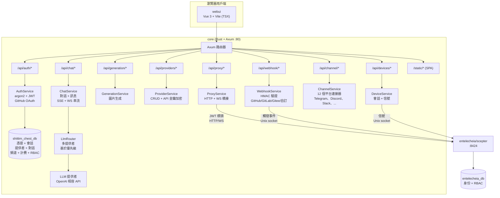
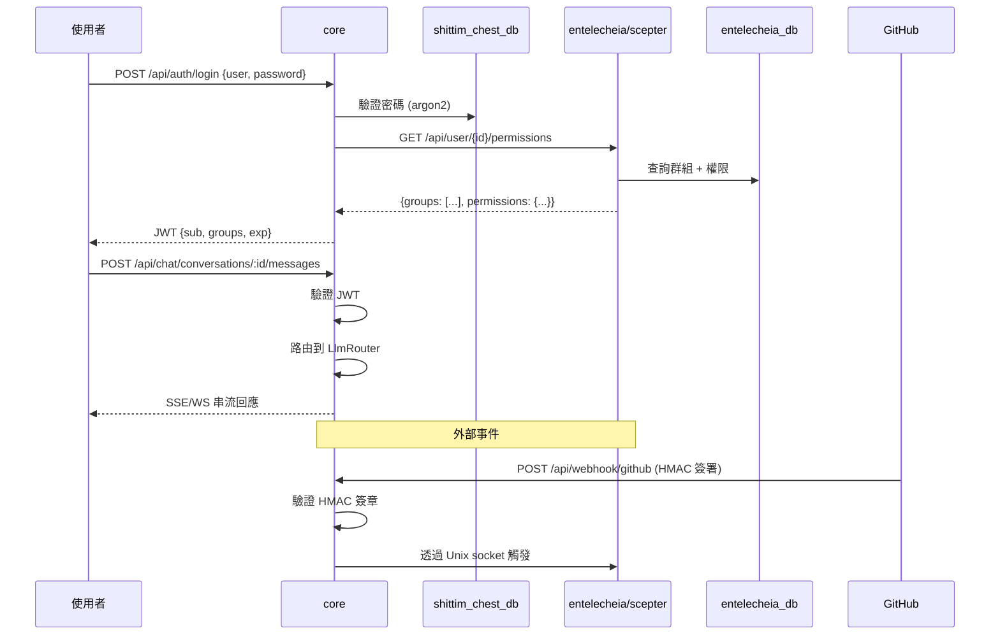

# 架構

> **版本**：0.1.0 — 開發進行中。
> **最後驗證**：2026-06-14
> 本專案是 [entelecheia](https://github.com/celestia-island/entelecheia) 的使用者面向外殼。

## 範圍

shittim-chest 是一個混合 Cargo + pnpm 的單一倉庫。它掌管圍繞 entelecheia 代理編排核心的使用者面向層。兩個專案透過 JWT 驗證的 HTTP/WebSocket 進行通訊 — shittim-chest 從不直接存取 entelecheia 的資料庫進行代理操作。

| 元件 | 技術 | 角色 | 狀態 |
| --- | --- | --- | --- |
| **core** | Rust + Axum | 統一後端：auth（JWT + OAuth）、獨立 LLM 路由、聊天 API、圖片生成、webhook 入口、scepter 代理、遠端裝置信號、頻道整合、計費、RBAC、工作區 | 🟢 已實作 |
| **cli** | Rust | Docker 編排器：dev、up、down、migrate、logs、status | 🟢 已實作 |
| **webui** | Vue 3 + Vite (TSX) | 前端：聊天表面、管理面板（20+ 個檢視）、2D SCADA 拓撲、3D 全息預覽 | 🟡 部分 |
| **協定型別** | Rust（`arona` crate）+ ts-rs | 由外部 `arona` git crate 提供的 JSON-RPC 2.0 協定型別；TS 繫結由 webui 使用 | 🟢 已實作 |
| **IDE 外掛** | TS + Kotlin + Rust + Lua | VS Code、IntelliJ、Zed、Neovim、LSP 橋接 | 🟡 功能正常 |
| **Tauri 應用** | Rust + Tauri | 桌面、行動、共享 DTO | 🟡 功能正常 |
| **harmony** | ArkTS | HarmonyOS 應用 | 🟡 功能正常 |

## 架構圖

### core 後端詳細



### 跨專案通訊



## 後端模組

所有模組位於 `packages/core/src/` 下。後端約 34K 行，橫跨 135 個 Rust 檔案（包括測試檔案為 138 個）。

### Auth（`packages/core/src/auth/`）

完全實作：

- 使用者名稱/密碼註冊和登入，使用 argon2 雜湊
- JWT 存取 + 刷新權杖系統，具有輪換功能
- GitHub OAuth 2.0 整合（重定向 + 回呼，自動建立使用者）
- 會話管理（`sessions` 資料表的 CRUD）
- 在所有路由中使用的權杖驗證中介軟體

### Chat（`packages/core/src/chat/`）

完全實作：

- 對話 CRUD（建立、列表、取得、更新、刪除）
- 帶有 LLM 路由的訊息發送/接收
- SSE（Server-Sent Events）串流回應（`/api/chat/stream`）
- WebSocket 串流（`/ws/chat/stream`）
- 使用 ILIKE 的訊息搜尋（`/api/chat/search?q=`）
- 對話匯出（`/api/chat/conversations/:id/export?format=json|md`）

### LLM（`packages/core/src/llm/`）

完全實作：

- 用於聊天和圖片生成的 OpenAI 相容 HTTP 用戶端
- 具有基於優先級選取的多提供者路由器
- 帶有 API 金鑰加密（AES-256-GCM）的提供者 CRUD
- 模型列表和提供者測試端點
- 請求超時和串流緩衝設定

### Generation（`packages/core/src/generation/`）

完全實作：

- 圖片生成端點（`/api/generation/images`、`/api/generation/models`）
- 使用已設定的 LLM 提供者

### Webhook（`packages/core/src/webhook.rs`）

完全實作（約 1,000+ 行）：

- 帶有 HMAC-SHA256 驗證的 GitHub webhook
- 帶有權杖驗證的 GitLab webhook
- 帶有 HMAC + 權杖備援的 Gitee webhook
- 自訂 webhook 端點（`/api/webhook/custom/{name}`）
- 重複傳遞偵測（LRU 快取，最多 10,000 個 ID）
- 帶有列表 API 的傳遞日誌
- 用於 webhook 來源的 IP 白名單系統（獨立的 `webhook_ip_whitelist.rs`）
- 透過 Unix socket 觸發轉發到 scepter

### 裝置（`packages/core/src/devices/`）

信號中繼已實作（需要外部 scepter 進行 WebRTC 握手）：

- 用於裝置列表、詳細資料、會話 CRUD 的 REST 端點
- 用於 WebRTC 的 WebSocket 信號中繼 — 將 SDP offer/ICE 候選轉發到 scepter 透過 Unix socket；SDP 答案必須來自 scepter（若 scepter 無法連線，`forward_sdp_to_scepter` 返回空字串）
- 終端中繼（透過 WebSocket 到 xterm.js）— 將按鍵轉發到 scepter
- 桌面影格中繼
- SFTP 檔案瀏覽器後端
- 可設定：每位使用者最大會話數、影格緩衝區大小、ICE 伺服器
- 裝置模型管理（`device_models/` 模組）

> **缺口：** 中繼是真實的，但無法在沒有執行的 scepter 實例的情況下完成 WebRTC 握手。當 scepter 關閉時，SDP 答案為空，WebRTC 優雅地失敗。

### Channels（`packages/core/src/channel/`）

完全實作（22 個模組檔案 + `mod.rs`）：

- 12 個平台連接器：Telegram、Discord、Slack、Lark/飛書、QQ Bot、WeCom、IRC、Matrix、Mattermost、Google Chat、Microsoft Teams、LINE
- 每個平台的真實 API 用戶端實作
- DM 政策控制（`dm_policy.rs`）
- 速率限制（`rate_limit.rs`）
- 健康檢查（`health_check.rs`）
- 頻道配對（`pairing.rs`）
- 外掛系統（`plugin.rs`）
- 加密的憑證儲存（`crypto.rs`）
- 中央登錄（`registry.rs`）和路由（`routes.rs`）

### 其他後端模組

| 模組 | 描述 |
| --- | --- |
| `proxy/` | Scepter HTTP/WS 橋接（`ws_bridge.rs` 是程式庫中最大的單一檔案） |
| `rbac/` | 基於角色的存取控制 |
| `workspace/` | 工作區管理 |
| `oauth.rs` | OAuth 提供者整合 |
| `billing.rs` | Stripe 付款整合（webhook HMAC 驗證、結帳/訂閱事件、配額強制、付款去重） |
| `container/` | Docker 容器管理 |
| `cruise/` | Cruise（自動化工作流程）支援 |
| `audio/` | 音訊/語音服務支援 |
| `skills.rs` | **樁** — 返回空陣列；尚無資料庫支援或 scepter 整合 |
| `tools.rs` | **樁** — 返回空陣列；尚無資料庫支援或 scepter 整合 |
| `system_settings.rs` | 系統設定 |
| `trigger_forward.rs` | 事件觸發轉發 |
| `quota_guard.rs` / `resource_quotas.rs` | 資源配額強制 |
| `avatar_platforms.rs` | 虛擬形象平台整合 |

### 資料庫

PostgreSQL 透過 SeaORM 1.x，具有 **5 個遷移**和 **25 個實體模型**：

`auth_users`、`avatar_platforms`、`channel_configs`、`channel_messages`、`channel_pairings`、`channel_plugins`、`conversations`、`cruise_history`、`device_models`、`device_sessions`、`llm_providers`、`messages`、`oauth_connections`、`payment_events`、`projects`、`rbac_grants`、`rbac_groups`、`rbac_user_groups`、`remote_devices`、`scene_configs`、`sessions`、`system_settings`、`webhook_deliveries`、`workspace_alias_registry`、`workspace_sessions`

## 前端

### webui（`packages/webui/`）

Vue 3 + Vite 前端，以 TSX 編寫（透過 `@vitejs/plugin-vue-jsx` — 無 `.vue` SFC 檔案）。npm 套件：`@celestia-island/webui`。約 31K 行。

#### 檢視

| 檢視群組 | 描述 |
| --- | --- |
| `demiurge/` | 主聊天表面（DemiurgeView）— 串流回應、代理狀態、工具呼叫 |
| `auth/` | LoginView、RegisterView、SetupView |
| `admin/` | 20+ 個管理檢視：Dashboard、Providers、Agents、RBAC、Webhooks、Channels、System、Device Models、Devices Settings、Skills、MCP Tools、OAuth Providers、Token Usage、Workspaces、Voice Service、Resource Quota 等 |
| `topology/` | 2D SCADA 拓撲：TopologyOverview、TopologyBoxDetail、TopologyDeviceDetail。傳輸是真實的（WS JSON-RPC 轉發到 scepter）；**沒有 scepter 時，TopologyOverview 退回到硬編碼的 `SIMULATED_DEVICES`（19 個演示裝置）和中文遙測晶片；TopologyBoxDetail 顯示空狀態** |
| `holographic/` | 3D 全息預覽：HolographicOverview、HolographicBoxZoom、HolographicModelDetail。**3D 模型載入是真實的**（從本機後端載入實際的 GLB 檔案、專案、場景設定）；遙測參數晶片需要 scepter，失敗時退回到空 |

#### 元件系統

| 目錄 | 描述 |
| --- | --- |
| `base/` | 50+ 個 `S` 前綴的設計系統元件（SButton、SCard、SModal、STable、STabs、STimeline、STreeView、SMarkdownRenderer、SMorphingTabs 等） |
| `chat/` | 聊天專用元件（ChatBubble、AgentStatusBar、FloatingChatBar、ThinkingDots、ReportViewer、NodeMinimap 等） |
| `header/` | 標頭元件（麵包屑列、模式切換） |
| `layout/` | 應用外殼（SAppShell、SSidebar、SDrawer、SWallpaperRenderer 等） |
| `preview/` | SCADA 符號庫、拓撲、全息元件 |
| `cruise/` | Cruise 工作流程元件 |
| `panels/`、`popups/`、`shared/` | 支援 UI |

#### 動畫系統

webui 中的所有 CSS 驅動運動和逐幀取樣都透過由 `packages/webui/src/theme/animationBus.ts` 擁有的**一個共享 rAF 迴路**執行 — 這是每個對話框、模態框、彈出視窗、抽屜、提示訊息和列表過渡預期要註冊的「動畫上下文」。該匯流排是處理程序級別的單例；在閒置時會自行關閉，僅在有進行中的工作時才會旋轉，因此閒置的頁面不會消耗幀數。

該匯流排暴露四個工作註冊 API 加上兩個側通道標誌：

| API | 用途 | 幀模型 |
| --- | --- | --- |
| `onFrame(cb, priority?)` | 註冊一個每幀回呼。`priority` ∈ `sync` / `normal` / `idle`。返回 `{ disconnect() }`。 | 每幀調用（sync），節流至約 30 Hz 預算（normal），或約 0.5 Hz 預算（idle）。 |
| `onceFrame(cb)` | 在下一幀執行回呼，然後自動斷開連線。發了即忘（無取消控制代碼）。 | 一次性。 |
| `scheduleFrame(cb)` | 在下一幀執行回呼；返回 `{ disconnect() }` 以在觸發前取消。用於「將多次調用合併為一個幀後回呼」的節流模式（取代手動的 `if(rafId)cancel; rafId=rAF(cb)` 慣用寫法）。 | 一次性（可取消）。 |
| `reportTransition(durationMs)` | **宣告式**：宣告「一個持續時間為 N 的 CSS 過渡正在進行中」而不需要每幀回呼。匯流排僅為該時間窗保持其迴路活躍，以便取樣 `onFrame` 的觀察者不會在過渡中途被暫停。 | 零每幀成本；僅狀態。 |
| `notifyScrollStart()` | 在 150 毫秒的捲動時間窗期間，抑制 `normal` 優先級回呼（節省功耗；sync 和 idle 不受影響）。 | 側通道標誌。 |
| `setReducedMotion(flag)` | 尊重使用者的 `prefers-reduced-motion` / `html.reduce-motion` 類別 — 在設定時暫停**動畫**迴路。一次性觸發（`onceFrame` / `scheduleFrame`）是工具性工作（測量、刷新），而不是動畫，因此它們在一個單獨的 drainer rAF 上繼續排出並且永不暫停。 | 側通道標誌。 |

匯流排之上的組合層是 `packages/webui/src/composables/useReportedTransition.ts`。**這是任何執行使用共享 `--duration-*` 權杖的 CSS `transition` / `animation` 的元件的首選表面**。它在元件卸載時自動取消，並合併快速切換。匯流排追蹤時間線；CSS 執行視覺工作；兩者透過共享權杖保持同步。

```ts
// 單一過渡元件（對話框開啟或關閉 — 互斥）
const anim = useReportedTransition(300);
function onBeforeEnter() { anim.run(); }
function onAfterEnter()  { anim.cancel(); }

// 重疊過渡（例如其項目同時進入和離開的 TransitionGroup）
// — 按軌道分割，這樣離開的 run() 不能取消正在進行的進入的 report：
const anim = useReportedTransition(300);
const enter = anim.track("enter");
const leave = anim.track("leave");
//   onBeforeEnter={enter.run} onAfterEnter={enter.cancel}
//   onBeforeLeave={leave.run} onAfterLeave={leave.cancel}
```

DOM 匯流排有意與 **`packages/webui/src/composables/three/animationBus3D.ts`** 分離，後者為 three.js 渲染管線擁有自己的 rAF 迴路。3D 幀時序必須永遠不影響 DOM 過渡排程，反之亦然；兩者可以獨立暫停或除錯。兩者都暴露相同的 `onFrame → { disconnect }` 形狀。

**運動權杖**（`packages/webui/src/theme/theme.scss`）是持續時間/緩動的單一事實來源：`--duration-instant/short/normal/long` 用於運動，`--duration-fade` 用於不透明度/顏色淡出，`--ease-spring/out-expo/in-expo/standard` 用於曲線。`prefers-reduced-motion` / `html.reduce-motion` 將運動權杖壓縮為 `0s`，但**刻意保持 `--duration-fade` 非零** — 抑制前庭觸發的*運動*，而非狀態變化的不透明度，是無障礙正確的行為。始終使用 `reportTransition(--duration-*)`，以便 CSS 過渡的匯流排時間線與其視覺時間線匹配。

**覆蓋範圍**：webui 中的每個 2D-DOM rAF 推遲現在都透過匯流排 — `onFrame` / `reportTransition` 用於連續動畫，`onceFrame` / `scheduleFrame` 用於一次性工具推遲（測量、節流重新計算、批次刷新）。唯一剩餘的原始 `requestAnimationFrame` 呼叫點是 3D 管線（`composables/three/*`，擁有自己的 `animationBus3D.ts`）和匯流排自己的內部迴路排程；兩者都是有意為之。新工作永遠不應直接呼叫 `requestAnimationFrame` — 選擇適當的匯流排 API。

#### 匯入路徑

webui 透過**兩個有意區分的路徑別名**（都在 `vite.config.ts` + `tsconfig.json` 中宣告）消費自己的 `src/`，整個程式庫遵循此分割：

| 別名 | 解析到 | 用於 |
| --- | --- | --- |
| `@/<path>` | `src/*` | **內部深層匯入** — 直接到達特定模組（`@/api/client`、`@/composables/useReportedTransition`、`@/theme/animationBus`）。約 600 個引用點；從不作為裸桶使用。 |
| `@celestia-island/shared_ui` | `src/`（→ `src/index.ts` 桶） | **僅策劃的公開 API 表面** — 始終是裸指定符，從不帶程式碼子路徑。約 92 個引用點。 |

此分割強制執行公開/私有邊界（如同套件 `exports` 對應）：桶（`src/index.ts`）是唯一可以「作為套件」匯入的內容，而 `@/` 允許內部程式碼到達實作模組。將桶視為合約 — 當某個東西應該是公開的時候新增到 `src/index.ts`。共享的設計系統資源（`theme/*.scss`、`res/*`）也可以在 `shared_ui` 命名空間下到達。舊版的 `@shared_ui` 別名是 `@celestia-island/shared_ui` 的重複，仍被少數 SCSS `@use` 陳述式引用；新程式碼應使用 `@celestia-island/shared_ui`。

### 協定型別（`arona` crate）

JSON-RPC 2.0 協定型別和共享的列舉由外部的 [`arona`](https://github.com/celestia-island/arona) Rust crate 提供，在 `Cargo.toml` 中宣告為 git 依賴。該 crate 衍生 `ts-rs` 繫結，生成到 `packages/webui/src/types/arona/` 中，並由 webui 透過 `@celestia-island/arona` 路徑別名消費。

### 管理面板

管理檢視存在於 webui 內，位於 `admin/` 路由群組下：Dashboard、Providers（CRUD + 新增提供者精靈）、Agents、Agent Detail、RBAC（群組 + 授權）、Webhooks、Channels、System、Device Models、Devices Settings、Skills、MCP Tools、OAuth Providers、Token Usage、Workspaces、Voice Service、Resource Quota。

### i18n

webui 使用 **`vue-i18n`**（非自訂實作）具有 **11 種宣告的語言**：阿拉伯語（`ar`）、德語（`de`）、英語（`en`）、西班牙語（`es`）、法語（`fr`）、日語（`ja`）、韓語（`ko`）、葡萄牙語（`pt`）、俄語（`ru`）、簡體中文（`zhs`）、繁體中文（`zht`）。

每種語言具有 **17 個命名空間 JSON 檔案**（admin、auth、chat、cmd、common、devices、errors、footer、help、logs、models、reports、skills、timeline、tokenUsage、tools、workspace）。應用程式內語言切換可透過標頭語言選擇器使用。

> **翻譯完整性差異顯著**（針對 950 個英文參考鍵值審計）：
> | 層級 | 語言 | 英文透傳 | 鍵值缺口 |
> |------|---------|-------------------|---------|
> | 翻譯良好 | `ja`、`ko`、`zhs`、`zht` | ~5% | `zhs` 缺少 18 個鍵值；其他缺少 112 個 |
> | 大部分已翻譯 | `de`、`fr`、`pt`、`es`、`ar` | ~9–14% | 缺少共享的 112 鍵區塊 |
> | 實際上未翻譯 | `ru` | **~76%** | 完整的鍵值平齊，但值為逐字英文 |
>
> 共享的 112 鍵缺口涵蓋較新的功能：`admin.agents.*`、`admin.deviceModels.*`、`admin.projects.*`、`admin.rbac.*`、`admin.resourceQuota.*`、`auth.protocol.*`、`chat.cruise.*`、`chat.voice_*`。

## RBAC 架構

### 資料分割

資料所有權在兩個專案之間分割以保持清晰的邊界：

| 資料 | 資料庫 | 擁有者 | 理由 |
| --- | --- | --- | --- |
| 使用者憑證（密碼雜湊、OAuth、API 金鑰） | shittim_chest_db | shittim-chest | 呈現層擁有登入流程 |
| 活動會話、刷新權杖 | shittim_chest_db | shittim-chest | 會話管理是前端關注事項 |
| 對話、訊息 | shittim_chest_db | shittim-chest | 聊天資料是使用者面向的 |
| LLM 提供者設定 | shittim_chest_db | shittim-chest | 提供者管理是使用者面向的 |
| 頻道設定、計費、工作區 | shittim_chest_db | shittim-chest | 使用者面向的操作資料 |
| 使用者身份、群組、角色指派 | entelecheia_db | entelecheia | 編排核心強制執行權限 |
| GroupPermissions（提供者配額、代理白名單） | entelecheia_db | entelecheia | 代理層級政策與代理同在 |

### 身分驗證流程

1. 使用者透過 core 進行身分驗證（密碼 / OAuth）
1. core 依據 `shittim_chest_db` 驗證憑證（密碼使用 argon2）
1. core 查詢 entelecheia 以取得使用者的群組權限（或從 TTL 快取讀取）
1. core 發出帶有 `{ sub: user_id, groups: [...] }` 的 JWT
1. 所有後續請求攜帶 JWT → core 驗證 → 為代理路由轉發到 scepter
1. scepter 驗證 JWT（透過環境變數共享金鑰）並強制執行群組層級權限

## 跨專案依賴

### Rust crate

shittim-chest 依賴於來自 celestia-island 生態系統的兩個外部 crate：

```toml
# 外部協定 crate — 在 shittim-chest 和 entelecheia 之間共享
arona = { git = "https://github.com/celestia-island/arona.git", branch = "dev" }

# 版本化 JSON 序列化（對 JSON/JSONB 欄進行讀取時遷移）
hifumi = { path = "../hifumi/packages/types" }
```

`arona` crate 提供兩個專案使用的 JSON-RPC 協定型別和共享的列舉。`hifumi` crate 為資料庫欄提供版本化的 JSON 序列化。

### npm 套件

webui 透過 `@celestia-island/arona` 路徑別名消費 `arona` crate 的 TS 繫結，該別名指向 `packages/webui/src/types/arona/`（`ts-rs` 輸出的位置）。webui 的 `@celestia-island/shared_ui` 是指向 `packages/webui/src/` 的自別名，用於內部匯入。

## 當前缺口

> **本章節記錄已知的限制和不完整區域。**

### 依賴於 Scepter 的功能

以下功能在 shittim-chest 中具有真實實作，但需要一個執行的 [entelecheia/scepter](https://github.com/celestia-island/entelecheia) 實例才能獲得完整功能：

| 功能 | 哪些能運作 | 哪些需要 scepter |
| --- | --- | --- |
| 拓撲 SCADA | WS 傳輸、SVG 渲染、麵包屑導航 | 即時遙測資料（轉發到 scepter 的 `topology.*` RPC） |
| 全息 3D | GLB 模型載入、場景設定、攝影機控制 | 遙測參數晶片 |
| 裝置 WebRTC | 信號中繼、JWT 驗證、ICE 轉發 | SDP 答案生成 |
| Cruise 儀表板 | 元件渲染、WS 訂閱 | 即時代理串流資料 |
| Scepter 代理 | HTTP/WS 橋接（`ws_bridge.rs`，2K 行） | 所有代理的代理操作 |

沒有 scepter 時，拓撲退回到 `SIMULATED_DEVICES`（硬編碼的演示資料）；全息晶片和裝置 WebRTC 顯示空/失敗狀態。

### i18n 缺口

請參閱上方的 [i18n 章節](#i18n)以取得完整的審計。摘要：`ru` 在結構上完整但約 76% 是英文透傳；8 種語言共享一個來自新功能的 112 鍵缺口。

### 測試覆蓋率

後端有針對 auth、chat、webhook HMAC 驗證、計費（8 個 Stripe 簽章測試）和工作區 API 的整合測試。前端有針對組合函數（`useToast`、`useConfirm`、`useSolarTime`、`useAsyncData`）和工具函數（validation、uuid、errors）的單元測試。

**未測試區域：** 大多數 CRUD 管理路由、頻道連接器 API 調用（所有 12 個連接器檔案零個測試；僅 `crypto.rs` 和 `rate_limit.rs` 經過測試）、裝置信號中繼、音訊模組（940 行，零個測試）、拓撲/全息頁面、IDE 外掛執行環境、Tauri/HarmonyOS 應用流程。相對於約 65K 行程式碼，覆蓋率較薄。

### 後端樁

`skills.rs` 和 `tools.rs` REST 端點仍然只是備援樁（返回 `[]`），但**主要的 WS 路徑已完全接線**，透過 `ws_bridge.rs` 中的通用通知-回應橋接。該橋接將 webui 的請求-回應方法轉換為 scepter 的通知式配對操作：

| WS 方法 | Scepter 配對 | 狀態 |
| --- | --- | --- |
| `skills.list` | `Skill.ListSkills` → `SkillsListResponse` | ✅ 已橋接（欄位對應器） |
| `tools.list` | `Mcp.ListTools` → `ToolsListResponse` | ✅ 已橋接（欄位對應器） |
| `layer2.agents.list` | `Tui.Layer2AgentList` → Response | ✅ 已橋接（身份） |
| `layer2.tools.list` | `Tui.Layer2AgentMcpTools` → Response | ✅ 已橋接（每個代理關聯） |
| `layer2.skills.list` | `Tui.Layer2AgentSkills` → Response | ✅ 已橋接（每個代理關聯） |

要新增一個新的橋接方法，只需在 `ws_bridge.rs` 的 `NOTIFICATION_BRIDGES` 中附加一個項目 — 不需要新的處理常式函數。REST 端點（`skills.rs`、`tools.rs`）僅在 WS 不可用時作為 HTTP 備援被訪問。

`chat.stop` 現在將 `request.cancel` 轉發到 scepter（透過 `cancel_active_request()` 中止正在執行的技能鏈），而不僅僅是清除用戶端串流顯示。

### 模擬模式

後端有一個 `SHITTIM_CHEST_MOCK_MODE` 環境旗標（`config.rs`），在開發期間跳過 JWT 驗證和 HMAC 檢查。這是一個**安全繞過**，不是資料模擬層 — 它發出響亮的警告，永遠不應該在生產中使用。

## 授權

| 參數 | 值 |
| --- | --- |
| 商業授權 | Business Source License 1.1 (BUSL-1.1) |
| 非商業用途 | Synthetic Source License 1.0 (SySL-1.0) |
| 額外使用授權 | 允許內部生產、學術、政府和非商業使用 |
| 限制 | 第三方託管/管理/轉售服務需要商業授權 |
