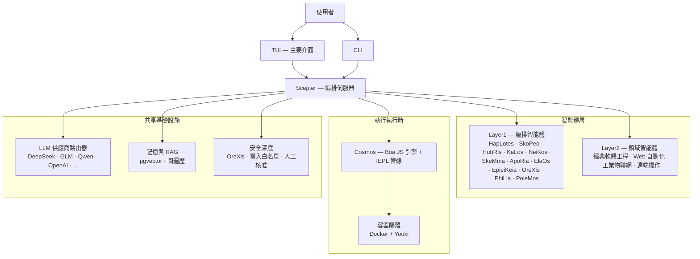

<!-- markdownlint-disable MD033 MD041 MD036 -->
<div align="center">


# Entelecheia

**面向工業 AI 控制的多智能體協作平台**

[](LICENSE)
[](https://github.com/celestia-island/entelecheia)

</div>

<div align="center">

[English](https://github.com/celestia-island/docs.celestia.world/blob/master/docs/en/guides/core/README-entelecheia.md) &bull; [Deutsch](https://github.com/celestia-island/docs.celestia.world/blob/master/docs/de/guides/core/README-entelecheia.md) &bull; [简体中文](https://github.com/celestia-island/docs.celestia.world/blob/master/docs/zhs/guides/core/README-entelecheia.md) &bull; **繁體中文** &bull; [日本語](https://github.com/celestia-island/docs.celestia.world/blob/master/docs/ja/guides/core/README-entelecheia.md) &bull; [한국어](https://github.com/celestia-island/docs.celestia.world/blob/master/docs/ko/guides/core/README-entelecheia.md) &bull; [Français](https://github.com/celestia-island/docs.celestia.world/blob/master/docs/fr/guides/core/README-entelecheia.md) &bull; [Español](https://github.com/celestia-island/docs.celestia.world/blob/master/docs/es/guides/core/README-entelecheia.md) &bull; [Português](https://github.com/celestia-island/docs.celestia.world/blob/master/docs/pt/guides/core/README-entelecheia.md) &bull; [Русский](https://github.com/celestia-island/docs.celestia.world/blob/master/docs/ru/guides/core/README-entelecheia.md) &bull; [العربية](https://github.com/celestia-island/docs.celestia.world/blob/master/docs/ar/guides/core/README-entelecheia.md)

</div>

> [celestia-island](https://github.com/celestia-island) 生態系統的一部分。

## 概述

Entelecheia 是一個僅執行（exec-only）微內核多智能體平台。LLM 僅能看到少數幾個原始工具（`exec`、`write_to_var`、`write_to_var_json`）——所有實際工作都在 IEPL TypeScript 管線中完成，代理程式碼透過 ES 模組匯入向大量 MCP 工具分發。

該平台專為 **安全關鍵的工業控制** 設計：跨供應商協議相容（Modbus、S7comm、OPC UA）、多層安全深度（指令審查 → 沙箱化執行 → 策略驗證 → 人工確認 → 審計追蹤）以及容器隔離的任務執行。

**版本 0.2.0** —— 早期開發階段。TUI 是主要介面；WebUI 位於同級儲存庫 [shittim-chest](https://github.com/celestia-island/shittim-chest) 中。

### 核心特性

- **僅執行微內核**：模型暴露的工具面被刻意限制為少量原始操作。工具呼叫透過 JavaScript 模組匯入在執行時內部發生，而非直接的 LLM 到工具繫結——這使得提示詞注入攻擊在結構上更難實施。
- **分層智能體**：十餘個 Layer1 編排智能體（HapLotes、SkoPeo、HubRis、KaLos、NeiKos、SkeMma、ApoRia、EleOs、EpieiKeia、OreXis、PhiLia、PoleMos）以及領域智能體（Web 自動化、經典軟體工程、工業物聯網、遠端操作）。程式碼庫中無 `todo!()` 或 `unimplemented!()` 佔位樁程式碼。
- **安全深度**：每一個觸及物理裝置的工具呼叫都經過 OreXis——安全哨兵智能體。寫入位址白名單、緊急操作的人工核准門控以及全鏈路審計日誌。
- **容器隔離**：兩級執行時（Docker/Podman 外部編排 + Youki/libcontainer 內部沙箱）。每個技能鏈在資源限制、seccomp 設定檔和網路出口控制的隔離容器中執行。
- **多供應商 LLM 路由**：眾多供應商配置（DeepSeek、智譜 GLM、Qwen、OpenAI、Anthropic、Google 等），具備自動容錯移轉、速率限制追蹤和分層模型選擇（Deep/Normal/Basic）。
- **自我迭代**：YOLO 巡航控制守護程序定期執行技能鏈，進行自動化程式碼分析、clippy 修復、記憶整合和安全審計——並配備 git 檢查點／回滾安全網。

## 快速開始

**Linux / macOS：**

```bash
curl -fsSL https://raw.githubusercontent.com/celestia-island/entelecheia/main/scripts/deploy/install.sh | bash
```

**Windows (WSL2)：**

```powershell
irm https://raw.githubusercontent.com/celestia-island/entelecheia/main/scripts/deploy/install.ps1 | iex
```

**從原始碼建構：**

```bash
git clone https://github.com/celestia-island/entelecheia.git
cd entelecheia
just bootstrap    # 安裝依賴，建構工作區，產生設定
just dev          # 啟動 TUI（處理 Docker／服務編排）
```

前置條件：Rust 1.85+（edition 2024）、Docker、`just` 任務執行器。

**嵌入式資料庫模式**（無需外部 PostgreSQL）：

```bash
just local         # 使用嵌入式 pglite 的 scepter
```

## 智能體

| 智能體 | 角色 |
|-------|------|
| **HapLotes** | Scepter 與 Cosmos 之間的通訊橋樑 |
| **SkoPeo** | 中央協調——目標／軌跡／任務編排 |
| **HubRis** | 規劃引擎——任務分解、TODO 管理 |
| **KaLos** | 檔案 I/O 閘道——原子化、衝突感知的檔案操作 |
| **NeiKos** | 容器執行時——建立、分叉、快照、執行 |
| **SkeMma** | JavaScript 執行時——Boa 引擎、IEPL 執行 |
| **ApoRia** | LLM 中心與知識儲存——RAG 向量資料庫、異常偵測 |
| **EleOs** | 外部資訊閘道——網頁擷取、網頁搜尋 |
| **EpieiKeia** | 時序編排——排程、訊息傳遞、檔案監視器 |
| **OreXis** | 安全哨兵——工具門控、寫入安全、合規審計、警報 |
| **PhiLia** | 記憶與協定樞紐——向量記憶、圖遍歷、資料品質 |
| **PoleMos** | 邊緣運算與裝置管理——主機檔案／命令存取、硬體資訊 |
| **經典軟體工程** | 程式碼生成、靜態分析、重構、LSP 整合 |
| **Web 自動化** | 瀏覽器控制——WebDriver、導覽、截圖、輸入 |
| **工業物聯網** | 工業協定——Modbus、S7comm、OPC UA、序列埠發現 |
| **遠端操作** | SSH、遠端終端機、GUI 自動化、檔案傳輸 |

## 架構



LLM 從不直接呼叫 MCP 工具。相反，它生成匯入智能體模組的 TypeScript 程式碼（`import { file_read } from 'kalos'`）。IEPL 管線將其轉譯為 JavaScript（SWC），在 Boa 引擎中執行，並透過 MCP 路由器路由本地分派——每一步都帶有斷路器、重試和安全策略強制執行。

## 文件

完整的架構、設計決策和指南請造訪 **[docs.celestia.world](https://docs.celestia.world)**：

- **[架構概覽](https://docs.celestia.world/en/designs/core/architecture.html)** —— 元件實際狀態、crate 層級、實作狀態
- **[基礎知識](https://docs.celestia.world/en/guides/core/fundamentals.html)** —— 智能體、僅執行工具面、技能、層級
- **[建構與部署](https://docs.celestia.world/en/guides/core/building.html)** —— 完整建構、安裝、Docker 和發布指南
- **[CLI 參考](https://docs.celestia.world/en/guides/core/cli.html)** —— 所有 CLI 命令和選項
- **[MCP 工具開發](https://docs.celestia.world/en/guides/core/mcp-tool-development.html)** —— 如何新增工具和智能體
- **[安全模型](https://docs.celestia.world/en/meta/security.html)** —— 認證、RBAC、容器強化
- **[設計決策](https://docs.celestia.world/en/designs/core/design-decisions.html)** —— ADR 索引（僅執行微內核、Boa 引擎、pgvector、分層工作區、容器沙箱）

## 授權條款

Business Source License 1.1 (BUSL-1.1)。商業使用需取得授權許可。非商業使用遵循 SySL-1.0 協議。於 2030-01-01 轉換為 Apache-2.0。
