# 貢獻 Shittim Chest

感謝您有興趣貢獻！本指南涵蓋了您入門所需的一切。

## 貢獻政策（請先閱讀）

Shittim Chest 是一個可以驅動實體和工業系統的平台的使用者面向表面，
因此**穩定性和安全性優先於貢獻吞吐量**。在發起 pull request 之前請閱讀本節。

- **高合併門檻，非公開路線圖。** 發起 PR 並不意味著它會被合併。

我們有意識地只接受少量變更，且僅在它們符合架構並通過審查時
才接受。這是設計上的選擇，並非無禮。

- **我們歡迎的內容：** 錯誤報告、針對性修復、對**外圍**（IDE 外掛、

Tauri 應用、頻道整合、提供者轉接器和文件）的範圍限定改進，
以及在程式碼之前的設計討論。

- **我們通常不會合併的內容：** 大型未經請求的重寫、未經事先設計討論的

架構變更、批次「vibe-coded」PR、任何降低核心安全性和正確性門檻
的內容，以及未經明確邀請和擴展審查的對安全性關鍵核心（auth、
JWT/OAuth、LLM 路由、webhook 驗證、RBAC）的變更。

- **核心 vs. 外圍。** 核心後端和 auth/RBAC 模型受到最嚴格的門檻要求，

主要由核心團隊維護。外圍（前端、IDE/行動應用、頻道連接器）
是外部貢獻最有幫助且最有可能被接受的地方。

- **需要 CLA。** 每個被接受的貢獻都需要簽署貢獻者授權協議。

請參閱 [`CLA.md`](../meta/cla.md)。提交必須帶有 `Signed-off-by` 行
（`git commit -s`）。

> **授權可能會開放；合併門檻不會。** 在 **2030-01-01**，本專案
> 將從 BUSL-1.1 轉換為 Synthetic Source License (SySL-1.0) — 請參閱
> [`LICENSE`](LICENSE)。這擴大了*您可以對程式碼做什麼*的範圍；
> 它**不**會降低審查門檻、不會移除 CLA，也不意味著我們接受更多 PR。
> 貢獻政策在變更日期前後保持不變。

## 安全性

**不要**為安全漏洞開立公開 issue。請透過
[GitHub 安全諮詢](https://github.com/celestia-island/shittim-chest/security/advisories/new)
私下回報。請參閱 [`SECURITY.md`](../meta/security.md)。

## 行為準則

保持尊重、建設性和包容。我們遵循 [Rust 行為準則](https://www.rust-lang.org/policies/code-of-conduct)。

## 開發環境設定

### 先決條件

- **Rust** 1.85+（`rustup default stable`）
- **Node.js** 20+ 和 **pnpm** 9+
- **just** 命令執行器（`cargo install just`）
- **PostgreSQL** 18+
- 一個執行中的 [entelecheia](https://github.com/celestia-island/entelecheia) scepter 實例於 `:8424`（可選 — shittim-chest 可獨立執行以用於聊天/圖片生成）

### 快速開始

```bash
git clone https://github.com/celestia-island/shittim-chest.git
cd shittim-chest
cp .env.example .env
# 編輯 .env — 設定 DATABASE_URL、JWT_SECRET、ENCRYPTION_KEY
# 獨立 LLM：設定 LLM_DEFAULT_PROVIDER_* 變數
# scepter 代理：設定 ENTELECHEIA_SCEPTER_URL

 # 完整開發堆疊（透過 Docker）
 just install  # 為離線構建預先暫存所有依賴（需要一次網路：
               #   cargo fetch + pnpm install + 解析本倉庫共享 devtool 腳本的 arona checkout）
 just dev      # 啟動 postgres + 構建 + 遷移 + 服務，並監視變更
               # （自動重建前端/後端；使用 --mock 也會重新啟動 scepter + 模擬 LLM）

 # `just watch` 是 `just dev` 的已棄用別名（監視是預設值）。
 ```

> **網路：** 第一次構建需要網際網路（cargo registry、git 依賴、
> arona + entelecheia checkout）。在有網路的機器上執行一次
> `just install`，後續的 `just dev` 執行可以離線進行。共享的
> Python devtool 腳本（目標快取守護、記錄器等）存在於 `arona`
> 倉庫中，可透過 cargo `[patch]` 路徑、同級 checkout 或最終手段的
> `git clone` 到 `targets/` 自動定位。

### 獨立開發（不含 entelecheia）

shittim-chest 可獨立執行以進行前端 + 聊天開發。在 `.env` 中設定以下內容：

```bash
LLM_DEFAULT_PROVIDER_ENDPOINT=https://api.deepseek.com/v1
LLM_DEFAULT_PROVIDER_API_KEY=sk-xxx
LLM_DEFAULT_PROVIDER_MODELS=deepseek-chat,deepseek-reasoner
LLM_DEFAULT_PROVIDER_CATEGORY=chat
```

然後 `just dev` — 聊天、圖片生成和身分驗證無需 scepter 即可運作。代理和裝置功能將顯示錯誤但不會崩潰。

### 跨專案依賴（本機開發）

同時開發 entelecheia 和 shittim-chest 時，在 `~/.cargo/config.toml` 中為所有跨倉庫依賴設定本機 Cargo 補丁：

```toml
# ~/.cargo/config.toml

# 帶有本機覆寫的 crates.io 依賴
[patch.crates-io]
libnoa = { path = "/path/to/noa" }

# 帶有本機覆寫的 git 依賴
[patch."https://github.com/celestia-island/arona.git"]
arona = { path = "/path/to/arona" }

[patch."https://github.com/celestia-island/hifumi.git"]
hifumi = { path = "/path/to/hifumi/packages/types" }

[patch."https://github.com/celestia-island/evernight.git"]
evernight = { path = "/path/to/evernight" }
```

**永遠不要將 `~/.cargo/config.toml` 提交到任何倉庫。** CI 使用 git 參考。

## 專案結構

```mermaid
flowchart TD
    root["shittim-chest/"] --> pkg["packages/"]
    root --> docs_dir["docs/"]
    root --> scripts_dir["scripts/"]
    root --> cargo_toml["Cargo.toml — Rust 工作區根"]
    root --> pkg_json["package.json — pnpm 工作區根"]
    root --> pnpm_ws["pnpm-workspace.yaml"]

    pkg --> cli_pkg["cli/ — CLI 包裝器，編排 Docker 服務"]
    pkg --> sc_pkg["core/ — Rust + Axum 後端"]
    pkg --> webui_pkg["webui/ — Vue 3 + Vite 前端 (TSX)"]
    pkg --> app_pkg["app/"]
    pkg --> ide_pkg["ide/"]

    sc_pkg --> sc_main["main.rs — CLI 入口點 (DbInit/Migrate/Reset/Serve)"]
    sc_pkg --> sc_lib["lib.rs — 模組宣告 (33 個模組)"]
    sc_pkg --> sc_config["config.rs — 環境設定"]
    sc_pkg --> sc_auth["auth/ — 登入、註冊、JWT、OAuth、會話"]
    sc_pkg --> sc_api["api.rs — 路由器引導 + 資料庫管理"]
    sc_pkg --> sc_chat["chat/ — 對話、訊息、SSE/WS 串流"]
    sc_pkg --> sc_llm["llm/ — LLM 用戶端、路由器、提供者管理"]
    sc_pkg --> sc_gen["generation/ — 圖片生成"]
    sc_pkg --> sc_webhook["webhook.rs — GitHub/GitLab/Gitee/自訂 webhook"]
    sc_pkg --> sc_devices["devices/ — 遠端裝置管理 + 信號"]
    sc_pkg --> sc_channel["channel/ — 12 平台頻道整合"]
    sc_pkg --> sc_proxy["proxy/ — Scepter HTTP/WS 橋接"]
    sc_pkg --> sc_entity["entity/ — SeaORM 實體模型 (25 個資料表)"]
    sc_pkg --> sc_migration["migration/ — 資料庫遷移 (5)"]
    sc_pkg --> sc_static["static_files.rs"]
    sc_pkg --> sc_cargo["Cargo.toml"]

    webui_pkg --> webui_views["views/ — demiurge (聊天)、auth、admin、topology、holographic"]
    webui_pkg --> webui_comp["components/ — base/ (50+ S-design-system)、chat/、layout/、preview/、..."]
    webui_pkg --> webui_stores["stores/ — Pinia 儲存"]
    webui_pkg --> webui_composables["composables/ — useChatStream、useSceneManager、..."]
    webui_pkg --> webui_i18n["i18n/ — vue-i18n、11 種語言、每種語言 17 個命名空間檔案"]
    webui_pkg --> webui_api["api/ — API 用戶端模組"]
    webui_pkg --> webui_types["types/ — TypeScript 型別"]

    app_pkg --> app_tauri["tauri/ — Tauri 桌面應用"]
    app_pkg --> app_shared["tauri_shared/ — Tauri 應用的共享 DTO"]
    app_pkg --> app_mobile["tauri_mobile/ — Tauri 行動應用"]
    app_pkg --> app_harmony["harmony/ — HarmonyOS 應用 (ArkTS)"]

    ide_pkg --> ide_vscode["vscode/ — VS Code 擴充 (TypeScript)"]
    ide_pkg --> ide_idea["idea/ — IntelliJ 外掛 (Kotlin)"]
    ide_pkg --> ide_zed["zed/ — Zed 擴充 (Rust)"]
    ide_pkg --> ide_neovim["neovim/ — Neovim 外掛 (Lua)"]
    ide_pkg --> ide_lsp["lsp-bridge/ — LSP 橋接 (Rust)"]
    ide_pkg --> ide_e2e["e2e/ — 共享 E2E 測試 (TypeScript)"]

    docs_dir --> docs_guides["guides/ — 多語言文件 (en, zhs, zht, ja, ko, fr, es, ru)"]

    scripts_dir --> scripts_images["images/ — Dockerfile"]
    scripts_dir --> scripts_utils["utils/ — Python 工具腳本"]
```



## 程式碼風格

### Rust

```bash
cargo fmt                  # 自動格式化
cargo clippy               # lint
cargo clippy --fix         # 自動修復
```

- 遵循標準 Rust 慣例（函數/變數使用 `snake_case`，型別使用 CamelCase）
- 在 crate 的 `Cargo.toml` 檔案中對共享依賴版本使用 `workspace = true`
- 錯誤處理：對應用程式碼使用 `anyhow::Result`，對程式庫 crate 錯誤型別使用 `thiserror`

### TypeScript / Vue

```bash
pnpm -r lint               # 跨所有套件的 ESLint
pnpm -r typecheck          # TypeScript 嚴格檢查
pnpm -r build              # 驗證生產構建
```

- Vue 3 搭配 TSX（`defineComponent`、`@vitejs/plugin-vue-jsx`）
- TypeScript 嚴格模式
- Pinia 用於狀態管理
- 遵循 `webui/` 中的現有模式

### i18n

在 webui 中新增 UI 字串時，透過 `packages/webui/src/i18n/` 使用 `vue-i18n` 的 `t()` 函數：

```ts
import { t } from '@/i18n'
// 在模板中：{t('key.name')}
// 帶參數：{t('msg.toolCalls', count, count > 1 ? t('msg.toolCalls.plural') : '')}
```

語言檔案按每種語言 17 個命名空間 JSON 檔案組織在 `i18n/locales/{lang}/` 下（admin、auth、chat、cmd、common、devices、errors、footer、help、logs、models、reports、skills、timeline、tokenUsage、tools、workspace）。新增鍵值時，將其新增到所有 11 種支援的語言：`ar`、`de`、`en`、`es`、`fr`、`ja`、`ko`、`pt`、`ru`、`zhs`、`zht`。

### 命名慣例

`packages/` 下的所有目錄名稱使用 **`snake_case`**：

| 型別 | 慣例 | 範例 |
| --- | --- | --- |
| Rust crate 目錄 | snake_case | `core/` |
| Rust crate 名稱 | snake_case | `core` |

## Justfile 命令

```bash
just                       # 列出所有命令
just dev                   # 透過 Docker 的完整開發堆疊 (postgres + 後端)，監視變更
just dev --clean           # 全新啟動（移除 volumes、.env、重新啟動）
just dev --mock            # 完整模擬堆疊（真實 scepter + 模擬 LLM）+ 後端，監視中；
                           # 模擬 scepter/LLM 每次執行都會重建+重新啟動
just up                    # 構建並啟動 Docker 中的所有服務
just down                  # 停止所有服務
just down --clean          # 停止並移除 volumes
just migrate               # 在容器內執行待處理的遷移
just logs                  # 從所有容器串流日誌
just status                # 檢查服務狀態
just watch                 # （`just dev` 的已棄用別名）
just build                 # 構建發行版二進位檔
just build-frontend        # 僅構建 Vue 前端
just build-release         # 構建前端 + 嵌入前端的發行版二進位檔
just test                  # 執行所有測試
just lint                  # 全部 lint (cargo clippy + eslint)
just fmt                   # 全部自動格式化
just clean                 # 清理構建產物
```

## Pull Request 流程

1. 從 `dev` 建立功能分支：`git checkout -b feat/my-feature dev`
1. 使用清晰、原子性的提交進行變更
1. 推送前執行 `just lint && just test`
1. 針對 `dev` 分支發起 PR
1. 確保 CI 通過（Rust 構建、npm 構建、lint）

## 提交慣例

使用 [Conventional Commits](https://www.conventionalcommits.org/)：

```text
feat(auth): 新增密碼登入端點
fix(proxy): 處理 WebSocket 重新連線
docs(readme): 新增 logo 和徽章
refactor(config): 提取環境載入
chore(deps): 升級 axum 到 0.8
```

## 授權與 CLA

Shittim Chest 依據 **Business Source License 1.1 (BUSL-1.1)** 授權，
**變更日期為 2030-01-01**，屆時轉換為
**Synthetic Source License (SySL-1.0)**。對於所有內部、學術、政府、
教育和非商業用途，今天已等同於 SySL-1.0
（請參閱 [`LICENSE`](LICENSE) 中的額外使用授權）。受限的
商業用途（作為服務託管、轉售或重新品牌化）在變更日期前需要
單獨的商業授權。

透過貢獻，您同意您的貢獻依據本專案的授權條款授權，
並且您簽署了 CLA（[`CLA.md`](../meta/cla.md)）。CLA 授予本專案
一個寬鬆的授權，**包括重新授權的權利**，因此本專案可以
保持其 BUSL→SySL 路徑並在未來調整其授權。
